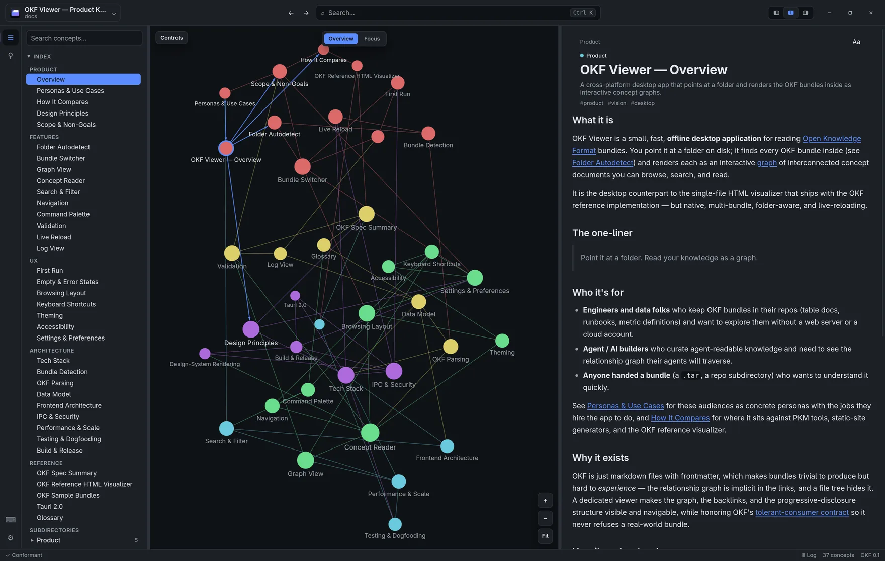

<p align="center">
  
</p>

<h1 align="center">OKF Studio</h1>

<p align="center"><strong>Point it at a folder. Read your knowledge as a graph.</strong></p>

<p align="center">
  <a href="https://saschb2b.github.io/okf-viewer/">Homepage</a>
  &nbsp;·&nbsp;
  <a href="https://github.com/saschb2b/okf-viewer/releases/latest">Download</a>
  &nbsp;·&nbsp;
  <a href="https://saschb2b.github.io/okf-viewer/#features">Features</a>
  &nbsp;·&nbsp;
  <a href="docs/index.md">Docs</a>
</p>

<p align="center">
  <a href="https://saschb2b.github.io/okf-viewer/">
    
  </a>
</p>

OKF Studio is a fast, native desktop app for reading [Open Knowledge Format](https://github.com/GoogleCloudPlatform/knowledge-catalog/tree/main/okf) bundles. Point it at a folder; it autodetects the OKF bundles inside and renders each as an interactive graph of interconnected concepts, alongside a markdown reader with backlinks, search, filters, validation, and live reload. It is offline, read-only, and built with [Tauri 2](https://tauri.app/) (a Rust core plus the system webview). Windows, macOS, and Linux.

## Download

Get the latest build from the [Releases page](https://github.com/saschb2b/okf-viewer/releases/latest), or browse the [homepage](https://saschb2b.github.io/okf-viewer/#download).

| Platform | Formats |
|----------|---------|
| **Windows** | `.msi` or NSIS `.exe` (x64) |
| **Linux** | `.deb` (recommended) or AppImage |
| **macOS** | build from source (see [Develop and run](#develop-and-run)) |

Unsigned for now, so your OS may show an "unverified publisher" prompt on first launch.

## Features

- **Knowledge as a graph.** A force-directed graph of concepts and links, colored by type. Explore structure instead of scrolling a wall of files.
- **A focused reader.** Markdown with frontmatter, syntax-highlighted code, zoomable images, and a relationship panel showing what a concept links to and what cites it.
- **Any conformant bundle.** Reads OKF and [ODSF](https://saschb2b.github.io/Open-Design-System-Format/) bundles from any producer, yours or someone else's. A tolerant reader never rejects a sloppy bundle; it surfaces issues instead.
- **Native and fast.** A Tauri 2 desktop app: a Rust core plus the system webview. Small, quick, no browser bloat.
- **Design-system aware.** Open an ODSF bundle and it renders the design tokens and live HTML/CSS examples inline.
- **Search, filter, navigate, live-reload.** Full-text search, type and tag filters, back/forward history, and instant refresh when files change on disk.

## What is OKF? What is ODSF?

- **[Open Knowledge Format](https://github.com/GoogleCloudPlatform/knowledge-catalog/tree/main/okf)** is Google's open, vendor-neutral spec for packaging knowledge an agent (or a human) can read: plain markdown files with YAML frontmatter, organized into a portable bundle. No SDK, no database, no lock-in.
- **[Open Design System Format](https://saschb2b.github.io/Open-Design-System-Format/)** is a profile of OKF for design systems. It adds machine-readable design tokens and runnable HTML/CSS examples so an agent produces UI that matches the system. This project's marketing site is built from an ODSF bundle ([`design-system/`](design-system/)), which OKF Studio can itself open and preview.

## Develop and run

Prerequisites: a stable **Rust** toolchain and **Node.js 20.19+ / 22.12+** with **pnpm**. On Ubuntu, also install the Tauri Linux dependencies (`libwebkit2gtk-4.1-dev`, `build-essential`, `libssl-dev`, `librsvg2-dev`, and related GTK packages); on Windows, the WebView2 runtime and MSVC build tools.

```bash
pnpm install
pnpm tauri dev      # run the app with hot reload
pnpm tauri build    # installers: .deb / AppImage (Linux), .msi / .exe (Windows), .app / .dmg (macOS)
```

Before finishing a change, run the local gate (it mirrors CI; see [`AGENTS.md`](AGENTS.md)):

```bash
pnpm lint                                       # eslint (type-aware)
pnpm typecheck                                  # tsc --noEmit
pnpm test                                       # frontend tests (Vitest)
pnpm build                                      # app build
cargo clippy -p okf-core --all-targets -- -D warnings
cargo test -p okf-core                          # Rust core tests (run against docs/)
node scripts/okf-validate.mjs docs              # OKF conformance of the spec bundle
```

The marketing site under [`site/`](site/) has its own build (`pnpm --dir site build`) and deploys to GitHub Pages.

## Repository layout

| Path | What |
|------|------|
| [`src/`](src/) | React 19 + TypeScript frontend: graph, reader, sidebar, panels. |
| [`src-tauri/`](src-tauri/) | Tauri 2 app shell: commands/events, plugins, capabilities, file watcher. |
| [`crates/okf-core/`](crates/okf-core) | Pure-Rust core: detection, parsing, graph, validation. No GUI dependencies; unit-tested. |
| [`docs/`](docs/) | The OKF product bundle: features, UX, architecture, reference. The source of truth, and the app's built-in sample. |
| [`site/`](site/) | Astro marketing and download site (deploys to GitHub Pages). |
| [`design-system/`](design-system/) | The ODSF design system the site is built from (a conformant bundle). |
| [`AGENTS.md`](AGENTS.md) | Architecture, conventions, and the local check gate. |
| `scripts/okf-validate.mjs` | Zero-dependency OKF conformance checker. |

## The spec lives in `docs/`

`docs/` is an OKF bundle that specifies what OKF Studio does and why, and the app renders it as the built-in sample (it dogfoods itself). Treat it as the source of truth, for humans and agents:

- **Read the relevant concept before changing behavior.** Start at [`docs/index.md`](docs/index.md).
- **Update the spec in the same change**, so the docs never drift from the code; on conflict, the bundle wins.
- **Record decisions in the bundle**, with a dated entry in [`docs/log.md`](docs/log.md), not only in the commit message.
- **Validate before finishing:** `node scripts/okf-validate.mjs docs` must report 0 errors.

See [`AGENTS.md`](AGENTS.md) for the full conventions and conformance checklist.

## License

[MIT](LICENSE).
