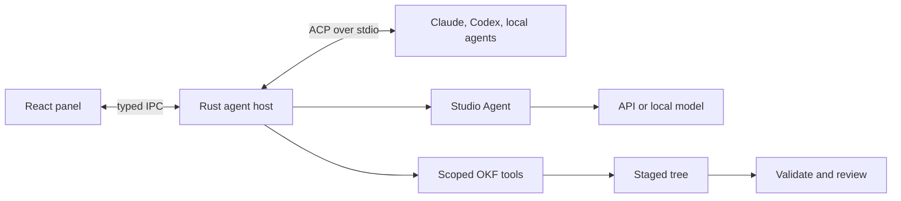

# Decision

One [Agent Panel](../features/agent-panel.md) hosts two boundaries: external agent processes over Agent Client Protocol (ACP), and a native Studio Agent backed by API or local model providers.

Rust owns processes, network, credentials, filesystem mediation, persistence, and validation. The webview renders typed state. This extends [IPC and Security](ipc-and-security.md), never direct webview filesystem/provider access.

# Boundaries

ACP standardizes capability negotiation, agent-owned auth, sessions, streaming, tools, permission requests, diffs, filesystem requests, cancellation, and optional restore. It avoids separate Claude and Codex clients.

ACP does not replace an external agent's system prompt. The native Studio Agent guarantees the packaged [OKF skill](../../.agents/skills/okf/SKILL.md), system prompt, scoped tools, validation, and staged writes. External agents receive bundle cwd, explicit resources, client permissions, and Studio OKF tools over MCP where supported.

# Components

| Component | Responsibility |
| --- | --- |
| Catalog and installer | Registry/custom metadata, pinned cache, app-scoped runtime, install/update/remove |
| ACP host | Process, transport, initialize, auth, sessions, cancellation, diagnostics, shutdown |
| Studio Agent | Provider adapter, system prompt, tool loop, compaction |
| Context service | Bundle inventory, attachments, source extraction, token budget |
| Permission service | Built-in denials, path normalization, once/thread/persistent grants |
| Change service | Staged tree, validation, diffs, atomic apply, checkpoint/restore |
| OKF tools | Read, search, traverse, propose, validate, provenance |

# Security and credentials

External agents own credentials. Studio invokes ACP-advertised methods and does not persist subscription secrets. Studio Agent API keys live in the OS credential store; settings retain only provider metadata and credential references. Secrets are redacted before diagnostics and never returned to the webview after entry.

Opening remains read-only. Client filesystem methods canonicalize paths and reject traversal, symlink escape, and access outside granted roots. Studio writes target a staged tree, validate, then apply atomically after review.

An external process may bypass client filesystem methods. Client checks do not sandbox it. Until platform enforcement exists, external write mode remains interactive and carries a containment warning. Unattended writes require enforcement.

Permission precedence is: non-overridable security rules, deny, confirm, allow, thread grant, tool default, global default. Writes outside roots, Git metadata, credentials, and packaged instructions are built-in denials.

# Installation, persistence, and network

Registry membership is not a sandbox. Studio shows publisher, repository, license, exact version, distribution, and runtime before install. Binary archives require verified digests. `npx` agents use an isolated app-managed Node runtime/cache. Installation never starts the agent.

The first catalog is a versioned JSON manifest bundled into both builds from one source file. React reads it through a generic IPC function; the desktop command parses it into Rust structs before returning it. Browser development uses the same manifest directly. Provider names, authentication methods, runtime kind, package coordinates, and pinned versions remain catalog data rather than brand-specific UI or process branches. Updating the bundled snapshot is explicit and reviewable; later remote refresh must verify a signed or pinned registry response before replacing it.

Custom ACP profiles are separate user data. Rust validates and stores a display name, absolute executable path, argv array, and an allowlist of environment variable names in the app-data directory. It rejects relative paths, shell strings in the executable field, environment assignments, invalid variable names, and oversized fields. Environment values are neither accepted by IPC nor persisted. The ACP host inherits only the named variables when it starts the executable directly, without a shell.

Package installation is a Rust-owned transaction. The bundled catalog pins the npm tarball URL, compressed byte count, unpacked byte count, and SHA-512 Subresource Integrity value. An explicit install request streams into an app-cache staging file with timeouts, a 64 MB hard cap, progress events, and cancellation checks. Studio rejects a size or digest mismatch, archive links, unsupported entry kinds, and every path outside the npm `package/` root. It extracts into a staging directory and renames that directory into its versioned destination only after verification. A receipt records the agent ID, version, cache path, and integrity value. Repeated requests return the matching receipt; stale or corrupt destinations are replaced. Installation does not execute package scripts or start the agent.

Studio uses no system Node fallback for catalog agents. The manifest pins the managed runtime to Node `v24.11.0` and records the official nodejs.org archive URL, SHA-256 value, byte count, archive kind, and root directory for Windows x64, Linux x64/ARM64, and macOS x64/ARM64. A preflight command selects only the compiled OS/architecture pair, rejects unsupported targets before network access, checks existing package/runtime receipts, and returns the exact remaining download footprint.

An install first ensures the managed runtime, then installs the ACP package with the same cancellation token. The runtime archive is streamed to a staging file, checked against its pinned size and SHA-256 value, and limited to 128 MB compressed and 512 MB expanded. ZIP and tar paths must remain under the pinned root. Unix Node archives may contain relative `npm` and `npx` symbolic links; Studio permits one only when its normalized target stays inside that root. Absolute or escaping links, hard links, and unsupported entry kinds fail the transaction. The verified runtime directory is renamed into its versioned cache location and recorded before package installation begins.

The React catalog calls preflight before enabling installation. It presents the runtime version and separate runtime/package byte counts, subscribes to progress only for the selected install ID, and exposes cancellation without treating a partial transaction as installed. An install receipt changes the catalog state to **Installed**, not **Connected**; no process launch is part of this command.

UI/provider settings use the existing store; credentials use the OS credential store; thread/change metadata uses a Rust-owned local store selected during implementation. Local bundle reading remains network-free. Network begins only after an explicit install, auth, remote provider prompt, URL attachment, or update action.

# ACP process host

Studio pins the official Rust SDK at `agent-client-protocol` 1.2.0 with schema artifact 1.4.0. Artifact versions describe the Rust API and generated schema; wire compatibility is negotiated separately. Studio requests ACP protocol v1 and rejects any response that selects another version.

The host starts a custom agent only through the typed `connect_custom_agent` command. It uses the stored absolute executable and argv array, clears the child environment, then restores only the variable names the profile allowlists. The process receives piped stdin/stdout for JSON-RPC and a separate stderr reader. Initialization has a 15-second deadline and sends the Studio implementation name and version. The response is reduced to typed implementation, authentication, and capability fields before crossing IPC; arbitrary agent metadata does not cross.

Authentication stays agent-owned. Studio reduces initialization to at most 16 bounded stable methods and sends only the selected advertised method ID through ACP `authenticate`; browser pages, subscription state, tokens, and API keys remain with the external agent. Authentication has a five-minute deadline and a retryable UI state. Rust rejects invented method IDs and blocks session creation until authentication succeeds. Connections without advertised methods start ready. The frontend records only the authenticated connection state so the panel can unlock the composer. ACP's client-owned terminal and environment-variable variants remain unstable and are not enabled.

Permission requests are deny by default. Rust accepts them only for a session with an active turn, exposes at most 16 advertised choices, and sends only the bounded tool-call ID, human title, choice ID, label, and ACP choice kind to the webview. Raw tool input, output, content, locations, and extension metadata never cross IPC. The user may select only an ID the agent offered or cancel. Requests expire after five minutes and resolve as ACP `cancelled` when the turn, connection, profile, or app ends. Studio passes `allow_always` and `reject_always` choices back when advertised but does not persist its own grant from that hint yet. Stderr retains at most the latest 64 KiB, removes control characters, and redacts inherited values before it can enter an error. Disconnect aborts the connection future; `kill_on_drop` terminates its child. Removing a profile aborts every connection that uses it, and dropping the app-owned host state aborts all remaining children. Fake in-process agents cover permission selection and invalid-choice rejection alongside initialization, advertised capability/auth capture, timeout, bounded diagnostic redaction, and profile-wide shutdown.

After initialization, each connection becomes a small Rust-owned actor. Typed commands enter through a bounded channel instead of sharing the SDK connection across Tauri requests. Session creation canonicalizes an absolute bundle directory off the async runtime, rejects missing and non-directory paths, and sends that directory as ACP `cwd` with no additional roots. It has a separate 30-second deadline. Studio returns only the stable connection ID, session ID, and canonical bundle root; agent metadata and configuration do not cross IPC. The actor retains the session-to-root association for later prompt and tool scoping. A fake agent asserts the exact canonical root it receives.

Prompt submission accepts non-empty text capped at 128 KiB and returns a stable turn ID as soon as the actor accepts it. One turn may run per session. Prompt work runs in a child task so the actor can process cancellation concurrently; disconnect aborts the task set. `session/update` notifications are reduced to text chunks for the matching active turn. Each chunk drops arbitrary metadata, strips controls, and is capped at 64 KiB before the `agent-turn-update` event. Completion reports a closed stop-reason vocabulary; failures carry the existing capped diagnostic message. Cancellation sends ACP `session/cancel` only when connection, session, and turn IDs match the active turn, then waits for the agent's `cancelled` stop reason. Fake-agent tests cover text streaming, successful completion, and cooperative cancellation.

# IPC

Implemented commands cover custom-agent connect/disconnect, authentication, session creation, text prompts, turn cancellation, and permission responses with stable connection, session, turn, and request IDs; Rust rejects a second active connection for the same profile. Typed events report connection termination, reduced turn updates, and requested/resolved permission state. The IPC module retains active connection identity and one app-lifetime connection listener so catalog remounts do not lose live process state. Failure messages remove controls and are capped before IPC. Planned commands cover catalog-agent connect, context, review, apply, and restore. Change sets and install progress remain event-based. Stable IDs let the frontend reject late updates without reopening completed requests.
