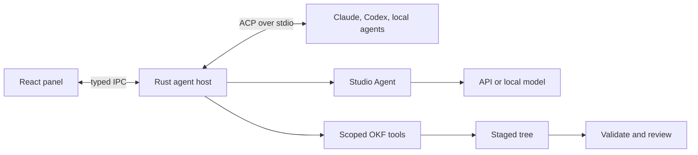

# Decision

One [Agent Panel](../features/agent-panel.md) hosts two boundaries: external agent processes over Agent Client Protocol (ACP), and a native Studio Agent backed by API or local model providers.

Rust owns processes, network, credentials, filesystem mediation, persistence, and validation. The webview renders typed state. This extends [IPC and Security](ipc-and-security.md), never direct webview filesystem/provider access.

# Boundaries

ACP standardizes capability negotiation, agent-owned auth, sessions, streaming, tools, permission requests, diffs, filesystem requests, cancellation, and optional restore. It avoids separate Claude and Codex clients.

ACP does not replace an external agent's system prompt. The native Studio Agent guarantees the packaged [OKF skill](../../.agents/skills/okf/SKILL.md), system prompt, scoped tools, validation, and staged writes. External agents receive bundle cwd, explicit resources, client permissions, and Studio OKF tools over MCP where supported. Studio labels first-turn skill material as client context and never claims it changed the external agent's system instructions.

# Components

| Component | Responsibility |
| --- | --- |
| Catalog and installer | Registry/custom metadata, pinned cache, app-scoped runtime, install/update/remove |
| ACP host | Process, transport, initialize, auth, sessions, cancellation, diagnostics, shutdown |
| Studio Agent | Provider adapter, system prompt, tool loop, compaction |
| Context service | Bundle inventory, attachments, source extraction, token budget |
| Permission service | Built-in denials, path normalization, once/thread/persistent grants |
| Change service | Staged tree, validation, diffs, atomic apply, checkpoint/restore |
| OKF tools | Read, search, traverse, propose, validate, provenance |

# Security and credentials

External agents own credentials. Studio invokes ACP-advertised methods and does not persist subscription secrets. Studio Agent API keys live in the OS credential store; settings retain only provider metadata and credential references. Secrets are redacted before diagnostics and never returned to the webview after entry.

Opening remains read-only. Client filesystem methods canonicalize paths and reject traversal, symlink escape, and access outside granted roots. Studio writes target a staged tree, validate, then apply atomically after review.

An external process may bypass client filesystem methods. Client checks do not sandbox it. Until platform enforcement exists, external write mode remains interactive and carries a containment warning. Unattended writes require enforcement.

Permission precedence is: non-overridable security rules, deny, confirm, allow, thread grant, tool default, global default. Writes outside roots, Git metadata, credentials, and packaged instructions are built-in denials.

# Installation, persistence, and network

Registry membership is not a sandbox. Studio shows publisher, repository, license, exact version, distribution, and runtime before install. Binary archives require verified digests. `npx` agents use an isolated app-managed Node runtime/cache. Installation never starts the agent.

The first catalog is a versioned JSON manifest bundled into both builds from one source file. React reads it through a generic IPC function; the desktop command parses it into Rust structs before returning it. Browser development uses the same manifest directly. Provider names, authentication methods, runtime kind, package coordinates, and pinned versions remain catalog data rather than brand-specific UI or process branches. Updating the bundled snapshot is explicit and reviewable; later remote refresh must verify a signed or pinned registry response before replacing it.

Custom ACP profiles are separate user data. Rust validates and stores a display name, absolute executable path, argv array, and an allowlist of environment variable names in the app-data directory. It rejects relative paths, shell strings in the executable field, environment assignments, invalid variable names, and oversized fields. Environment values are neither accepted by IPC nor persisted. The ACP host inherits only the named variables when it starts the executable directly, without a shell.

Studio thread metadata uses the existing Tauri store under the compatibility filename `okf-viewer.json`. It keeps at most 50 newest entries and at most one current plus one archived pointer for each bundle and agent profile. Each entry contains a canonical bundle root, agent profile ID, opaque ACP session ID, bounded title, archive flag, optional guided-workflow marker, and integer update timestamp. The workflow vocabulary is closed to Deep research and dataset change. Reads treat store contents as untrusted: invalid types, empty or control-bearing strings, oversized fields, unknown workflows, unsafe timestamps, and excess entries are discarded. Entries written before the archive or workflow fields existed migrate as current general threads. Saving replaces the matching state slot and removes an older state for the same session. Archiving changes only this pointer and clears frontend memory; it does not send ACP `session/close` or claim that ACP persisted a transcript. Transcript content, prompts, attachments, tool and plan records, permissions, credentials, usage, and diagnostics are excluded. The browser development mock uses the same validation and a namespaced local-storage key.

Package installation is a Rust-owned transaction. The bundled catalog pins the npm tarball URL, compressed byte count, unpacked byte count, SHA-512 Subresource Integrity value, package-relative entry point, argv, and provider environment names. An explicit install request streams into an app-cache staging file with timeouts, a 64 MB hard cap, progress events, and cancellation checks. Studio rejects a size or digest mismatch, archive links, unsupported entry kinds, and every path outside the npm `package/` root. It extracts into a staging directory and renames that directory into its versioned destination only after verification.

The root adapter tarballs do not contain their production dependencies. Studio therefore invokes the pinned runtime's `npm-cli.js` directly through managed Node, inside the staging package, with scripts, audit, funding, and development dependencies disabled. The npm process receives a cleared environment restored only with bounded platform, locale, proxy, and certificate variables; `NODE_OPTIONS` and arbitrary npm configuration cannot inject code or replace the registry. Inherited values are redacted from bounded installation diagnostics. Dependency installation shares the cancellation token and has a ten-minute deadline. npm verifies registry integrity metadata and writes a package lock. The receipt records the root package integrity plus SHA-256 values for that lock and the launch entry point. Repeated requests require the matching receipt, lock, entry point, and dependency directory. A malformed receipt or one from an older schema is treated as stale and replaced through the normal verified installation flow instead of blocking preflight. No package lifecycle script runs, and installation does not start the agent.

Studio uses no system Node fallback for catalog agents. The manifest pins the managed runtime to Node `v24.11.0` and records the official nodejs.org archive URL, SHA-256 value, byte count, archive kind, and root directory for Windows x64, Linux x64/ARM64, and macOS x64/ARM64. A preflight command selects only the compiled OS/architecture pair, rejects unsupported targets before network access, checks existing package/runtime receipts, and returns the exact remaining pinned-archive footprint. The UI identifies npm-resolved production dependencies as an additional download whose platform-specific size is determined during installation.

An install first ensures the managed runtime, then installs the ACP package with the same cancellation token. The runtime archive is streamed to a staging file, checked against its pinned size and SHA-256 value, and limited to 128 MB compressed and 512 MB expanded. ZIP and tar paths must remain under the pinned root. Unix Node archives may contain relative `npm` and `npx` symbolic links; Studio permits one only when its normalized target stays inside that root. Absolute or escaping links, hard links, and unsupported entry kinds fail the transaction. The verified runtime directory is renamed into its versioned cache location and recorded before package installation begins.

The React catalog calls preflight before enabling installation. It presents the runtime version and separate runtime/package byte counts, subscribes to progress only for the selected install ID, and exposes cancellation without treating a partial transaction as installed. An install receipt changes the catalog state to **Installed**, not **Connected**; no process launch is part of this command.

Catalog connection is a separate typed command. Rust revalidates the runtime receipt paths, package receipt, dependency lock, and entry-point digest, then canonicalizes the entry point under the versioned package root. On Windows, the verified `\\?\` path is converted back to the equivalent Win32 drive or UNC form before it becomes managed Node's explicit argv; Node 24 does not resolve a verbatim drive path as its main module. Studio never invokes a shell, `npx`, a package bin shim, or system Node. The child receives a bounded cross-platform process environment plus only the provider variable names declared by the catalog; every inherited value joins the existing diagnostic redaction set. A launch failure exposes the exit status and one bounded diagnostic line, without SDK serialization metadata or a runtime stack. Catalog identity uses the same one-active-connection rule and ACP actor as a custom profile, so initialization, authentication, permissions, prompts, cancellation, and shutdown do not branch by brand.

UI/provider settings use the existing store; credentials use the OS credential store; thread/change metadata uses a Rust-owned local store selected during implementation. Local bundle reading remains network-free. Network begins only after an explicit install, auth, remote provider prompt, URL attachment, or update action.

# ACP process host

Studio pins the official Rust SDK at `agent-client-protocol` 1.2.0 with schema artifact 1.4.0. Artifact versions describe the Rust API and generated schema; wire compatibility is negotiated separately. Studio requests ACP protocol v1 and rejects any response that selects another version.

The host starts custom and installed catalog agents only through typed connect commands. A custom profile supplies its stored absolute executable and argv. A catalog agent supplies a revalidated managed Node executable and package entry point. Both clear the child environment, then restore only their allowlisted values. The process receives piped stdin/stdout for JSON-RPC and a separate stderr reader. Initialization has a 15-second deadline and sends the Studio implementation name and version. The response is reduced to typed implementation, authentication, and capability fields before crossing IPC; arbitrary agent metadata does not cross.

Authentication stays agent-owned. Studio reduces initialization to at most 16 bounded stable methods and sends only the selected advertised method ID through ACP `authenticate`; browser pages, subscription state, tokens, and API keys remain with the external agent. Authentication has a five-minute deadline and a retryable UI state. Rust rejects invented method IDs and blocks session creation until authentication succeeds. Connections without advertised methods start ready. The frontend records only the authenticated connection state so the panel can unlock the composer. ACP's client-owned terminal and environment-variable variants remain unstable and are not enabled.

Permission requests are deny by default. Rust accepts them only for a session with an active turn, exposes at most 16 advertised choices, and sends only the bounded tool-call ID, human title, choice ID, label, and ACP choice kind to the webview. Raw tool input, output, content, locations, and extension metadata never cross IPC. The user may select only an ID the agent offered or cancel. Requests expire after five minutes and resolve as ACP `cancelled` when the turn, connection, profile, or app ends. Studio passes `allow_always` and `reject_always` choices back when advertised but does not persist its own grant from that hint yet. Stderr retains at most the latest 64 KiB, removes control characters, and redacts inherited values before it can enter an error. Disconnect aborts the connection future; `kill_on_drop` terminates its child. Removing a profile aborts every connection that uses it, and dropping the app-owned host state aborts all remaining children. Fake in-process agents cover permission selection and invalid-choice rejection alongside initialization, advertised capability/auth capture, timeout, bounded diagnostic redaction, and profile-wide shutdown.

After initialization, each connection becomes a small Rust-owned actor. Typed commands enter through a bounded channel instead of sharing the SDK connection across Tauri requests. Session creation canonicalizes an absolute bundle directory off the async runtime, rejects missing and non-directory paths, and sends that directory as ACP `cwd` with no additional roots. It has a separate 30-second deadline. Studio returns only the stable connection ID, session ID, and canonical bundle root; agent metadata and configuration do not cross IPC. The actor retains the session-to-root association for later prompt and tool scoping. A fake agent asserts the exact canonical root it receives.

Studio advertises ACP `fs/read_text_file` and leaves `fs/write_text_file` false. A read is accepted only for an active session and an absolute path whose canonical target remains under that session's canonical bundle root. Canonicalizing the target before the root check rejects `..` traversal and symbolic-link escape. Directories, missing files, non-UTF-8 content, zero-based line requests, and text above 1 MiB are rejected. Valid requests preserve line endings and apply ACP's 1-based `line` and maximum-line `limit` fields. The bridge reads only; opening a bundle or approving a generic ACP permission does not enable an ACP write method. Fake-agent tests cover the advertised capability and a ranged read, while boundary tests cover outside-root, binary, and oversized files.

Each new ACP session includes a standard stdio MCP descriptor, which every ACP agent must support. The descriptor starts the current Studio executable in `--okf-mcp <canonical-bundle-root>` mode with an absolute executable path, explicit argv, and no environment entries. That mode parses the bundle once and speaks MCP over inherited stdin/stdout. `okf_inventory` pages at most 200 filtered concept summaries and returns whole-bundle metadata and counts. `okf_read` identifies a concept through its bundle-relative ID, pages at most 1,000 body lines, and caps serialized body text at 64 KiB. `okf_search` returns at most 50 scored metadata/snippet matches. `okf_sources` pages at most 200 deduplicated canonical resources and external citations, retains their referring concept IDs, and performs no fetch. `okf_traverse` is cycle-safe, capped at three breadth-first hops and 200 concepts, and preserves authored link direction. `okf_validate` pages at most 200 parser and conformance issues with severity totals. Filters, offsets, and every serialized string are bounded; outputs contain concept IDs rather than absolute paths. No write, shell, network, or arbitrary-file tool exists. This helper is mediation, not a sandbox: an already-unsandboxed external process retains its operating-system access.

Prompt context is an ordered list of bundle-relative file paths, capped at eight bounded entries. A searchable picker exposes the bundle inventory, prioritizes the concept open beside the panel, suppresses duplicates, and shows each chosen concept as a removable chip. Rust resolves every attachment against the session's canonical bundle root, rejects absolute paths, traversal, symbolic-link escape, directories, and missing files, then sends the file resource links in picker order before the unchanged user message. The webview never reads a concept body. An accepted turn clears the attachments; a rejected prompt leaves them available for correction or retry.

Reader selection context reuses the text-source boundary rather than the file-resource boundary. The user selects text in the rendered concept and opens the composer context menu. At trigger activation, the frontend verifies that every selection range starts and ends inside the current reader scope, extracts plain text, and rejects empty or over-65,536-character selections. It sends a bounded title, the text, `text/plain`, and a bundle-relative `<concept>.md#reader-selection` origin. No HTML, DOM reference, absolute path, or read grant enters prompt state. Rust applies the existing eight-source, per-source, and combined-content validation before constructing the labelled ACP text block. The removable chip and queued draft retain the captured snapshot; later selection changes do not alter it. Reader selections remain outside transcript export.

Pasted sources cross IPC as title and content pairs. A validation issue selected from the parsed bundle uses the same bounded text-source boundary with its severity and concept ID as visible provenance. It counts toward the shared eight-source limit and remains untrusted prompt evidence; attaching it grants no write or filesystem capability. Local sources enter through Rust-owned native file and folder pickers that accept `.pdf`, `.txt`, `.md`, `.markdown`, `.html`, `.htm`, `.csv`, and `.json`. The file picker reads only the selected paths. The folder picker walks the selected directory without following symbolic links, inspects at most 4,096 entries across eight levels, ignores unsupported files, and sorts supported files by relative path. It fails when the supported set cannot fit in the remaining source tray instead of dropping files. The webview receives the filename or folder-relative path as a bounded origin label and a closed-set media type, never an absolute path or reusable filesystem grant. HTML is transported as text and never enters a webview HTML sink.

Image intake is available only when the connected agent advertises ACP image prompt support. A Rust-owned picker accepts PNG, JPEG, and WebP, verifies each file's signature instead of trusting its extension, and caps one image at 8 MiB and all attached images at 16 MiB. The webview receives base64 bytes, the filename, media type, and original-byte SHA-256 only after explicit selection. Rust decodes and revalidates the size and digest on prompt submission. The actor rejects image blocks for an agent without the capability even if a webview request is forged. Studio does not decode, preview, OCR, or persist the image.

URL sources enter through a separate Rust-owned HTTPS fetch command. It disables environment proxies, permits at most three HTTPS redirects, and applies the same URL and DNS checks to every hop. Literal and resolved private, loopback, link-local, multicast, documentation, and other special-use addresses are rejected; a mixed DNS answer is rejected in full. The response must declare plain text, Markdown, HTML, CSV, JSON, or a JSON suffix media type. Studio caps the decompressed body at 256 KiB, stores the final fragment-free URL as provenance, and hashes the original response bytes. Remote PDFs, images, scripts, linked assets, and page subrequests are not fetched.

CSV sources are parsed locally with `csv` 1.4 in strict-width mode. Studio labels columns by position, converts quoted commas and multiline cells without losing their value boundaries, and emits Markdown tables in exact 100-row ranges. Malformed records and normalized output above 262,144 characters fail. The ACP provenance block carries SHA-256 of both the original CSV bytes and the normalized content sent to the agent.

JSON sources are parsed locally into a deterministic structural table. Every object, array, and scalar receives an RFC 6901 JSON Pointer. Object keys sort lexically, array indices stay in source order, and tables use exact 100-node ranges. Studio caps one document at 16,384 nodes and the existing 262,144-character normalized-output limit. Malformed input fails. The provenance block carries SHA-256 of the original JSON bytes and normalized content.

PDF extraction uses `pdf-extract` 0.12 and its `lopdf` 0.42 parser in a separate invocation of the current Studio executable. The parent passes the selected path as JSON over stdin, not argv, then caps stdout at 320 KiB, diagnostics at 4 KiB, and runtime at 15 seconds. The child caps input at 16 MiB and 256 pages, catches parser unwinds, rejects encryption and incomplete page extraction, and emits page-labelled Markdown. Image-only PDFs fail with an OCR-specific recovery message. Partly empty documents carry a warning. A parser crash or timeout terminates the helper rather than the desktop host.

Rust accepts at most eight sources, rejects controls in titles and origins and empty text content, caps titles at 256 characters, origins at 2,048 characters, each extracted body at 262,144 characters, all bodies at 524,288 characters, and the selected raw text files at 32 MiB. It accepts only supported media types and valid lowercase SHA-256 values. Text sources become labelled ACP text blocks with provenance and a digest of the exact submitted content. An image becomes a provenance text block followed by an ACP image block. Source attachments grant no later filesystem access and do not modify the bundle. Only the explicit URL mode performs a bounded network request. The first-turn client notice marks every source as untrusted knowledge.

Prompt submission accepts non-empty text capped at 128 KiB and returns a stable turn ID as soon as the actor accepts it. One turn may run per session. The frontend treats session creation and prompt acceptance as a waiting state. It adds the user message to the transcript and clears the composer and attachments only after acceptance. That first acceptance also derives a bounded plain-text thread title unless the user already supplied one. A pre-acceptance failure keeps the default title, editable prompt, and attachments in place and offers an explicit retry, so the transcript never claims that an unaccepted turn ran. While a turn is active, the frontend may retain one in-memory follow-up snapshot containing bounded prompt text, concept paths, and sources. It is visible, editable, removable, and excluded from the transcript. A terminal event dequeues it through the same prompt boundary. Rejection restores the snapshot to the composer; acceptance clears it and starts the next live turn. Rust never accepts concurrent turns and does not own or persist this queue. For each accepted prompt, the frontend also retains its already-bounded draft until the turn completes. A failure exposes a retry action while the same session is idle. Retry sends the saved draft through the ordinary prompt boundary as a new turn and keeps the failed output intact. A rejected retry stays available with its error; acceptance removes the old action. Non-failure stop reasons and history restore discard the snapshot. Prompt work runs in a child task so the actor can process cancellation concurrently; disconnect aborts the task set. `session/update` notifications are reduced to text chunks, structured plans, tool lifecycle fields, or usage for the matching active turn. Text chunks drop arbitrary metadata, strip controls, and are capped at 64 KiB. A plan carries at most 64 entries; each status and priority is reduced to a closed vocabulary and each control-stripped task is capped at 1,024 characters. A tool event carries only a control-stripped ID and title capped at 512 characters, closed kind and status values, and an optional replacement location list. Location reduction looks up the canonical root for the notification's session, then accepts at most eight absolute paths whose components remain lexically under that root. It rejects relative paths, `.` or `..`, the root itself, non-Unicode or control-bearing components, paths above 1,024 characters, and duplicate path-line pairs. Accepted paths cross IPC with forward slashes and optional positive line numbers. Files need not exist because ACP may report a prospective edit or deleted path. Symlinks receive no special access because locations are display-only metadata. Rust still drops tool arguments, output, content, absolute paths, and extension metadata. A usage event carries token counts clamped to `Number.MAX_SAFE_INTEGER` and an optional cumulative cost only when its amount is finite, non-negative, no more than one trillion units, and its currency is three ASCII letters. ACP metadata does not cross. The frontend replaces matching plan and tool cards rather than appending duplicate updates, merges absent tool fields, replaces or clears an advertised location list, and replaces one session usage value in the composer footer. Early plan and tool updates are inserted after their accepted user message. Turn cancellation or failure closes any still-running tool card locally. Completion reports a closed stop-reason vocabulary; failures carry the existing capped diagnostic message. The transcript renders cancellation, refusal, limits, unknown stops, and failures as labelled turn-status records rather than agent-authored messages. Usage and locations remain ephemeral and excluded from export. Cancellation sends ACP `session/cancel` only when connection, session, and turn IDs match the active turn, then waits for the agent's `cancelled` stop reason. Rust fake-agent tests cover plan and tool replacement, location and usage reduction, field bounds, raw-field exclusion, text streaming, successful completion, and cooperative cancellation. Frontend mock coverage adds pre-acceptance retry, accepted-turn retry, queued-start recovery, and failure after partial output.

The current in-memory thread can be exported as Markdown after its first accepted message. Its bounded title becomes the document heading and safe suggested filename. The document identifies the bundle and agent, quotes user messages, writes the latest structured plan for each turn as a task list, labels tool titles and final states, preserves agent Markdown, and labels lifecycle records as turn status. Before a guided Deep research export crosses IPC, the frontend checks agent messages for a Markdown `Sources` section with at least one list item containing a Markdown link, public URL, or bundle-relative `.md` path and a non-empty `Inferences` section. Missing structure blocks the save dialog with an actionable error. The check does not claim to validate evidence quality. Export is unavailable while a turn or save is active. Rust accepts at most 2 MiB, opens the native save dialog, writes only the explicitly selected `.md` destination, and returns the filename rather than its absolute path. Cancelling changes nothing; a write failure stays visible and retryable. Export does not persist the transcript and never includes raw permission arguments, tool arguments or output, tool locations, credentials, or agent diagnostics that were already excluded from frontend state.

The first prompt in each session carries the canonical OKF `SKILL.md`, `spec.md`, `commands.md`, and `templates.md`, compiled from the repository's one skill source. If the agent advertises ACP embedded-context support, Studio sends them as four Markdown resources with stable `okf-studio://` URIs. The compatibility path uses labelled text content, which every ACP agent must accept. Both paths include a `file:` resource link to the canonical bundle-root `index.md`, a client-context notice that treats bundle files as untrusted knowledge, and the unchanged user text as the final content block. Context is marked attached only after a successful prompt response, so a failed first turn retries it; later turns avoid paying the context cost again.

# IPC

Implemented commands cover custom and catalog-agent connect, disconnect, authentication, session creation, text prompts, turn cancellation, permission responses, and explicit transcript export with stable connection, session, turn, and request IDs; Rust rejects a second active connection for the same source. Typed events report connection termination, reduced turn updates, and requested/resolved permission state. The IPC module retains active connection identity and one app-lifetime connection listener so catalog remounts do not lose live process state. Failure messages remove controls and are capped before IPC. Planned commands cover context, review, apply, and restore. Change sets and install progress remain event-based. Stable IDs let the frontend reject late updates without reopening completed requests.
