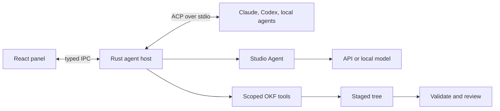

# Decision

One [Agent Panel](../features/agent-panel.md) hosts two boundaries: external agent processes over Agent Client Protocol (ACP), and a native Studio Agent backed by API or local model providers.

Rust owns processes, network, credentials, filesystem mediation, persistence, and validation. The webview renders typed state. This extends [IPC and Security](ipc-and-security.md), never direct webview filesystem/provider access.

# Boundaries

ACP standardizes capability negotiation, agent-owned auth, sessions, streaming, tools, permission requests, diffs, filesystem requests, cancellation, and optional restore. It avoids separate Claude and Codex clients.

ACP does not replace an external agent's system prompt. The native Studio Agent guarantees the packaged [OKF skill](../../.agents/skills/okf/SKILL.md), system prompt, scoped tools, validation, and staged writes. External agents receive bundle cwd, explicit resources, client permissions, and Studio OKF tools over MCP where supported.

# Components

| Component | Responsibility |
| --- | --- |
| Catalog and installer | Registry/custom metadata, pinned cache, app-scoped runtime, install/update/remove |
| ACP host | Process, transport, initialize, auth, sessions, cancellation, diagnostics, shutdown |
| Studio Agent | Provider adapter, system prompt, tool loop, compaction |
| Context service | Bundle inventory, attachments, source extraction, token budget |
| Permission service | Built-in denials, path normalization, once/thread/persistent grants |
| Change service | Staged tree, validation, diffs, atomic apply, checkpoint/restore |
| OKF tools | Read, search, traverse, propose, validate, provenance |

# Security and credentials

External agents own credentials. Studio invokes ACP-advertised methods and does not persist subscription secrets. Studio Agent API keys live in the OS credential store; settings retain only provider metadata and credential references. Secrets are redacted before diagnostics and never returned to the webview after entry.

Opening remains read-only. Client filesystem methods canonicalize paths and reject traversal, symlink escape, and access outside granted roots. Studio writes target a staged tree, validate, then apply atomically after review.

An external process may bypass client filesystem methods. Client checks do not sandbox it. Until platform enforcement exists, external write mode remains interactive and carries a containment warning. Unattended writes require enforcement.

Permission precedence is: non-overridable security rules, deny, confirm, allow, thread grant, tool default, global default. Writes outside roots, Git metadata, credentials, and packaged instructions are built-in denials.

# Installation, persistence, and network

Registry membership is not a sandbox. Studio shows publisher, repository, license, exact version, distribution, and runtime before install. Binary archives require verified digests. `npx` agents use an isolated app-managed Node runtime/cache. Installation never starts the agent.

UI/provider settings use the existing store; credentials use the OS credential store; thread/change metadata uses a Rust-owned local store selected during implementation. Local bundle reading remains network-free. Network begins only after an explicit install, auth, remote provider prompt, URL attachment, or update action.

# IPC

Commands cover list/install/connect/authenticate/session/prompt/cancel/permission/context/review/apply/restore. Events carry install progress, connection state, session updates, permission requests, and change sets. Stable IDs let the frontend accept late cancellation updates without reopening completed requests.

