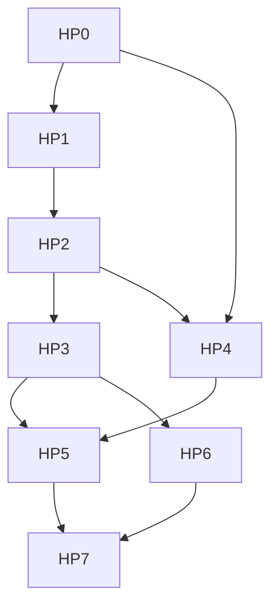

# Outcome

A user asks one bundle-sized question and Studio answers it without the user decomposing it by hand. Studio computes the slices, runs them in parallel against the capability each needs, holds the whole job inside a budget the user saw before it started, and assembles one reviewable result whose every part names the slice and revision it came from.

The measure of success is not that Studio can fan out. It is that a fanned-out job costs less and finishes sooner than the same work done as one long thread, at equal or better quality, on every provider the user might connect.

# Product stance

- Studio is a control plane over harnesses it does not own. It competes on decomposition, budget, provenance, and review, not on having a better model loop.
- Decomposition is deterministic. `okf-core` already knows the bundle, so a delegate is given its context rather than sent to look for it.
- Reading fans out. Writing stays single-threaded through the staged tree, and Apply stays a human control.
- A run without a declared budget does not start, and a fan-out reports what it spent.
- Studio never presents an external agent's internal subagents as managed state. The protocol does not expose them.
- Every claim of efficiency is a measured number from the frozen benchmark suite, not an argument.

# Current baseline

The [specialization roadmap](agent-specialization-roadmap.md) delivered the layer this one builds on: narrow capability packs with declared tools and completion checks, validated artifacts bound to a bundle fingerprint, deterministic verification with an isolated critic, the granted-bundle federation path, reviewed staging, and a frozen benchmark suite with machine-scored fixtures.

What is missing is above it. Threads run in parallel only because a user opened them, nothing computes a slice, no run carries a budget, and cost is not aggregated across a job. The [harness research](../reference/agent-harness-research.md) and [Agent Orchestration](../architecture/agent-orchestration.md) set the contract these packages implement.

# Work packages

Each package ends in a focused commit or short reviewable series, and is complete only when code, product bundle, site copy, fixtures, and the automated checks agree.

## HP0: Runtime determinism and the measured baseline

- [x] Give the agent host typed milestone receipts for turn quiescence, artifact validation, and staged-tree settling.
- [x] Route every agent host event out through one bus that stamps a host-wide monotonic sequence and reports a lost or unserializable send instead of discarding it.
- [ ] Derive turn liveness for delegated runs as well as ACP turns. Today it is derived from the turn event stream, which covers every path that publishes turn events and nothing else.
- [x] Decode the envelope at the webview boundary, report a malformed payload or a sequence gap as a named diagnostic a test can assert on, and expose a milestone wait.
- [x] Publish the same milestones from the browser mock, from the same classification, so a test waits on the signal the app actually uses.
- [x] Remove sleep-based synchronization from the test lanes. The suite now contains none.
- [x] Convert the turn-shaped `waitFor` timeouts in the agent journeys to milestone waits. The waits that remain are condition waits on non-turn state (a resumed composer, a focus move), which is what a condition wait is for.
- [ ] Hold new clients behind a readiness gate so no surface renders partial host state. Deferred until a partial-state window is demonstrated: Tauri completes `setup` before the window loads, so the gate currently has no symptom to fix and would be structure without a reason.
- [ ] **Owner action.** Record the current single-thread cost, token, latency, and quality numbers as the before figure. The benchmark harness validates contracts and stores reports; it does not run providers, and producing real numbers needs configured provider credentials and the spend that comes with them. Nothing else in this roadmap can be honestly measured against an invented baseline, so this blocks the efficiency claim in HP7 rather than the packages in between.

Gate: the agent lanes contain no sleep-based synchronization, two consecutive shuffled runs produce identical deterministic scores, and the baseline report is retained locally with app version, capability versions, and provider-reported model.

## HP1: Deterministic slices

- [x] Add a Rust slice service that computes a bounded work set from the parsed bundle by folder, type, tag, or link neighbourhood. Source and health-finding decomposition wait for the run contract, which is where a finding gets an owner.
- [ ] Add the bundle grant ID to slice identity. The plan carries the fingerprint and bundle-relative concept ids today; the grant ID belongs at the IPC boundary, where grants live, rather than in `okf-core`.
- [x] Cap slice count and slice size, and name what each cap excluded rather than truncating silently. A concept that carries nothing to slice by is reported too, because a bundle full of those is a finding about the bundle.
- [x] Scale the width to the job rather than fixing it. A decomposition that yields one group plans one slice, and nothing pads a plan out to a target width.
- [x] Expose the plan over IPC as a read-only preview that starts nothing: how many runs, which concepts each covers, and what each cap excluded. Projected cost joins it in HP4, where cost gets a source.
- [x] Recompute nothing implicitly. A plan carries the fingerprint it was computed against.

Gate: the same bundle and the same decomposition request produce byte-identical slices across runs, and a bundle change invalidates them by the existing staleness rule.

## HP2: One delegated run

- [ ] Define a run as slice, capability, budget, artifact contract, and provenance, resolved before a model is contacted.
- [ ] Enforce depth one. A run cannot start another run.
- [ ] Deny staging, apply, and restore to every run, and carry the producing session, capability digest, and slice fingerprint with its result.
- [ ] Return one validated artifact or a bounded summary, never a transcript for another model to read.
- [ ] Support a run on the native Studio Agent and on an ACP session Studio created, with the same contract on both paths.

Gate: a fake native model and a fake ACP agent execute the identical run contract, and a run that attempts a write is refused with the existing staging error rather than a new one.

## HP3: Fan-out and assembly

- [ ] Run slices concurrently under a bounded width, with cancellation that stops pending runs and lets in-flight runs finish or abort cleanly.
- [ ] Assemble results into one artifact whose every item names its slice, run, and fingerprint.
- [ ] Exclude stale results from the assembly and report them as excluded, rather than mixing generations.
- [ ] Complete a fan-out with partial results when some runs fail, naming each failure.
- [ ] Emit a quiescence receipt when the whole job settles.

Gate: a fan-out over a fixture bundle with an induced mid-job bundle change produces an assembly that names the excluded stale runs, and the same fixture without a change produces a stable assembly across two runs.

## HP4: Budgets and honest cost

- [ ] Ingest the ACP usage update, and use the native provider's own accounting where there is no ACP counterpart.
- [ ] Enforce a per-run and a per-job ceiling, stop cleanly at the ceiling, and keep what completed.
- [ ] Show projected cost before a job starts and actual cost during and after it.
- [ ] Mark cost unavailable where the provider reports none, and never estimate it into a number that looks measured.

Gate: a provider that reports no usage produces a job that runs to completion with cost marked unavailable, and a ceiling reached mid-job stops the job without discarding completed runs.

## HP5: The orchestration surface

- [ ] Show a job as visible rows: slice, capability, budget, consumption, artifact, outcome.
- [ ] Let the user approve, narrow, or cancel a job from its preview, and cancel a run from its row.
- [ ] Keep the job surface inside the existing panel layout and its 360, 440, and 560 pixel fixtures, with the shared focus ring and control floor.
- [ ] Label an external agent's own tool activity as that agent's, never as Studio-managed runs.
- [ ] Cover ready, previewing, running, partial, stopped-at-budget, stale, and failed states in Storybook with interaction checks.

Gate: the story lane passes the visual-consistency assertions, and a user reading only the surface can say what each run was asked and what it returned.

## HP6: Verification over assembled work

- [ ] Run the deterministic pass over the assembly, not only over individual run artifacts, and report coverage gaps between the slice set and the assembled items.
- [ ] Require the critic to complete its declared checks before reporting a result, closing the early-victory failure mode named in the research.
- [ ] Keep the separation intact: an assembly cannot be approved by a model, and a critic cannot clear a deterministic block.

Gate: a fixture whose assembly omits a slice is reported as an incomplete assembly by the deterministic pass alone, with the critic disabled.

## HP7: Prove the efficiency

- [ ] Extend the frozen benchmark suite with bundle-sized tasks that a single thread can only sample.
- [ ] Score each task single-threaded and fanned out on the same providers, measuring cost, tokens, latency, completion, invalid claims, and validator outcome.
- [ ] Publish the comparison in the product bundle and the site only where the numbers support it, and record where fan-out lost.
- [ ] Repeat across providers to show whether the orchestration gain holds regardless of model, as the published study reports for its own harness.

Gate: the suite produces a defensible before-and-after per provider, and any efficiency claim in the site copy traces to a retained local report.

# Dependency order

HP0 is first because everything after it is asynchronous work that has to be tested without timeouts, and because the before figure cannot be recovered once the orchestration exists.

# Deferred decisions

- Unattended fan-out on a schedule waits for the automation contract deferred in the [specialization roadmap](agent-specialization-roadmap.md).
- Cross-provider jobs, where different runs in one fan-out use different agents, wait until per-provider cost reporting is proven comparable.
- A compression model for long histories, as the single-threaded literature recommends, waits until a measured context ceiling rather than an anticipated one.
- Managing an external agent's own subagents is not planned. The protocol exposes no sub-session, and a surface for state Studio cannot observe would be a fiction.
- Branch-per-thread and per-turn repository checkpoints are not planned. Staged OKF revisions remain the change model, and Git remains optional.
