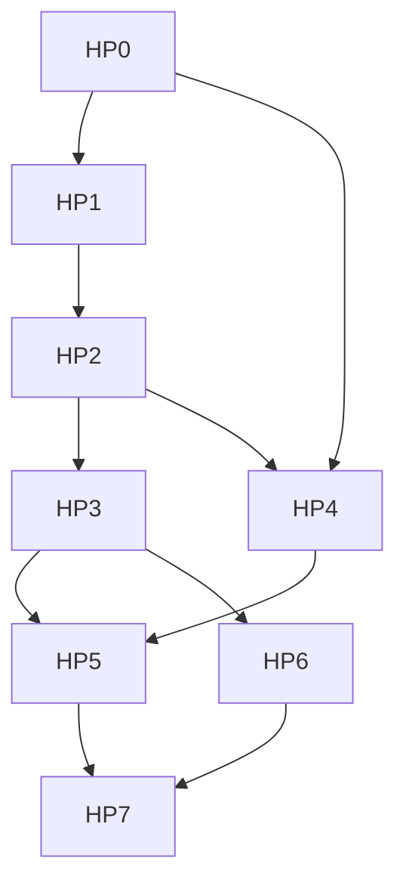

# Outcome

A user asks one bundle-sized question and Studio answers it without the user decomposing it by hand. Studio computes the slices and runs them in parallel against the capability each needs. It holds the whole job inside a budget the user saw before it started. It assembles one reviewable result, and every part of that result names the slice and revision it came from.

Success means a fanned-out job costs less and finishes sooner than the same work done as one long thread. The comparison holds at equal or better quality, on every provider the user might connect.

# Product stance

- Studio is a control plane over harnesses it does not own. It competes on decomposition, budget, provenance, and review, not on having a better model loop.
- Decomposition is deterministic. `okf-core` already knows the bundle, so Studio hands a delegate its context rather than sending the delegate to look for it.
- Reading fans out. Writing stays single-threaded through the staged tree, and Apply stays a human control.
- A run without a declared budget does not start, and a fan-out reports what it spent.
- Studio never presents an external agent's internal subagents as managed state. The protocol does not expose them.
- Every claim of efficiency is a measured number from the frozen benchmark suite, not an argument.

# Current baseline

The [specialization roadmap](agent-specialization-roadmap.md) delivered the layer this one builds on. That layer holds narrow capability packs with declared tools and completion checks. It holds validated artifacts bound to a bundle fingerprint, and deterministic verification with an isolated critic. It also holds the granted-bundle federation path, reviewed staging, and a frozen benchmark suite with machine-scored fixtures.

What is missing sits above it. Threads run in parallel only because a user opened them. Nothing computes a slice, no run carries a budget, and no job adds up cost across its runs. The [harness research](../reference/agent-harness-research.md) and [Agent Orchestration](../architecture/agent-orchestration.md) set the contract these packages implement.

# Work packages

Each package ends in a focused commit or short reviewable series. A package is complete only when code, product bundle, site copy, fixtures, and the automated checks agree.

## HP0: Runtime determinism and the measured baseline

- [x] Give the agent host typed milestone receipts for turn quiescence, artifact validation, and staged-tree settling.
- [x] Route every agent host event out through one bus. The bus stamps a host-wide monotonic sequence and reports a lost or unserializable send instead of discarding it.
- [ ] Derive turn liveness for delegated runs as well as ACP turns. Today the host derives it from the turn event stream, which covers every path that publishes turn events and nothing else.
- [x] Decode the envelope at the webview boundary. Report a malformed payload or a sequence gap as a named diagnostic a test can assert on, and expose a milestone wait.
- [x] Publish the same milestones from the browser mock, from the same classification, so a test waits on the signal the app actually uses.
- [x] Remove sleep-based synchronization from the test lanes. The suite now contains none.
- [x] Convert the turn-shaped `waitFor` timeouts in the agent journeys to milestone waits. The waits that remain are condition waits on non-turn state (a resumed composer, a focus move), which is what a condition wait is for.
- [ ] Hold new clients behind a readiness gate so no surface renders partial host state. Deferred until someone shows a partial-state window. Tauri completes `setup` before the window loads, so the gate has no symptom to fix and would be structure without a reason.
- [ ] **Owner action.** Record the current single-thread cost, token, latency, and quality numbers as the before figure. The benchmark harness validates contracts and stores reports. It does not run providers, and real numbers need configured provider credentials and the spend that comes with them. No other package in this roadmap can claim a measured gain against an invented baseline. So this blocks the efficiency claim in HP7 rather than the packages in between.

Gate: the agent lanes contain no sleep-based synchronization, and two consecutive shuffled runs produce identical deterministic scores. The baseline report stays on the local machine with app version, capability versions, and provider-reported model.

## HP1: Deterministic slices

- [x] Add a Rust slice service that computes a bounded work set from the parsed bundle by folder, type, tag, or link neighbourhood. Source and health-finding decomposition wait for the run contract, which is where a finding gets an owner.
- [ ] Add the bundle grant ID to slice identity. The plan carries the fingerprint and bundle-relative concept ids today. The grant ID belongs at the IPC boundary, where grants live, rather than in `okf-core`.
- [x] Cap slice count and slice size, and name what each cap excluded rather than truncating silently. The plan also names a concept that carries nothing to slice by, because a bundle full of those is a finding about the bundle.
- [x] Scale the width to the job rather than fixing it. A decomposition that yields one group plans one slice, and nothing pads a plan out to a target width.
- [x] Expose the plan over IPC as a read-only preview that starts nothing: how many runs, which concepts each covers, and what each cap excluded. Projected cost joins it in HP4, where cost gets a source.
- [x] Recompute nothing implicitly. A plan carries the fingerprint the planner computed it against.

Gate: the same bundle and the same decomposition request produce byte-identical slices across runs, and a bundle change invalidates them by the existing staleness rule.

## HP2: One delegated run

- [x] Define a run as slice, capability, budget, artifact contract, and provenance. Studio resolves all five before it contacts a model. Resolution starts nothing. It answers whether a run may exist.
- [x] Enforce depth one. A run cannot start another run.
- [x] Deny writing to every run, at resolution rather than at runtime. Resolution refuses a stage-class capability. It also refuses any capability whose declared tools include a staging tool, which the class check alone would pass. Provenance carries the capability version, its digest, and the slice fingerprint.
- [x] Execute a resolved run against a provider on an isolated session that carries no write grant, and validate what comes back. A turn that finishes without a usable artifact is its own outcome rather than a failure.
- [x] Support execution on the native Studio Agent and on an ACP session Studio created, with the same contract on both paths. Unlike the isolated critic, a run does not require the native provider. A critic only reads a packet Rust prepared, while a run is real work. Restricting it would make fan-out a property of which agent you connected.

Gate: a fake native model and a fake ACP agent execute the identical run contract. A run that attempts a write hits the existing staging error rather than a new one.

## HP3: Fan-out and assembly

- [x] Run every slice and assemble the result, with cancellation that stops pending runs and leaves in-flight ones alone.
- [ ] Run slices concurrently rather than in sequence. Needs one session per concurrent run, and no test yet shows that safe under permission prompts and cancellation.
- [x] Assemble results into one result. Every included run names its slice and fingerprint, and the assembly carries its own completeness rather than leaving each surface to derive it.
- [x] Exclude stale results and report them as excluded, rather than mixing generations.
- [x] Complete with partial results when runs fail. Name each failure, separate a failure from a run that stopped at its ceiling, and name a planned slice that never reported at all.
- [ ] Emit a quiescence receipt when the whole job settles. The milestone channel from HP0 carries it. The fan-out that would publish it does not exist yet.

Gate: a fan-out over a fixture bundle with an induced mid-job bundle change produces an assembly that names the excluded stale runs. The same fixture without a change produces a stable assembly across two runs.

## HP4: Budgets and honest cost

- [x] Fold usage reports into a spend figure. Take the maximum of cumulative totals rather than summing them, add cost across runs, and carry the largest context any single run reached.
- [x] Decide whether a run hit a ceiling, naming which one. Stopping a live run at that decision waits on run execution in HP2.
- [ ] Show projected cost before a job starts and actual cost during and after it.
- [x] Mark spend unavailable where the provider reports none, and treat "we cannot check" as a different answer from "we checked and it is fine". The ledger drops nonsense values rather than recording them.

Gate: a provider that reports no usage produces a job that runs to completion with cost marked unavailable. A ceiling reached mid-job stops the job without discarding completed runs.

## HP5: The orchestration surface

- [x] Show the plan before anything runs, reachable from the launcher with no agent connected, because planning reads the parsed bundle and needs neither. Each run is a row with its name, a bar, and its concept count. "Not covered" names the caps and the skipped concepts. The plan states the fingerprint the planner computed it against.
- [x] Show a running job in the plan rows. Each run reports waiting, running, and its outcome as the job proceeds, and the assembly states coverage against the plan when it finishes.
- [ ] Show live consumption per run. The ledger exists. Nothing feeds it usage during a run yet.
- [x] Let the user start a job from its preview. Without a connected agent, Studio disables the run control and says why.
- [ ] Cancel a job from the surface. The runner accepts an abort signal. No control sends one yet.
- [ ] Keep the job surface inside the existing panel layout and its 360, 440, and 560 pixel fixtures, with the shared focus ring and control floor.
- [ ] Label an external agent's own tool activity as that agent's, never as Studio-managed runs.
- [x] Cover the preview states in Storybook with interaction checks: each decomposition, switching between them, and no bundle open. Running, partial, stopped-at-budget, and failed wait on execution.

Gate: the story lane passes the visual-consistency assertions. A user who reads only the surface can say what Studio asked each run and what the run returned.

## HP6: Verification over assembled work

- [x] Report coverage against the plan rather than against whoever answered, so the report names a slice that never reported. This lives in the assembly, since that is where the plan and the results meet.
- [x] Require the critic to complete its declared checks. The code already enforces this. It rejects a report that omits a required category. An unavailable check makes the outcome inconclusive rather than clean, and the report must name it as a limitation. The rules existed without tests, so the tests are the change.
- [x] Keep the separation intact. No model can approve an assembly, and no critic can clear a deterministic block. The existing blocking test covers both.

Gate: the deterministic pass alone, with the critic disabled, reports a fixture whose assembly omits a slice as an incomplete assembly.

## HP7: Prove the efficiency

- [ ] Extend the frozen benchmark suite with bundle-sized tasks that a single thread can only sample.
- [ ] Score each task single-threaded and fanned out on the same providers, measuring cost, tokens, latency, completion, invalid claims, and validator outcome.
- [ ] Publish the comparison in the product bundle and the site only where the numbers support it, and record where fan-out lost.
- [ ] Repeat across providers to show whether the orchestration gain holds regardless of model, as the published study reports for its own harness.

Gate: the suite produces a defensible before-and-after per provider, and any efficiency claim in the site copy traces to a retained local report.

# Dependency order

HP0 comes first for two reasons. Everything after it is asynchronous work the suite has to test without timeouts. And once the orchestration exists, nobody can recover the before figure.

# Deferred decisions

- Unattended fan-out on a schedule waits for the automation contract deferred in the [specialization roadmap](agent-specialization-roadmap.md).
- Cross-provider jobs, where different runs in one fan-out use different agents, wait until per-provider cost reporting is proven comparable.
- A compression model for long histories, as the single-threaded literature recommends, waits until a measured context ceiling rather than an anticipated one.
- Studio will not manage an external agent's own subagents. The protocol exposes no sub-session, and a surface for state Studio cannot observe would be a fiction.
- Studio will not add branch-per-thread or per-turn repository checkpoints. Staged OKF revisions remain the change model, and Git remains optional.
