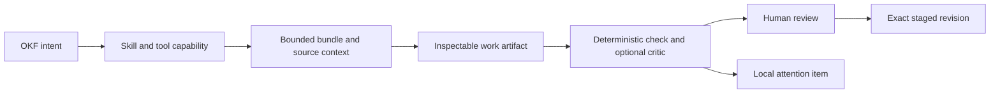
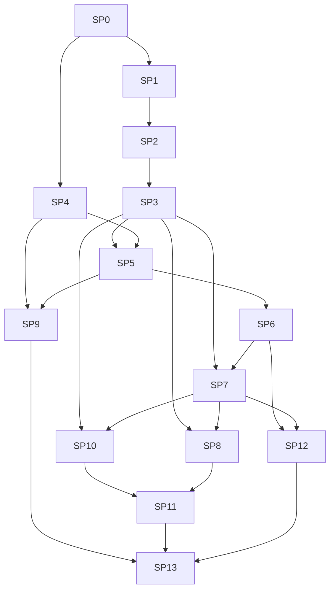

# Outcome

OKF Studio should feel to knowledge work the way a specialized development agent feels to Git and GitHub. The user starts from a bundle, concept, source, validation issue, or recurring knowledge task. Studio assembles the relevant OKF capability, context, tools, and review surface. The connected agent remains replaceable.

The transformation is successful when common OKF work begins from named domain actions, produces structured inspectable artifacts, uses the minimum relevant context, and reaches a deterministic validation or review gate without the user restating the OKF method in every prompt.

# Product stance

- The bundle is the authority for knowledge. Local memory and session history are aids, not hidden facts.
- Domain specialization belongs to Studio capabilities and open skill resources, not provider-specific panel branches.
- Deterministic parsing, identity, provenance, policy, and validation stay in Rust. Agents reason over the bounded results.
- A user action may prefill or schedule work. It does not silently authenticate, fetch, prompt, grant, write, or apply.
- Structured work surfaces complement the transcript. They do not hide agent actions or replace review.
- The built-in suite comes first. Imported capability packs remain non-executable until their trust and update model is proven.

# Current baseline

The completed [Studio transformation](studio-roadmap.md) already provides external ACP and native agent paths, packaged OKF guidance, bounded OKF MCP tools, explicit context attachments, source ingestion, parallel threads, reviewed staging, validation, checkpoints, and restricted offline execution. The [specialized-agent research](../reference/specialized-agent-systems.md) identifies the missing layer above that foundation.

# Second-pass review

The architecture, UX, security, and dependency review found seven gaps in the first pass and later dogfood pass, then changed the package contract:

| Gap | Resolution |
| --- | --- |
| Work stopped at one active bundle | Add a read-only, grant-based federation package with stable bundle and concept identity |
| Structured artifacts lacked a common lifecycle | Require schema version, bundle fingerprint, source references, producing turn, validation state, and stale-state rules |
| External agents could appear to have loaded a capability without proof | Record delivery separately from agent use; never claim compliance only because context was sent |
| Generic chat received the shared kernel but could miss the narrow methods | Expose the complete active catalog and a read-only, digest-bound resource loader while keeping detailed methods progressive |
| Automation did not define sleep, missed schedules, overlap, or offline behavior | Add a Rust-owned run ledger, one-run-at-a-time policy, explicit catch-up choice, and fail-closed scope revalidation |
| Benchmark goals were qualitative | Add frozen fixtures, machine-scored safety and structure checks, repeated-run stability, and locally retained reports |
| The UX packages did not share a journey contract | Define one task launcher and artifact lifecycle across first use, object actions, stale work, provider limits, and narrow layouts |

The second pass also rejects a false analogy. GitHub can isolate code tasks with branches and worktrees because Git owns the change model. Studio must continue to use staged OKF revisions and checkpoints. A bundle does not need to be a Git repository, and specialization cannot make Git a prerequisite.

# Cross-cutting contracts

Identity
: A domain object is addressed by a Rust-issued bundle grant ID, bundle fingerprint, object kind, and bundle-relative object ID. Cross-bundle results always retain the bundle ID. Paths supplied by the webview, model, deep link, or CLI are never authority.

Capability evidence
: Studio records capability selection, resource delivery, tool availability, and observed tool use as separate facts. An external agent may ignore delivered guidance. The UI and benchmark report must preserve that distinction.

Artifact lifecycle
: Every structured artifact has a schema version, producing task and turn, input manifest, bundle fingerprint, validation state, and stale reason. A new bundle revision never silently updates an old artifact.

Risk classes
: Read, analyze, fetch, stage, and apply remain distinct. Task and skill declarations can request only read, analyze, fetch, or stage. Apply has no agent-callable capability.

Local records
: Benchmark reports, memory, routine ledgers, and attention items stay in app data with bounded retention and user deletion. They are not telemetry and are never uploaded by Studio.

Provider support
: A task is fully supported, degraded, or unavailable based on negotiated capabilities. Degraded tasks name the missing behavior before the first prompt and never simulate it with provider-specific assumptions.

# Work packages

Each package ends in a focused commit or short series of reviewable commits. A package is complete only when code, product bundle, site copy, fixtures, and the relevant automated and rendered checks agree.

## SP0: Benchmark and specialization contract

- [x] Define representative OKF tasks for inspection, creation, enrichment, audit, repair, research, change impact, and migration.
- [x] Record input bundles, allowed tools, expected artifacts, hard safety failures, and scored quality criteria.
- [x] Run the current Studio Agent, Codex ACP, Claude ACP, and one local model where available to establish a baseline. The clean deterministic environment records each unconfigured provider as unavailable instead of inventing a run.
- [x] Measure task completion, invalid claims, context volume, tool calls, validation outcome, time, and model cost when reported.
- [x] Add a fixture corpus containing conformant, thin, disconnected, stale, contradictory, malformed, and generated large-bundle cases.
- [x] Freeze deterministic fixture fingerprints and machine-score artifact shape, path identity, citations, safety violations, and validator results before using rubric-based model judgment.
- [x] Retain benchmark reports locally with app version, capability versions, provider-reported model, and explicit unavailable cases; send no evaluation data to Studio infrastructure.

Gate: the suite can distinguish a fluent answer from correct OKF work, produces the same deterministic scores in two consecutive shuffled runs, and runs without network access except for explicitly remote research cases.

## SP1: Versioned OKF capability kernel

- [x] Replace the hard-coded single-skill catalog with a typed manifest containing capability ID, version, description, resources, required Studio tools, artifact kinds, and risk class.
- [x] Compile built-in resources from one canonical repository location and verify their digest at build time.
- [x] Expose the bounded capability catalog to Studio Agent through progressive loading and to external ACP agents through compatible resource context.
- [x] Give generic native and ACP chat the complete active catalog and a closed loader for one narrow method without preloading every workflow.
- [x] Record which capabilities and resource versions were attached to each accepted turn without copying their full text into the transcript.
- [x] Reject unknown resources, undeclared tools, duplicate IDs, invalid versions, and packs above the bounded size limit.
- [x] Model capability support as selected, delivered, tool-observed, degraded, or unavailable instead of treating prompt attachment as proof of use.
- [x] Version manifest and resource schemas independently so a content update does not require an IPC contract change.

Gate: a fake native model and fake ACP agent receive the same selected OKF capability resources, while agents without rich resource support receive a bounded text fallback.

## SP2: Curated OKF skill suite

- [x] Split the general OKF instructions into narrow skills for inspect, create, enrich, audit, repair, cited research, change impact, and specification migration.
- [x] Give every skill trigger guidance, required inputs, ordered method, artifact contract, stop conditions, and completion checks.
- [x] Keep shared specification and templates in deduplicated resources referenced by the skills.
- [x] Add worked examples and adversarial examples for incomplete evidence, conflicting facts, missing citations, broad rewrites, and unsafe destination requests.
- [x] Let the user inspect the exact built-in skill version and resources from Studio settings.
- [x] Give every skill a benchmark task set and an owner-visible changelog so instruction edits are evaluated like tool changes.
- [x] Keep task method in skills and invariant trust rules in the native system boundary; a disabled or outdated skill cannot remove the safety contract.

Gate: benchmark tasks select no more than the required skill set, and disabling a skill removes its task entry points without weakening the base safety boundary.

## SP3: OKF task router and context plan

- [x] Replace prompt-prefix workflow detection with stable task IDs and typed kickoff payloads.
- [x] Derive a visible context plan from the task, active concept, graph neighborhood, validation state, selected evidence, and user attachments.
- [x] Show the planned skills, bundle objects, sources, and tool scope before the first prompt; let the user remove optional context.
- [x] Keep task selection deterministic for explicit actions. Model-suggested task changes require confirmation when they alter tools, network, or write scope.
- [x] Let ordinary chat select a narrow method from the same catalog while reserving deterministic task identity and accepted context scope for the visible launcher.
- [x] Persist task identity and the accepted context manifest with the agent-owned session pointer so restore can explain what was used.
- [x] Budget context by bytes and estimated tokens, prefer metadata before bodies, and explain every truncation or omitted object before send.
- [x] Bind the accepted plan to one bundle fingerprint and require a refreshed preview when live reload changes any planned object.

Gate: the same explicit task produces the same bounded context plan from the same bundle revision, independent of provider.

## SP4: Knowledge health engine

- [x] Add deterministic health categories for conformance, graph connectivity, navigation, provenance, freshness signals, duplication, and coverage hints.
- [x] Keep tolerant consumption intact. Health findings guide work and never make a readable bundle fail to open.
- [x] Add bounded Rust tools for health summary, finding detail, affected concepts, and suggested deterministic repairs.
- [x] Track every finding against a bundle fingerprint so live reload can resolve, retain, or invalidate it without stale UI.
- [x] Separate facts from heuristics and show why each finding exists.
- [x] Give each rule a stable ID, version, severity class, evidence fields, repairability class, and suppression fingerprint.
- [x] Bound the initial engine for 10,000 concepts and 50,000 links, move expensive analysis off the UI thread, and cancel obsolete work after live reload.

Gate: the fixture corpus produces stable findings with no model call, no network request, and no false claim that a heuristic is an OKF conformance error.

## SP5: Structured OKF work surfaces

- [x] Define typed artifacts for source inventory, bundle plan, health report, research brief, change-impact map, migration plan, and staged revision.
- [x] Validate artifact identities, bounds, citations, concept paths, source references, and revision links in Rust before rendering them as trusted structure.
- [x] Put current artifacts beside the graph and reader with bidirectional concept selection; keep transcript chronology and raw agent prose separate.
- [x] Let users correct editable planning fields directly and send the revision back as explicit context.
- [x] Export artifacts as conformant Markdown concepts only through reviewed staging when they belong in the bundle.
- [x] Apply the common artifact lifecycle contract and retain invalid agent output as labelled prose with a recovery action instead of dropping it or rendering it as structured work.
- [x] Keep artifact edits local until the user explicitly sends them; show the sent revision and reject late agent updates for an older artifact revision.

Gate: every artifact has loading, empty, partial, invalid, stale, and large states in Storybook and passes keyboard, focus, overflow, and narrow-width checks.

## SP6: Native OKF entry points

- [x] Add context actions from a concept, graph selection, validation finding, citation, search result, and source tray.
- [x] Offer only tasks that fit the selected object and current agent capabilities.
- [x] Use one task launcher that previews the context plan instead of scattering prompt templates across components.
- [x] Add command-palette actions and keyboard paths for the same task IDs.
- [x] Preserve the user's current workspace and return focus to the originating object when the task is cancelled.
- [x] Use the same launcher states for first use, authentication, unsupported capability, stale plan, context overflow, and active-thread conflict.
- [x] Isolate launcher and artifact states in Storybook through its MCP surface before whole-panel integration screening.

Gate: a user can start an audit, repair, cited explanation, change-impact check, or enrichment from the object in question without manually naming its path in chat.

## SP7: Granted bundle library and federation

- [x] Introduce opaque Rust-owned bundle IDs for current and recent granted bundles without changing OKF concept IDs on disk.
- [x] Add read-only federated inventory, search, type, tag, source, and relationship-candidate queries across an explicit selected bundle set.
- [x] Return every result with bundle ID, bundle title, concept ID, revision fingerprint, and grant state; never merge namespaces by title or path alone.
- [x] Let users inspect and remove the bundle set before a federated task starts. Revoked, missing, or changed bundles become visible partial results.
- [x] Keep writes single-destination. A cross-bundle finding must choose one active destination and attach other bundles as read-only evidence.
- [x] Detect possible duplicate concepts and unlinked relationships as heuristic candidates that require review before any proposal.

Gate: two bundles may contain the same concept path and title without identity collision, and revoking either grant removes its results and context without affecting the other.

## SP8: Source adapters and producer workflows

- [x] Define a typed source-adapter contract for discovery, inventory, extraction, provenance, and refresh fingerprints.
- [x] Refactor the existing text, Markdown, HTML, PDF, CSV, JSON, image, folder, and URL paths behind that contract.
- [x] Add high-value structured adapters for OpenAPI, dbt manifests, and BigQuery metadata exports before live authenticated connectors.
- [x] Make every adapter produce a visible source inventory and deterministic provenance before an agent proposes concepts.
- [x] Keep live cloud connectors deferred until credentials, least-privilege scopes, pagination, cost, and offline behavior are specified per provider.
- [x] Version normalized evidence and adapter contracts, preserve partial-success diagnostics, and bind refresh comparison to the original adapter plus source fingerprint.
- [x] Treat adapter output as untrusted evidence and keep embedded instructions inert across every media type.

Gate: two adapters with equivalent source material produce stable normalized evidence and provenance, and malformed or partial exports fail with actionable recovery.

## SP9: Verification and critic passes

- [x] Run deterministic checks after each artifact or staged-revision update and before any optional model critique.
- [x] Add a read-only OKF critic role with a separate bounded context for coverage, contradictions, unsupported claims, and missed relationships.
- [x] Prevent the critic from editing, approving, applying, expanding scope, or treating its own inference as evidence.
- [x] Compare the critic result with deterministic findings and show agreements, disagreements, and unverified questions.
- [x] Feed benchmark regressions into CI with model-free contract tests and an opt-in provider evaluation job.
- [x] Require claim-level references from critic findings to artifact fields, concept IDs, or source IDs and reject unresolvable references from the structured result.
- [x] Record provider and capability limitations beside the critic result so an absent check never appears as a pass.

Gate: the critic catches seeded semantic defects without changing the staged revision, and deterministic failures block completion even when the critic approves.

## SP10: Inspectable workspace memory

- [x] Store bundle-scoped preferences, dismissed finding fingerprints, task records, and routine definitions outside the bundle.
- [x] Show origin, owner, last validation, last use, retention, and delete controls for every memory item.
- [x] Revalidate bundle-related hints against the current fingerprint before attaching them.
- [x] Never turn an agent statement into memory without an explicit user action or deterministic Studio observation.
- [x] Keep authored facts, citations, staged files, credentials, prompt bodies, and response bodies out of memory.
- [x] Use a versioned local schema, per-kind retention limits, bounded counts, and corruption quarantine that cannot block opening a bundle.
- [x] Show the exact context-plan effect of each memory item before the user accepts an agent-suggested preference.

Gate: deleting memory changes future context plans but cannot change the bundle or break session restoration.

## SP11: Local routines and attention inbox

- [x] Save named manual or scheduled routines with explicit bundle, task, agent, model, tool, network, source, and staging scope.
- [x] Start with deterministic health rescans and source-fingerprint checks that work without an agent.
- [x] Keep agent-backed routines unavailable until the user can select a live-capable profile and review an execution-time-verifiable effective scope and stop conditions.
- [x] Collect results in a local attention inbox with reason, age, bundle, and next action; keep notification text content-free.
- [x] Stop all routine work on grant revocation, bundle removal, profile failure, timeout, or application exit.
- [x] Persist a Rust-owned run ledger with scheduled time, actual start, scope fingerprint, outcome, and recovery state; never infer success from a missing process.
- [x] Serialize runs per bundle and routine, prevent overlap, and make missed-run catch-up an explicit per-routine choice after sleep or application downtime.
- [x] Revalidate bundle grants, agent, model, tool set, network mode, staging mode, and source fingerprints at execution time rather than trusting the saved definition.

Gate: a scheduled routine cannot fetch, prompt, or stage beyond its saved scope, and no routine can apply a bundle change.

## SP12: OS and agent ecosystem wiring

- [x] Add a guarded `okf-studio://` scheme for opening a bundle, selecting a concept, and prefilling a named task.
- [x] Add a CLI for open, inspect, validate, and visible task kickoff using the same typed payloads.
- [x] Require a Rust-owned existing grant or a native confirmation dialog before an external path becomes active.
- [x] Productize the bounded OKF MCP server for other local agents through an explicit one-shot grant handshake.
- [x] Add platform entry points only where the installer can remove them cleanly and the operating system preserves user intent.
- [x] Separate parse and confirmation from execution so a visible preview shows the decoded target, task, attachments, and omitted unsupported fields.
- [x] Rate-limit duplicate launches, cap payloads before allocation, and keep untrusted prompt text inert until the user submits it.

Gate: hostile deep links, shell arguments, encoded traversal, stale grants, and duplicate launches cannot start an agent or broaden filesystem access.

## SP13: Capability packs and completion

- [x] Define an inspectable, versioned pack containing declarative skills, templates, artifact schemas, and required Studio tool IDs.
- [x] Ship no imported executable scripts, hooks, binaries, or MCP commands in the first pack format.
- [x] Verify provenance, digest, compatibility, conflicts, updates, removal, and rollback before activation.
- [x] Complete the provider benchmark matrix and the first-use, object-action, federated-search, artifact-review, memory, routine, and OS-entry journeys.
- [x] Update the site, migration notes, security docs, and support boundaries.
- [x] Run app, Rust, Storybook, site, OKF, ODSF, installer, and platform gates.
- [x] Prove upgrade and rollback from the current single-skill system without losing profiles, sessions, staged checkpoints, settings, or bundle grants.

Gate: a new user can open a real bundle, choose a native OKF task from the object they are viewing, inspect the selected capability and context, receive a structured result, verify it, and apply any knowledge change through the existing reviewed transaction.

# Dependency order

# Deferred decisions

- Live authenticated cloud connectors wait for provider-specific credential, permission, pagination, billing, and offline contracts.
- Imported executable skill scripts and third-party MCP servers wait for a separate sandbox and trust design.
- Cross-device memory and routine sync wait for a product decision that preserves the no-account local-first path.
- Always-running background service, tray residency, and wake-from-sleep scheduling wait for measured demand and platform lifecycle designs.
- OS-wide content indexing is not planned. It would copy bundle knowledge into operating-system indexes with different retention and access controls.
- Voice input is an optional composer input, not an OKF specialization dependency.
- Automatic cross-bundle writes are not planned. Federation remains read-only evidence feeding one explicitly selected destination revision.

# Follow-on transformation

This roadmap completed the domain task, context, safety, artifact, and integration foundation. It did not yet define how agents should write or revise the prose inside OKF concepts. [OKF Writing Quality](okf-writing-quality-roadmap.md) plans that follow-on work around reader purpose, evidence-preserving revision, advisory diagnostics, and provider benchmarks based on real writing rather than fluent output alone.
