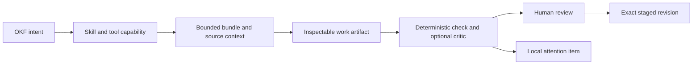
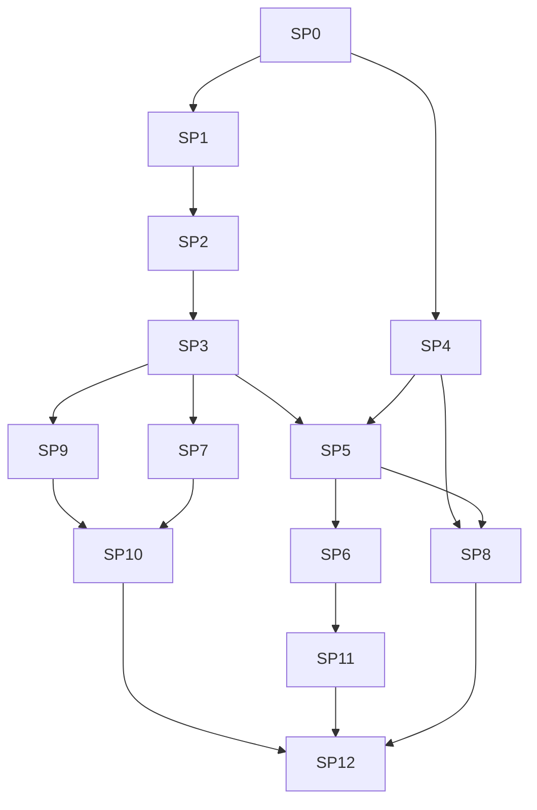

# Outcome

OKF Studio should feel to knowledge work the way a specialized development agent feels to Git and GitHub. The user starts from a bundle, concept, source, validation issue, or recurring knowledge task. Studio assembles the relevant OKF capability, context, tools, and review surface. The connected agent remains replaceable.

The transformation is successful when common OKF work begins from named domain actions, produces structured inspectable artifacts, uses the minimum relevant context, and reaches a deterministic validation or review gate without the user restating the OKF method in every prompt.

# Product stance

- The bundle is the authority for knowledge. Local memory and session history are aids, not hidden facts.
- Domain specialization belongs to Studio capabilities and open skill resources, not provider-specific panel branches.
- Deterministic parsing, identity, provenance, policy, and validation stay in Rust. Agents reason over the bounded results.
- A user action may prefill or schedule work. It does not silently authenticate, fetch, prompt, grant, write, or apply.
- Structured work surfaces complement the transcript. They do not hide agent actions or replace review.
- The built-in suite comes first. Imported capability packs remain non-executable until their trust and update model is proven.

# Current baseline

The completed [Studio transformation](studio-roadmap.md) already provides external ACP and native agent paths, packaged OKF guidance, bounded OKF MCP tools, explicit context attachments, source ingestion, parallel threads, reviewed staging, validation, checkpoints, and restricted offline execution. The [specialized-agent research](../reference/specialized-agent-systems.md) identifies the missing layer above that foundation.

# Work packages

Each package ends in a focused commit or short series of reviewable commits. A package is complete only when code, product bundle, site copy, fixtures, and the relevant automated and rendered checks agree.

## SP0: Benchmark and specialization contract

- [ ] Define representative OKF tasks for inspection, creation, enrichment, audit, repair, research, change impact, and migration.
- [ ] Record input bundles, allowed tools, expected artifacts, hard safety failures, and scored quality criteria.
- [ ] Run the current Studio Agent, Codex ACP, Claude ACP, and one local model where available to establish a baseline.
- [ ] Measure task completion, invalid claims, context volume, tool calls, validation outcome, time, and model cost when reported.
- [ ] Add a fixture corpus containing conformant, thin, disconnected, stale, contradictory, malformed, and large bundles.

Gate: the suite can distinguish a fluent answer from correct OKF work and can run without network access except for the explicitly remote research cases.

## SP1: Versioned OKF capability kernel

- [ ] Replace the hard-coded single-skill catalog with a typed manifest containing capability ID, version, description, resources, required Studio tools, artifact kinds, and risk class.
- [ ] Compile built-in resources from one canonical repository location and verify their digest at build time.
- [ ] Expose the bounded capability catalog to Studio Agent through progressive loading and to external ACP agents through compatible resource context.
- [ ] Record which capabilities and resource versions were attached to each accepted turn without copying their full text into the transcript.
- [ ] Reject unknown resources, undeclared tools, duplicate IDs, invalid versions, and packs above the bounded size limit.

Gate: a fake native model and fake ACP agent receive the same selected OKF capability resources, while agents without rich resource support receive a bounded text fallback.

## SP2: Curated OKF skill suite

- [ ] Split the general OKF instructions into narrow skills for inspect, create, enrich, audit, repair, cited research, change impact, and specification migration.
- [ ] Give every skill trigger guidance, required inputs, ordered method, artifact contract, stop conditions, and completion checks.
- [ ] Keep shared specification and templates in deduplicated resources referenced by the skills.
- [ ] Add worked examples and adversarial examples for incomplete evidence, conflicting facts, missing citations, broad rewrites, and unsafe destination requests.
- [ ] Let the user inspect the exact built-in skill version and resources from Studio settings.

Gate: benchmark tasks select no more than the required skill set, and disabling a skill removes its task entry points without weakening the base safety boundary.

## SP3: OKF task router and context plan

- [ ] Replace prompt-prefix workflow detection with stable task IDs and typed kickoff payloads.
- [ ] Derive a visible context plan from the task, active concept, graph neighborhood, validation state, selected evidence, and user attachments.
- [ ] Show the planned skills, bundle objects, sources, and tool scope before the first prompt; let the user remove optional context.
- [ ] Keep task selection deterministic for explicit actions. Model-suggested task changes require confirmation when they alter tools, network, or write scope.
- [ ] Persist task identity and the accepted context manifest with the agent-owned session pointer so restore can explain what was used.

Gate: the same explicit task produces the same bounded context plan from the same bundle revision, independent of provider.

## SP4: Knowledge health engine

- [ ] Add deterministic health categories for conformance, graph connectivity, navigation, provenance, freshness signals, duplication, and coverage hints.
- [ ] Keep tolerant consumption intact. Health findings guide work and never make a readable bundle fail to open.
- [ ] Add bounded Rust tools for health summary, finding detail, affected concepts, and suggested deterministic repairs.
- [ ] Track every finding against a bundle fingerprint so live reload can resolve, retain, or invalidate it without stale UI.
- [ ] Separate facts from heuristics and show why each finding exists.

Gate: the fixture corpus produces stable findings with no model call, no network request, and no false claim that a heuristic is an OKF conformance error.

## SP5: Structured OKF work surfaces

- [ ] Define typed artifacts for source inventory, bundle plan, health report, research brief, change-impact map, migration plan, and staged revision.
- [ ] Validate artifact identities, bounds, citations, concept paths, source references, and revision links in Rust before rendering them as trusted structure.
- [ ] Put current artifacts beside the graph and reader with bidirectional concept selection; keep transcript chronology and raw agent prose separate.
- [ ] Let users correct editable planning fields directly and send the revision back as explicit context.
- [ ] Export artifacts as conformant Markdown concepts only through reviewed staging when they belong in the bundle.

Gate: every artifact has loading, empty, partial, invalid, stale, and large states in Storybook and passes keyboard, focus, overflow, and narrow-width checks.

## SP6: Native OKF entry points

- [ ] Add context actions from a concept, graph selection, validation finding, citation, search result, and source tray.
- [ ] Offer only tasks that fit the selected object and current agent capabilities.
- [ ] Use one task launcher that previews the context plan instead of scattering prompt templates across components.
- [ ] Add command-palette actions and keyboard paths for the same task IDs.
- [ ] Preserve the user's current workspace and return focus to the originating object when the task is cancelled.

Gate: a user can start an audit, repair, cited explanation, change-impact check, or enrichment from the object in question without manually naming its path in chat.

## SP7: Source adapters and producer workflows

- [ ] Define a typed source-adapter contract for discovery, inventory, extraction, provenance, and refresh fingerprints.
- [ ] Refactor the existing text, Markdown, HTML, PDF, CSV, JSON, image, folder, and URL paths behind that contract.
- [ ] Add high-value structured adapters for OpenAPI, dbt manifests, and BigQuery metadata exports before live authenticated connectors.
- [ ] Make every adapter produce a visible source inventory and deterministic provenance before an agent proposes concepts.
- [ ] Keep live cloud connectors deferred until credentials, least-privilege scopes, pagination, cost, and offline behavior are specified per provider.

Gate: two adapters with equivalent source material produce stable normalized evidence and provenance, and malformed or partial exports fail with actionable recovery.

## SP8: Verification and critic passes

- [ ] Run deterministic checks after each artifact or staged-revision update and before any optional model critique.
- [ ] Add a read-only OKF critic role with a separate bounded context for coverage, contradictions, unsupported claims, and missed relationships.
- [ ] Prevent the critic from editing, approving, applying, expanding scope, or treating its own inference as evidence.
- [ ] Compare the critic result with deterministic findings and show agreements, disagreements, and unverified questions.
- [ ] Feed benchmark regressions into CI with model-free contract tests and an opt-in provider evaluation job.

Gate: the critic catches seeded semantic defects without changing the staged revision, and deterministic failures block completion even when the critic approves.

## SP9: Inspectable workspace memory

- [ ] Store bundle-scoped preferences, dismissed finding fingerprints, task records, and routine definitions outside the bundle.
- [ ] Show origin, owner, last validation, last use, retention, and delete controls for every memory item.
- [ ] Revalidate bundle-related hints against the current fingerprint before attaching them.
- [ ] Never turn an agent statement into memory without an explicit user action or deterministic Studio observation.
- [ ] Keep authored facts, citations, staged files, credentials, prompt bodies, and response bodies out of memory.

Gate: deleting memory changes future context plans but cannot change the bundle or break session restoration.

## SP10: Local routines and attention inbox

- [ ] Save named manual or scheduled routines with explicit bundle, task, agent, model, tool, network, source, and staging scope.
- [ ] Start with deterministic health rescans and source-fingerprint checks that work without an agent.
- [ ] Add agent-backed routines only after the user selects a live-capable profile and reviews its effective scope and stop conditions.
- [ ] Collect results in a local attention inbox with reason, age, bundle, and next action; keep notification text content-free.
- [ ] Stop all routine work on grant revocation, bundle removal, profile failure, timeout, or application exit.

Gate: a scheduled routine cannot fetch, prompt, or stage beyond its saved scope, and no routine can apply a bundle change.

## SP11: OS and agent ecosystem wiring

- [ ] Add a guarded `okf-studio://` scheme for opening a bundle, selecting a concept, and prefilling a named task.
- [ ] Add a CLI for open, inspect, validate, and visible task kickoff using the same typed payloads.
- [ ] Require a Rust-owned existing grant or a native confirmation dialog before an external path becomes active.
- [ ] Productize the bounded OKF MCP server for other local agents through an explicit one-shot grant handshake.
- [ ] Add platform entry points only where the installer can remove them cleanly and the operating system preserves user intent.

Gate: hostile deep links, shell arguments, encoded traversal, stale grants, and duplicate launches cannot start an agent or broaden filesystem access.

## SP12: Capability packs and completion

- [ ] Define an inspectable, versioned pack containing declarative skills, templates, artifact schemas, and required Studio tool IDs.
- [ ] Ship no imported executable scripts, hooks, binaries, or MCP commands in the first pack format.
- [ ] Verify provenance, digest, compatibility, conflicts, updates, removal, and rollback before activation.
- [ ] Complete the provider benchmark matrix and the first-use, object-action, artifact-review, memory, routine, and OS-entry journeys.
- [ ] Update the site, migration notes, security docs, and support boundaries.
- [ ] Run app, Rust, Storybook, site, OKF, ODSF, installer, and platform gates.

Gate: a new user can open a real bundle, choose a native OKF task from the object they are viewing, inspect the selected capability and context, receive a structured result, verify it, and apply any knowledge change through the existing reviewed transaction.

# Dependency order

# Deferred decisions

- Live authenticated cloud connectors wait for provider-specific credential, permission, pagination, billing, and offline contracts.
- Imported executable skill scripts and third-party MCP servers wait for a separate sandbox and trust design.
- Cross-device memory and routine sync wait for a product decision that preserves the no-account local-first path.
- Always-running background service, tray residency, and wake-from-sleep scheduling wait for measured demand and platform lifecycle designs.
- OS-wide content indexing is not planned. It would copy bundle knowledge into operating-system indexes with different retention and access controls.
- Voice input is an optional composer input, not an OKF specialization dependency.

