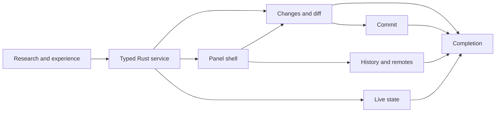

# Outcome

OKF Studio users can inspect repository state, review changes, stage files, commit, and browse history. They can also synchronize the repository that contains the active bundle explicitly, without leaving the knowledge workspace. The implementation follows the [Git Experience Contract](git-experience-contract.md) and the source-level findings in [Zed Git Research](zed-git-research.md).

# Product stance

Git support is repository-native and workspace-scoped. It uses the installed Git executable behind typed Rust operations. The panel covers the common loop. Unsupported history editing and merge workflows remain available through the user's terminal or editor. Network operations never run automatically.

This changes the former “not a git client” boundary. Studio remains neither a Git hosting product nor a general-purpose history-rewriting client. Git exists because OKF bundles live in repositories by design, and because reviewed agent writes need a natural checkpoint path. Users should also not lose context merely to stage and commit accepted knowledge.

# Work packages

## G0: Research and experience freeze

- [x] Inspect Zed's current Git documentation and pinned `git` and `git_ui` source.
- [x] Record adopted, adapted, deferred, and rejected patterns.
- [x] Freeze surface ownership, narrow layout, pressure states, commit scope, network rules, and repository authorization before component work.

Exit: research has claim-level citations and the experience contract prevents nested panel workspaces, silent network activity, and ambiguous commit scope.

## G1: Typed Rust repository service

- [x] Discover the Git executable and the repository containing the active bundle.
- [x] Authorize the repository root against the persisted folder grant.
- [x] Parse branch, upstream, ahead/behind, staged, unstaged, untracked, rename, deletion, and conflict state into closed DTOs.
- [x] Return bounded history pages and unified diffs without absolute paths.
- [x] Disable shell execution, hooks, pagers, external diffs, optional locks, and interactive prompts.
- [x] Cover the mutation path, status framing, history, and tracking with focused temporary-repository and parser tests. Cover the invalid-input, non-repository, outside-grant, rename, and worktree watcher boundaries the same way. Keep presentation pressure states in Storybook rather than duplicating them through slow repositories.

Exit: read-only repository inspection is deterministic, bounded, and cannot expand filesystem authority.

## G2: Git panel shell

- [x] Add a right-docked Git panel that is mutually exclusive with Agent.
- [x] Add a status-bar opener showing the current branch when available.
- [x] Implement fixed Changes/History tabs, one flexible list, and stable footer.
- [x] Design loading, clean, unavailable, unsafe-scope, and retryable failure states.
- [x] Add Storybook states and interactions before production mutation controls.

Exit: repository state is understandable at wide and 360-pixel widths with no overflow, hidden primary action, or competing scroll regions.

## G3: Changes, staging, and diff review

- [x] Render one row per changed path with unchecked, checked, or mixed stage state.
- [x] Stage or unstage one path, Stage All, and Unstage All through fixed IPC commands.
- [x] Open a bounded read-only Git diff workspace for a file or all changes.
- [x] Reuse Studio's semantic diff grammar without coupling Git state to agent staging.
- [x] Keep conflicts explicit and explain their recovery path.

Exit: the index can be prepared entirely from the panel and every action refreshes against repository truth.

## G4: Commit workflow

- [x] Keep a bounded commit draft at the panel foot.
- [x] Distinguish Commit staged from Commit tracked and exclude untracked files from the latter.
- [x] Validate empty messages and unresolved conflicts before the command crosses IPC.
- [x] Run commits without hooks or an interactive editor.
- [x] Offer revision-bound Undo commit through a soft reset and remove it when repository state moves.

Exit: the common stage, write message, commit, and recover loop works without a terminal and never hides what entered the commit.

## G5: History and explicit remotes

- [x] Render bounded history pages with subject, author, time, and short SHA.
- [x] Open a selected commit in the diff workspace.
- [x] Add explicit Fetch, fast-forward-only Pull, and Push actions with one pending operation.
- [x] Report remote failures through bounded panel feedback without leaking command lines, absolute paths, credentials, or environment detail.

Exit: users can inspect recent repository evolution and run the ordinary remote loop without automatic network traffic.

## G6: Live repository state

- [x] Watch repository index, HEAD, refs, and granted working-tree changes in Rust.
- [x] Coalesce event bursts and emit one bounded invalidation event.
- [x] Refresh only while the matching repository is active and preserve tab, draft, and component scroll state.
- [x] Treat terminal-side edits, staging, commits, checkouts, and fetches as the same watched working-tree or metadata invalidation paths, including linked-worktree metadata roots.

Exit: repository truth has one owner and external Git activity appears promptly without a permanent polling loop.

## G7: Product integration and quality gates

- [x] Add keyboard shortcuts, command-palette actions, accessible names, focus restoration, and reduced-motion behavior.
- [x] Update product scope, principles, browsing layout, IPC/security, frontend architecture, testing, feature docs, and site copy.
- [x] Run React Stinky, React Compiler, Tauri Stinky, theme-color, no-slop, and visual-consistency passes.
- [x] Screen component isolation through Storybook MCP at wide and 360-pixel widths, including empty, long-content, pending, and error states.
- [x] Pass frontend, Storybook, site, OKF, Rust core, and native-host gates.

Exit: all three shipping surfaces agree, every quality gate is green, and no temporary screenshot remains in the repository.

# Dependency order

# Deferred decisions

- Hunk and line staging wait for a revision-bound patch model.
- Merge-conflict editing waits for an editor-grade text surface.
- Branch creation, deletion, checkout, rebase, cherry-pick, stash, submodules, and worktree management need separate user-job and recovery contracts.
- Hosting-provider pull requests and issue integration remain separate from repository Git.

# Implementation record

The work landed in five bounded commits after the research freeze. Those commits covered the repository service and IPC, the Git workspace and stories, event-driven repository invalidation, interaction and pressure-state completion, and the shipping documentation. The final implementation keeps Zed's useful structural choices and retains Studio's own trust model. Installed Git is authoritative, and the folder grant bounds discovery. The diff owns the main workspace, Git and Agent share one dock slot, and network activity remains explicit.
