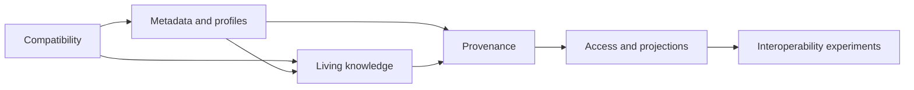

# Outcome

OKF Studio should be the safest place to open, understand, repair, and share an OKF bundle made by any producer. Public issues in Google's knowledge-catalog repository show recurring needs around Markdown compatibility, bundle metadata, relationship semantics, provenance, lifecycle, selective disclosure, and interoperability. They are demand signals, not amendments to the OKF specification.

This roadmap converts those signals into bounded Studio work. It keeps the required format small, preserves unknown extensions, and puts optional conventions behind advisory profiles. A bundle remains readable when it does not adopt them.

# Value and sequence

| Order | Capability area | User value | Why it comes here |
| --- | --- | --- | --- |
| 1 | Compatibility and conformance | Existing bundles keep their links and graph shape when opened in Studio. | Every later feature depends on faithful parsing. |
| 2 | Bundle metadata and profiles | Teams can describe a bundle and opt into useful checks without creating a new hard schema. | Profiles need a generic extension-preserving model first. |
| 3 | Living knowledge and relationships | Renames, typed connections, validity, and retirement become reviewable maintenance work. | These operations depend on stable parsing and profile semantics. |
| 4 | Provenance and freshness | Readers can judge where a claim came from and whether its evidence is still current. | Existing source receipts provide a foundation, but durable bundle representation needs a contract. |
| 5 | Access and projections | Teams can create least-disclosure outputs without mistaking metadata for authorization. | Security semantics must be explicit before any routing hint is rendered. |
| 6 | Interoperability experiments | Multilingual, external-bundle, semantic-web, and sidecar use cases can be tested without burdening the core format. | These need real fixtures and adoption evidence before product commitment. |

# Delivery rules

- **Keep conformance small.** Only the existing OKF hard requirements can make a bundle invalid. Profile and health findings are advisory unless a profile explicitly defines its own export gate.
- **Preserve before interpreting.** Unknown root and concept fields must survive parsing before Studio gives any one extension special behavior.
- **Keep network work explicit.** Source checks and external-bundle resolution run only after a named user action or an enabled local routine with visible scope.
- **Keep writes reviewed.** Rename, repair, projection, lifecycle, and normalization changes use the existing staged revision, validation, diff, and Apply boundary.
- **Separate hints from authority.** Audience or sensitivity metadata can guide a projection. It never grants filesystem, agent, or network access.
- **Measure with foreign bundles.** A capability is not complete when it only works on Studio's own `docs/` bundle.

# Area 1: Compatibility and conformance

This area answers the most immediate producer complaint: a syntactically valid link or extension should not silently disappear from the graph.

| Package | Value | Deliverables | Completion gate |
| --- | --- | --- | --- |
| **EC1 Encoded Markdown paths** | Bundles can link to files with spaces and non-ASCII names without false broken links. | Percent-decode link paths before scheme, absolute-path, traversal, and target checks; retain the authored href for display; cover malformed encodings and encoded traversal. | Rust tests prove spaces, UTF-8, security guards, and tolerant failure. The `docs/` bundle remains conformant. |
| **EC2 CommonMark link coverage** | Reference-style links and other ordinary Markdown forms produce the same graph edges users see in the reader. | Replace the inline-link regex boundary with parser-backed extraction; cover reference definitions, optional titles, angle-bracket destinations, fragments, and escaped characters. | A table-driven corpus produces identical targets in the core and rendered reader. No raw HTML is trusted. |
| **EC3 Producer compatibility corpus** | Regressions are found before release against realistic bundles, not just local examples. | Check in small licensed fixtures for Google samples and adversarial link cases; record expected concepts, edges, warnings, and preserved extensions. | Corpus results are deterministic, network-free, and run in the pure `okf-core` lane. |
| **EC4 Compatibility Clinic** | A bundle author can understand and repair portability problems without hand-inspecting Markdown. | Add a report grouped by parser, link, index, and extension issue; preview safe normalizations as staged changes; export a machine-readable diagnostic. | A sloppy bundle still opens. No repair is applied without review, and every finding names the file and rule. |

EC1 is the first implementation slice and directly addresses percent-encoded targets in [#200](https://github.com/GoogleCloudPlatform/knowledge-catalog/issues/200). EC2 covers the citation syntax raised in [#199](https://github.com/GoogleCloudPlatform/knowledge-catalog/issues/199). EC3 supplies the corpus requested in [#62](https://github.com/GoogleCloudPlatform/knowledge-catalog/issues/62). EC4 can diagnose and stage portable relative-link repairs for the absolute-link problem in [#157](https://github.com/GoogleCloudPlatform/knowledge-catalog/issues/157).

# Area 2: Bundle metadata and advisory profiles

This area gives teams a place for bundle-level conventions without teaching Studio one fixed domain ontology.

| Package | Value | Deliverables | Completion gate |
| --- | --- | --- | --- |
| **MP1 Preserve bundle-root extensions** | Producer metadata survives a read and can be shown or passed to an agent. | Add ordered `extra` metadata to the bundle model; preserve unknown root frontmatter keys through Rust, IPC, TypeScript, mocks, and MCP inventory. | Nested root metadata round-trips without loss and does not alter core conformance. |
| **MP2 Generic metadata inspector** | Users can inspect bundle and concept extensions without waiting for a custom Studio renderer. | Render unknown fields with bounded depth, safe scalar formatting, copy actions, and source location; keep recognized ODSF rendering separate. | Large or hostile values cannot freeze the reader or inject markup. Narrow and wide states are verified. |
| **MP3 Declarative advisory profiles** | A team can state its own recommended fields, relationship vocabulary, and health checks while the bundle stays portable. | Define a namespaced profile descriptor, version pin, local resolver, diagnostic contract, and explicit unavailable state. | No profile can weaken OKF validation, start network work, execute code, or hide unknown fields. |
| **MP4 Profile-aware authoring** | Authors get templates and completion for the conventions they chose. | Feed active profile fields and examples into Create, Revise, and Audit tasks; label profile-required versus OKF-required fields; stage migrations. | Generated concepts pass both the core validator and the selected profile checks, with the distinction visible in review. |

The source signals are bundle-level metadata and schemas in [#212](https://github.com/GoogleCloudPlatform/knowledge-catalog/issues/212) and [#214](https://github.com/GoogleCloudPlatform/knowledge-catalog/issues/214). Studio's answer is generic preservation plus optional profiles, not new hard-coded keys.

# Area 3: Living knowledge and relationships

This area treats a bundle as maintained knowledge. The useful unit is a reviewed graph change, not an isolated text edit.

| Package | Value | Deliverables | Completion gate |
| --- | --- | --- | --- |
| **LK1 Stable identity and safe move** | Authors can reorganize concepts without breaking inbound links, indexes, citations, or open tabs. | Test an optional stable identity convention; compute impact; update Markdown targets and navigation entries; preserve anchors where possible; stage the move as one transaction. | Fixture coverage includes spaces, UTF-8, case changes, nested paths, collisions, missing IDs, and rollback. No write can escape the bundle grant. |
| **LK2 Relationship profile** | Agents and readers can distinguish evidence, dependency, ownership, supersession, and ordinary relatedness where a bundle opts in. | Define a namespaced typed-edge convention; preserve prose links as the portable baseline; map recognized relations into filters and graph inspection. | Unknown relation types remain visible. Ordinary Markdown links still work without the profile. |
| **LK3 Reliability and lifecycle** | Readers can tell whether knowledge is current, uncertain, contradicted, superseded, deprecated, or retired. | Add optional confidence, freshness, contradiction, effective-time, and lifecycle fields through a profile; derive advisory status; make retrieval qualify affected answers. | Missing metadata never invalidates a concept. Conflicts, stale signals, and supersession cycles produce actionable diagnostics without claiming truth from metadata alone. |
| **LK4 Retirement and deletion workflow** | Removing knowledge leaves an explainable history instead of unexplained broken references. | Offer deprecate, redirect, tombstone, and delete choices; show affected links and retrieval consequences; record the decision in `log.md`. | Each choice has deterministic preview, validation, restore, and Git diff coverage. |
| **LK5 Lineage completion** | Users can follow typed dependencies and supersession across several hops without losing their place. | Extend the existing lineage panel with relation filters, direction, validity status, path explanation, and bounded traversal. | Cycles, hubs, missing targets, and narrow layout have explicit states and performance bounds. |

These packages respond to stable identity, frontmatter relationships, and rationale trails in [#120](https://github.com/GoogleCloudPlatform/knowledge-catalog/issues/120), typed relationships in [#148](https://github.com/GoogleCloudPlatform/knowledge-catalog/issues/148), graded confidence in [#151](https://github.com/GoogleCloudPlatform/knowledge-catalog/issues/151), maintenance signals in [#158](https://github.com/GoogleCloudPlatform/knowledge-catalog/issues/158), and deletion semantics in [#207](https://github.com/GoogleCloudPlatform/knowledge-catalog/issues/207).

# Area 4: Provenance, evidence, and freshness

Studio already creates bounded source receipts. This area makes evidence durable and useful after the originating thread is gone.

| Package | Value | Deliverables | Completion gate |
| --- | --- | --- | --- |
| **PF1 Durable provenance mapping** | A concept created from a file, URL, or pasted source can retain an inspectable origin. | Define a profile mapping from source receipts to concept-level provenance; preserve source URI, observed time, digest, adapter, and relevant locator without storing credentials or cache paths. | Reopening the bundle reconstructs the same human-readable source identity. Sensitive local paths are redacted or explicitly approved. |
| **PF2 Citation and evidence contract** | Readers can connect individual claims to supporting evidence rather than trusting a concept-wide source list. | Support Markdown citations and a structured optional evidence map; render claim-to-source navigation; expose the same evidence to retrieval. | Missing or dangling citations are advisory findings with exact locations. Citation rendering remains sanitized. |
| **PF3 Explicit source-liveness checks** | Users can find stale or vanished public evidence before relying on it. | Add opt-in HEAD/GET checks with bounded redirects, timeouts, content fingerprints, and last-observed status; reuse routine recovery and attention records. | No network request runs on open. Private addresses, redirects, and credential-bearing URLs remain blocked by the existing fetch policy. |
| **PF4 Evidence health** | A maintainer gets a prioritized queue for unsupported, stale, or contradicted knowledge. | Join citations, source status, lifecycle, retrieval conflicts, and concept changes into deterministic Knowledge Health findings. | Findings explain their evidence and never claim factual invalidity from a failed URL alone. Repairs remain staged proposals. |

The demand appears in provenance fields [#52](https://github.com/GoogleCloudPlatform/knowledge-catalog/issues/52), inline citations [#94](https://github.com/GoogleCloudPlatform/knowledge-catalog/issues/94), source quality gates [#95](https://github.com/GoogleCloudPlatform/knowledge-catalog/issues/95), evidence trails [#204](https://github.com/GoogleCloudPlatform/knowledge-catalog/issues/204), and source liveness [#211](https://github.com/GoogleCloudPlatform/knowledge-catalog/issues/211).

# Area 5: Access hints and recipient projections

This area reduces accidental disclosure while keeping the authorization boundary honest. An OKF file remains an ordinary file readable by anything with filesystem access.

| Package | Value | Deliverables | Completion gate |
| --- | --- | --- | --- |
| **AP1 Ignore semantics** | Generated, private, or irrelevant files can stay outside Studio's scan, retrieval, agent context, and exports. | Specify and implement a root `.okfignore`; show excluded counts and rule sources; share one matcher across scan, watcher, retrieval, source inventory, and projection. | Negation, nested rules, symlinks, case behavior, and grant boundaries have parity tests. The UI states that ignore rules are not encryption or access control. |
| **AP2 Audience and sensitivity hints** | Teams can label intended handling without mistaking a label for enforcement. | Define optional profile fields for audience, sensitivity, and handling notes; show them in reader, context review, and staged changes. | Hints never expand access or silently remove evidence. Unknown values remain visible. |
| **AP3 Reviewed recipient projection** | A user can produce a least-disclosure bundle for a named recipient without editing the source bundle by hand. | Compute an inclusion plan from explicit selection and hints; show transitive links, redactions, broken-link consequences, and destination; export to a new folder. | Source remains unchanged. Every omitted concept and rewritten link is listed, validation runs on the output, and overwrite requires explicit confirmation. |
| **AP4 Erasure audit** | A user can verify that excluded material did not leak through backlinks, indexes, citations, logs, assets, or generated summaries. | Scan the projected output for source identities, excluded paths, digests, and known sensitive terms; produce a retained audit report. | Seeded leakage fixtures are caught across Markdown, frontmatter, indexes, assets, and exported diagnostics. |

The source signals are agent ignore rules [#77](https://github.com/GoogleCloudPlatform/knowledge-catalog/issues/77), erasure conformance [#90](https://github.com/GoogleCloudPlatform/knowledge-catalog/issues/90), and per-fragment access pressure [#209](https://github.com/GoogleCloudPlatform/knowledge-catalog/issues/209). Studio's projection proposal is a product response to that pressure, not a claim that metadata can enforce filesystem access.

# Area 6: Interoperability experiments

These are useful research tracks, but they do not yet justify changes to the required format.

| Experiment | Value to test | Bounded first step | Adoption gate |
| --- | --- | --- | --- |
| **IX1 Multilingual variants** | Readers and agents can choose a language without duplicating an entire bundle. | Compare filename, frontmatter, and profile-based variants on a small bilingual fixture; define fallback and identity behavior. | Choose a convention only after links, search, retrieval, rename, and projection work in both languages. |
| **IX2 External bundle references** | A concept can point to knowledge owned elsewhere while Studio keeps network and trust boundaries visible. | Prototype an explicit registry entry and cached read-only resolution with origin, digest, and unavailable state. | No external bundle is fetched on open, and cross-bundle identity cannot impersonate a local concept. |
| **IX3 Semantic-web adapters** | RDF/OWL or JSON-LD users can exchange selected typed relationships without making Markdown authors learn those systems. | Build import/export adapters over the relationship profile, not an alternate core syntax. | A round trip preserves the declared subset and reports every lossy construct. |
| **IX4 Sidecar resources** | Data, notebooks, diagrams, and other supporting files can travel with a concept safely. | Inventory sidecars through explicit metadata, media type, digest, size, and safe-open policy. | Unknown media stays downloadable but is never executed or rendered as trusted HTML. |

These experiments cover multilingual variants [#49](https://github.com/GoogleCloudPlatform/knowledge-catalog/issues/49), a bundle media type [#111](https://github.com/GoogleCloudPlatform/knowledge-catalog/issues/111), and a registry for external OKF references [#175](https://github.com/GoogleCloudPlatform/knowledge-catalog/issues/175). Semantic-web adapters remain a Studio hypothesis and need producer evidence before implementation. Each implementation package must pin the exact source URL and retrieval date in its own research note.

# Cross-package completion gate

A package is complete only when all applicable conditions hold:

1. The user job and failure states are documented before production wiring.
2. The Rust-owned filesystem, network, and grant boundaries remain explicit.
3. Foreign and adversarial fixtures cover the behavior at the cheapest reliable layer.
4. Unknown fields and unknown profile values survive without data loss.
5. The user-facing behavior ships in code, this specification bundle, and the product site.
6. New writes use staged review, validation, atomic Apply, restore, and Git-visible changes.
7. Core conformance and profile advice are visibly distinct.
8. The bundle validator, relevant local CI lanes, and site build pass.

# Current implementation record

| Package | Status | Evidence |
| --- | --- | --- |
| EC1 Encoded Markdown paths | Shipped | `okf-core` decodes link paths before classification and resolution, with regression cases for spaces, UTF-8, encoded traversal, encoded schemes, and malformed sequences. |
| EC2 CommonMark link coverage | Shipped | Rust uses `pulldown-cmark` instead of an inline-link regex. Rust and the sanitized `marked` reader pass one shared eleven-case target corpus, including references, footnotes, code, autolinks, spaces, and UTF-8. |
| EC3 Producer compatibility corpus | Shipped | A network-free `okf-core` lane reads reduced Apache-2.0 excerpts from Google's pinned GA4, Bitcoin, and Stack Overflow bundles plus an adversarial extension fixture. Its manifest freezes concepts, edges, broken targets, issue levels, producer types, and preserved nested fields. |
| EC4 Compatibility Clinic | Shipped | The grouped, exportable report keeps conformance, portability, and preservation distinct. Safe inline-link normalizations are regenerated in Rust, staged without changing disk, reviewed hunk by hunk, validated against an isolated bundle, revision-bound on atomic Apply, and conditionally restorable. Stale sources and forged findings are rejected. |
| MP1 through IX4 | Planned | Each package remains gated by the dependency and completion criteria above. No planned profile or experiment is part of core OKF conformance. |

Related product boundaries: [Design Principles](principles.md), [Scope & Non-Goals](scope-and-non-goals.md), [Validation](../features/validation.md), [Knowledge Health](../features/knowledge-health.md), [Source Adapters and Provenance](../features/source-adapters.md), and [OKF Parsing](../architecture/okf-parsing.md).
