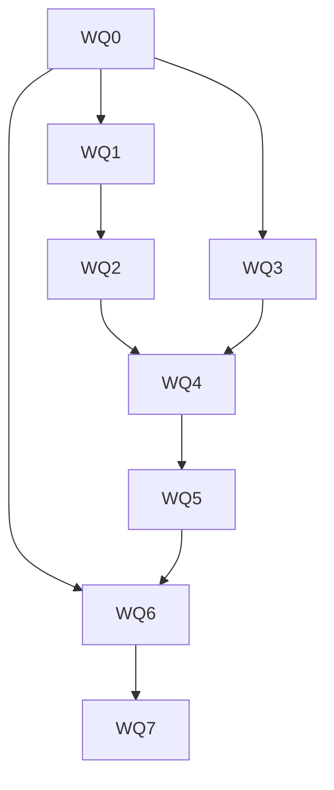

# Outcome

Agents should write OKF concepts that read like careful domain work, not generic assistant output. A useful concept answers a specific reader question, states its point directly, preserves evidence and qualifications, and uses the shape that fits the knowledge. The user should not need a separate editing pass to remove throat-clearing, repeated conclusions, vague claims of importance, decorative headings, or lists that should have been prose.

This transformation is successful when common authoring and revision tasks produce prose that people prefer to the current baseline while retaining every required fact, qualifier, citation, link, formula, code sample, and domain term. Shorter is not automatically better. A result that reads smoothly but loses knowledge is a failure.

# Delivery status

The product implementation is complete. The shared resource, author and revise capabilities, diagnostics, protected claim ledger, review surface, critic, benchmark, documentation, site copy, and rollback path ship together in `okf-foundation@1.1.0`.

Three release-evidence items remain open because this workspace cannot manufacture them: a configured Studio Agent run, shuffled blind human preference, and protected signing plus non-Windows packages. An authenticated external Codex run completed all seven cases twice and passed all 14 deterministic preservation checks. The [dogfood record](okf-writing-quality-dogfood.md) retains the evidence and names the unavailable gates without treating them as passes.

# Why this work is separate

The completed [OKF Agent Specialization](agent-specialization-roadmap.md) gives agents named domain tasks, bounded context, provenance, structured artifacts, deterministic checks, and reviewed writes. Those features make OKF work safer and easier to inspect. They do not define how a concept should be written, how an agent should revise prose without changing meaning, or how Studio can measure whether the writing improved.

The repository's general `no-slop` guidance is a useful editorial reference, but shipping it unchanged as the OKF writing contract would be too broad. OKF concepts often need exact source language, technical terminology, authored voice, dense reference material, and structured facts. The product therefore needs a narrower writing resource built around knowledge preservation, reader purpose, and reviewable change.

# Product stance

- Writing quality is guidance, not an OKF conformance rule. A stylistically weak bundle remains readable and valid.
- Source facts, uncertainty, qualifications, citations, links, formulas, code, and established domain terms outrank stylistic preferences.
- The agent matches the bundle's language, audience, and house style instead of imposing one universal English voice.
- Concision never justifies omitting knowledge. Semantic preservation is checked before prose quality is scored.
- Deterministic checks identify observable patterns. Heuristics remain advisory, explain their evidence, and can be suppressed.
- Revisions are staged and reviewed. Studio never rewrites an existing bundle in the background.
- A style-only revision cannot add or remove factual claims. When it does, the work becomes enrichment and needs evidence.

# Shared writing contract

Reader job
: Name who will use the concept and the question or decision it should support. The opening should answer that job, not announce that an answer is coming.

Meaning
: State the actual point and its consequence. Explain why a feature, rule, or decision exists when that context helps the reader understand its value or the gap it closes.

Evidence
: Keep sourced facts, user decisions, agent inferences, and unknowns distinct. Preserve the language that carries uncertainty or scope.

Structure
: Use tables, lists, definitions, examples, or prose according to the shape of the information. Do not add headings, bold labels, or summary sections merely to make a short concept look substantial.

Prose
: Prefer concrete nouns, active verbs, causal sentences, and specific subjects. Remove throat-clearing, repeated conclusions, vague authorities, inflated significance, and generic closing claims.

Revision
: Inventory claims before editing and reconcile them afterward. Show which claims are unchanged, reworded, added, or removed, and preserve frontmatter, links, and citations unless the user explicitly changes their meaning.

# Second-pass review

The first plan focused on editing guidance. A second pass found that prose work can damage knowledge even when the result sounds better. The packages below include these corrections.

| Risk | Resolution |
| --- | --- |
| English-focused guidance overrides another language or an established bundle voice | Detect the bundle language and local conventions first; label initial English guidance as language-specific and keep style rules replaceable |
| A writing linter becomes a prescriptive validity gate | Keep writing findings advisory, evidence-based, suppressible, and separate from conformance |
| Concision removes qualifiers, examples, or operational detail | Freeze factual invariants before revision and fail the artifact when required knowledge is missing afterward |
| A fluent rewrite introduces unsupported claims | Require a claim ledger and evidence for every factual addition; route semantic changes through enrichment |
| One approved example becomes an exact-text target | Freeze facts, audience, and constraints, then use blind pairwise review rather than string similarity |
| A model grades prose in its own preferred voice | Keep deterministic measures narrow, run any critic in an isolated no-tool session, and retain human preference as the authority |
| Provider-specific prompt tuning makes the capability non-portable | Deliver the same versioned writing resources through the capability pack and compare live providers against the same cases |
| Automatic cleanup surprises existing bundle authors | Offer explicit authoring and revision actions only; do not rewrite existing concepts during upgrade, scan, or validation |

# Work packages

Each package ends in a focused commit or short series of reviewable commits. A package is complete only when its contracts, fixtures, product documentation, and relevant rendered and automated checks agree.

## WQ0: Baseline and evaluation contract

- [x] Build a frozen corpus covering factual but generic prose, concise but incomplete prose, fluent unsupported prose, over-structured concepts, copied source language, voice mismatch, and strong domain writing.
- [x] Include representative concept types such as product rationale, architecture, runbook, reference, decision, and source-derived knowledge.
- [x] Record the reader job, required facts, qualifications, citations, links, terms, language, and structural constraints for every case.
- [x] Capture current outputs from Studio Agent and each configured replaceable provider. Record unavailable providers as unavailable, not as passing runs.
- [x] Add model-free checks for required knowledge, citations, links, claim count, repeated passages, empty sections, and unsupported additions.
- [x] Define a shuffled blind pairwise human review for directness, coherence, concreteness, structure, voice fit, and usefulness.
- [x] Freeze the improvement threshold after the baseline is measured and before implementation begins.

Gate: the evaluation separates better prose from shorter but incomplete prose, produces stable model-free results in two shuffled runs, and retains the baseline outputs for comparison.

## WQ1: Versioned OKF writing resource

- [x] Add one canonical OKF writing resource to the built-in skill bundle rather than copying editorial rules into each authoring skill.
- [x] Define the reader-job, evidence, structure, prose, and revision contracts with examples drawn from real OKF concept types.
- [x] Document exceptions for exact quotations, legal or standards language, API references, technical terminology, formulas, code, tables, multilingual bundles, and established house style.
- [x] Include before-and-after examples that preserve facts, plus adversarial examples where a smoother rewrite is wrong.
- [x] Add the resource version and digest to the capability manifest and `okf-foundation` pack, with an inspectable changelog and rollback path.
- [x] Deliver the resource progressively only to capabilities that produce or revise human-facing prose.

Gate: native and external agents receive the same inspectable writing resource and delivery receipt, while the previous capability-pack version remains installable through rollback.

## WQ2: OKF authoring and revision capabilities

- [x] Add `okf-author` for turning an accepted plan or validated evidence set into new concepts.
- [x] Add `okf-revise` for improving existing prose without changing its factual meaning.
- [x] Give both capabilities explicit triggers, required inputs, ordered method, artifact contract, stop conditions, completion checks, and adversarial examples.
- [x] Use one ordered method: establish the reader job, inventory claims, select the information shape, draft, edit for directness, reconcile claims, then stage.
- [x] Update create, enrich, research, and migration capabilities to use the shared writing pass when they emit concept prose.
- [x] Keep inspect, audit, and repair outputs concise through their own artifact contracts instead of attaching authoring guidance indiscriminately.
- [x] Route any requested factual addition or removal from `okf-revise` to enrichment and require the corresponding evidence and tool scope.

Gate: explicit create and revise actions select the correct bounded capability, use no undeclared tools, and cannot broaden write or evidence scope through prose instructions.

## WQ3: Advisory writing diagnostics

- [x] Add a versioned `writing` category to Knowledge Health without changing OKF conformance or tolerant bundle opening.
- [x] Detect observable patterns such as duplicated adjacent text, repeated boilerplate, empty headings, conclusion echoes, generic openers and closers, excessive heading depth, decorative bold labels, and list density that obscures continuous reasoning.
- [x] Give each rule a stable ID, version, evidence span, explanation, severity, and suppression fingerprint.
- [x] Keep phrase matches contextual and advisory. Do not use a blanket word blacklist, reading-grade target, or word count as a quality gate.
- [x] Add false-positive fixtures for quotations, standards text, reference indexes, checklists, incident procedures, generated schemas, and intentionally repeated warnings.
- [x] Bound scanning cost for large bundles and cancel obsolete work after live reload.

Gate: two shuffled runs produce the same findings, every finding points to visible evidence, suppressions are stable, and no writing rule can block opening or validation.

## WQ4: Fact-preserving revision artifact

- [x] Define a versioned `writing-revision` artifact with reader, purpose, concept paths, bundle revision, source references, and findings addressed.
- [x] Include a before-and-after claim ledger that marks every claim as unchanged, reworded, added, or removed.
- [x] Validate bundle identity, concept paths, frontmatter, links, citations, and ledger completeness in Rust before rendering the artifact as trusted structure.
- [x] Treat added or removed factual claims as enrichment that needs evidence and a matching task scope.
- [x] Reject a style-only artifact that drops a number, qualifier, citation, link target, formula, code block, or required claim.
- [x] Carry accepted revisions into the existing staged-write and per-hunk review flow without creating another write authority.

Gate: seeded losses and unsupported additions fail deterministically, while a meaning-preserving rewrite reaches reviewed staging with a complete claim map.

## WQ5: Writing review experience

- [x] Add native **Write concept** and **Improve writing** actions from the reader, source inventory, and relevant work artifacts.
- [x] Show the reader job, selected writing capability, source set, and planned concept paths before the first prompt.
- [x] Present the original and proposed prose beside a plain-language claim summary that distinguishes wording changes from knowledge changes.
- [x] Support accepting or rejecting individual hunks while keeping links, citations, and claim status visible.
- [x] Design loading, empty, partial, invalid, stale, unavailable, conflict, large, and narrow states.
- [x] Add an optional isolated critic for clarity, redundancy, concreteness, structure, voice fit, rationale coverage, and claim preservation. The critic gets no tools, write grant, or approval authority.
- [x] Isolate every state and interaction in Storybook and screen it through the Storybook MCP surface before whole-panel integration.

Gate: before staging, a user can tell what will read differently, whether any knowledge changed, and which evidence supports each semantic change at wide and narrow widths.

## WQ6: Benchmark and provider proof

- [x] Extend the OKF benchmark with factual-invariant retention, unsupported claims, qualification retention, citation and link retention, writing findings, redundancy, and blind human preference.
- [x] Keep compression, reading level, and sentence length descriptive. Do not optimize them as standalone targets.
- [x] Add deterministic cases for authoring and revision, including cases designed to tempt the agent into deleting useful detail or inventing rationale.
- [ ] Run each case twice in shuffled order through Studio Agent and at least one configured external or local provider using the same capability resources.
- [ ] Retain prompts, resource receipts, artifacts, deterministic results, and blinded comparison samples locally with the provider-reported model.
- [x] Use model critique only as a labelled secondary signal. It cannot supply the sole passing score.
- [ ] Require zero hard safety or fact-preservation regressions and meet the threshold frozen in WQ0 before rollout.

Gate: live provider outputs beat the frozen baseline in blind preference without losing required facts, qualifications, citations, links, or safety boundaries.

## WQ7: Rollout and completion

- [x] Dogfood the workflow on selected Studio product and feature concepts, retaining the accepted before-and-after evidence.
- [x] Ship the updated capability pack with compatibility checks, rollback, and a clear note that existing concepts are not rewritten automatically.
- [x] Update feature, architecture, migration, security, support, and site copy to explain both the writing improvement and its limits.
- [x] Add recovery guidance for unavailable providers, invalid claim ledgers, stale revisions, false-positive diagnostics, and interrupted review.
- [ ] Complete app, Rust, Storybook, site, OKF, ODSF, installer, and platform gates.

Gate: a new user can author or revise a real concept from a bounded source set, inspect the reader purpose and claim map, review every semantic change, and apply the result through the existing transaction while retaining a working capability-pack rollback.

# Dependency order

# Exit contract

- A user can start from accepted evidence, a work plan, or an existing concept without writing an editing prompt from scratch.
- Studio shows the reader job, selected capability, source set, concept paths, and expected write scope before work begins.
- Every proposed revision maps its claims and makes added or removed knowledge explicit.
- Required facts, qualifications, citations, links, formulas, code, and domain terms survive unless the user reviews an evidence-backed semantic change.
- Blind reviewers prefer the shipped outputs to the frozen baseline at the threshold defined in WQ0.
- Writing diagnostics remain advisory, explainable, suppressible, and separate from OKF conformance.
- The same versioned capability works through Studio Agent and at least one replaceable provider without provider-specific task logic.
- Upgrading Studio does not rewrite existing bundles or silently accept a writing change.

# Non-goals

- A general grammar or spell-checking product.
- One mandatory voice for every bundle, language, or organization.
- Simplifying quotations, standards language, legal text, formulas, code, or exact technical terms.
- Treating style findings as OKF validation failures.
- Background rewriting of existing concepts.
- A publishing or marketing-copy system.
- A model judge as the sole authority for writing quality.
