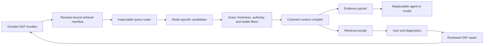

# Product position

OKF Studio should not ship a generic vector database beside the graph. It should turn an OKF bundle into inspectable, revision-bound model context and let each query use the evidence path that fits it.

The retrieval system should remain quiet during ordinary use. The conversation shows an answer, citations, and one compact evidence summary. The evidence inspector leads with trust and source review. Route internals, candidate lists, scores, filters, and diagnostics stay under technical disclosure or in the separate Evidence Lab. The [retrieval experience contract](retrieval-experience-contract.md) fixes that hierarchy before implementation.

The product is an OKF context engine:

- upstream, it helps people and agents create retrieval-ready knowledge with stable identity, structure, provenance, and links
- at query time, it routes among exact, lexical, graph, dense, global, and full-context modes
- downstream, it gives any connected agent a coherent evidence packet plus a receipt that explains selection, exclusions, and scope
- after a miss, it turns diagnostics into reviewed knowledge repairs rather than hidden index tuning.

The [research brief](rag-state-and-failures.md) supports this position. The [roadmap](retrieval-intelligence-roadmap.md) converts it into measured work packages, with the experience contract as a prerequisite for interface-changing work.

# Why this belongs in OKF Studio

Most RAG stacks begin with documents that have no stable semantic unit, relationship model, revision identity, or repair workflow. They reconstruct those properties through chunk metadata, LLM extraction, vector indexes, and tracing products. That reconstruction is expensive and remains difficult to review.

OKF starts with authored concepts and a traversable bundle. Studio already knows the current concept, graph neighborhood, index path, backlinks, validation state, [source receipts](../../features/source-adapters.md), selected bundle set, and exact revision. Retrieval can use those facts directly and preserve them in the context it emits.

This closes a gap in the current product. Studio can attach selected concepts and run bounded search or graph tools, but the user or agent still decides how to find and combine evidence. There is no shared query plan, hybrid candidate set, relevance pass, coverage check, or explanation of why one concept entered context while another did not.

# The context engine

## Retrieval manifest

The manifest is a disposable app-data projection of one or more granted bundle revisions. It records concept and section identity, headings, descriptions, types, tags, source references, links, index ancestry, table boundaries, token estimates, and health signals. Optional lexical and dense indexes point back to those identities.

The bundle remains the authority. Studio can delete and rebuild the manifest. Embeddings, generated summaries, ranking features, and derived relationship candidates do not enter bundle files unless a user reviews an explicit proposal.

## Query router

The router selects a stable local mode from the query class. Route execution then applies available indexes, bundle scale, provider capabilities, privacy settings, and context budget without silently changing the question's intent. Routine local selection appears in the compact evidence summary, and the user can inspect it afterward. A preflight asks for attention only when scope, network use, expected cost, or available capability changes materially.

| Query class | Default evidence path | Example |
| --- | --- | --- |
| Exact identifier or phrase | exact plus lexical | “Where is `TS-999` defined?” |
| Known concept | concept plus index and bounded neighbors | “Explain the validation feature” |
| Relationship or impact | directed graph traversal and path ranking | “What depends on this metric?” |
| Corpus overview | index hierarchy and coverage-aware global synthesis | “What changed across the product?” |
| Indirect or semantic lookup | lexical plus optional dense candidates and reranking | “Where do we prevent silent authority?” |
| Temporal or conflict question | time, source, supersession, and contradiction filters | “Which definition is current?” |
| Small stable bundle | long context or cached snapshot when supported | “Compare every principle” |
| Structured numeric question | table and schema-aware retrieval | “Which package has the highest failure count?” |

No route is universal. A query can combine paths, but the receipt preserves each candidate source and score rather than collapsing them into one unexplained ranking.

## Context compiler

The compiler assembles evidence for reading rather than concatenating top-k chunks. It keeps the parent concept, heading path, table headers, citations, and local relationship context with each excerpt. It orders sections so definitions precede dependent claims and marks omissions caused by budget, authorization, stale state, or low relevance.

The compiler produces two outputs:

Evidence packet
: The bounded text or structured resources sent to the selected agent or model.

Retrieval receipt
: A typed record of query, route, bundle fingerprints, candidate generators, filters, scores, included sections, omitted candidates, token budget, citations, provider involvement, and timing.

The receipt is the retrieval equivalent of Studio's capability and tool evidence. It proves what Studio selected and delivered. It does not prove that the model used every item correctly.

The compact summary belongs to the completed conversation turn. Opening its detail replaces the flexible transcript viewport and restores the previous scroll, draft, selection, and focus state when closed. The full Evidence Lab remains a separate troubleshooting workspace. Neither surface adds another persistent band above the composer.

# OKF advantages and honest limits

| Existing primitive | Retrieval value | Limit that remains |
| --- | --- | --- |
| Concept ID | Stable parent identity for every section or excerpt | Concepts can still be too large or contain several topics |
| `index.md` hierarchy | Human-curated global and local navigation | An index may be missing or incomplete |
| Links and backlinks | Ready graph candidates and impact paths | Link meaning is prose-defined and not automatically typed |
| Type, tags, title, description | Exact filters and retrieval features | Optional metadata can be absent or stale |
| Resource and citations | Provenance and source opening | Presence does not establish authority or current validity |
| Timestamp and log | Change and freshness signals | Neither defines effective dates or supersession alone |
| Validation and health | Corpus quality filters and repair targets | Heuristics cannot become hidden retrieval truth |
| Bundle fingerprint | Index and cache invalidation | A fingerprint identifies bytes, not semantic equivalence |
| Bundle grants and federation | Candidate scope before retrieval | No concept-level ACL or enterprise directory mapping exists |
| Reviewed staging | Safe repair of retrieval defects | Repair still needs evidence and user review |

# Product value

For an OKF author, Studio can explain why a concept is hard to retrieve. It can propose a better title, description, link, index entry, citation, or split. Retrieval quality becomes part of knowledge maintenance without turning it into conformance.

For an agent user, the context plan shows the evidence route before a prompt and the receipt afterward. The user can trace a wrong answer to a miss, filter, stale source, context omission, or generation failure.

For an ordinary question, this traceability does not require reading retrieval machinery. The user can stay with the answer and citations, and open the evidence summary when confidence is low. They enter the diagnostic workspace only when the retrieval path itself needs comparison.

For teams with an existing RAG stack, Studio can export a revision-bound retrieval manifest instead of forcing them to adopt its index. Stable OKF identities then survive across Qdrant, Weaviate, PostgreSQL, a local BM25 index, or a provider file-search API.

For local and small models, structured candidates and coherent ordering reduce the amount of inference needed to reconstruct relationships. Long-context or cached-snapshot mode can avoid retrieval entirely when the bundle is small and stable enough.

For external agents, the existing [one-shot MCP grant](../../features/external-entry-points.md) can expose the same query planner, retrieval, and explanation tools. An agent no longer needs broad bundle reads or its own private chunking scheme to answer a bounded question.

# Synergies outside the panel

## Retrieval manifest export

Export JSONL or a versioned directory containing section identities, parent concepts, metadata, graph edges, source references, content hashes, and bundle fingerprint. Adapters can map the manifest into existing vector stores without losing OKF identity.

## Context MCP

Extend the bounded OKF MCP surface with tools for query planning, retrieval, receipt inspection, and retrieval diagnosis. The same Rust grant and response bounds apply. Tools return evidence and identities, never raw filesystem authority.

## Provider cache integration

Use the bundle fingerprint and context-manifest digest as cache identity where a provider or local runtime exposes prefix or KV caching. Cache use is an optimization and must not change evidence semantics.

## Web and source retrieval

Source adapters can feed the context compiler after explicit fetch. Web pages still require extraction, deduplication, provenance, and hostile-content treatment. Fetched evidence remains separate from authored bundle knowledge until reviewed enrichment.

## Diagnostic exchange

Studio can export the retrieval receipt as a bounded debug bundle, or import it into an OKF research task. This gives external pipelines a portable failure record and gives Studio a path to compare two retrieval configurations without importing their databases.

# Product boundaries

- The bundle remains readable and useful without embeddings, a vector database, an account, or a hosted provider.
- Derived indexes and caches live in app data and are disposable. They are not OKF conformance requirements.
- Studio enforces grants before retrieval. Relevance never broadens authorization.
- A generated summary, inferred edge, reranker score, or model confidence is derived state, not authored knowledge.
- Retrieval does not authorize a claim. Answers still need citations and claim-level evidence where the task requires them.
- A receipt explains Studio's selection. It cannot certify model reasoning.
- Query routing may suggest a broader source or network action, but the user must approve any new grant or fetch.
- Existing source adapters remain the ingestion boundary. Retrieval work does not create a second parser stack in the frontend.
- OKF v0.1 remains tolerant and vendor-neutral. Retrieval metadata cannot become a new hard bundle requirement.
- Per-query route controls and diagnostics cannot become permanent Settings rows or persistent conversation shelves.
- A backend package cannot ship visible controls before its surface owner, states, narrow behavior, and Storybook prototype pass the experience definition of ready.

# Decisions to prove before adoption

- A local lexical and graph baseline must beat the current full-text search on the frozen query corpus before Studio adds dense retrieval.
- Dense retrieval must show incremental recall worth its model size, index time, privacy cost, and invalidation complexity.
- The router must outperform one fixed hybrid route and expose a deterministic fallback when classification is uncertain.
- Context compilation must improve answer evidence use without hiding omitted material.
- Cached full-context mode must use exact fingerprint invalidation and show a cost or latency benefit on supported providers.
- Retrieval diagnostics must identify actionable failure classes more reliably than answer-level pass or fail alone.
- Reviewed repairs must improve a held-out query set and must not encourage keyword stuffing or generated metadata churn.
- The first exact-query slice must preserve the readable conversation, live-work bounds, composer reachability, focus, and scroll state under narrow and long-content pressure.

# Non-goals

- Replacing every vector database or RAG framework.
- Storing embeddings or provider-specific cache state in an OKF bundle.
- Claiming that every Markdown link is a typed knowledge-graph edge.
- Inventing source authority, effective dates, or permissions from prose.
- Moving enterprise data into a Studio-controlled cloud.
- Letting retrieval results bypass context preview, source provenance, or reviewed writes.
- Optimizing only for retrieval benchmark scores while answer correctness, abstention, cost, or user trust regress.
