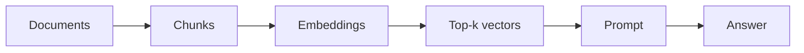
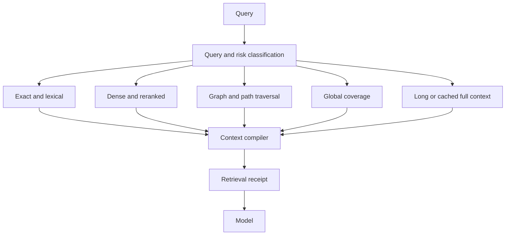

# Question

What has become difficult about production retrieval-augmented generation, which alternatives now matter, and where can OKF Studio solve a real problem instead of adding another vector-search wrapper?

# Conclusion

RAG is no longer one pipeline. Production systems choose among lexical search, dense retrieval, reranking, graph traversal, long context, cached context, and agent-directed search. Each mode fails differently. The durable problem is context selection under constraints: find the right evidence, keep its structure and authority visible, exclude stale or unauthorized material, fit the model budget, and explain the result when an answer is wrong.

OKF has an advantage before retrieval begins. A bundle already separates knowledge into stable concepts, carries human navigation, explicit links, metadata, citations, validation findings, and a revision fingerprint. Studio already adds bounded reads, source provenance, graph queries, federation, structured work, and reviewed repair. These primitives can reduce the destructive ingestion and opaque debugging that conventional RAG systems add later.

The advantage is incomplete. An OKF concept is not always the right token-sized retrieval unit. A Markdown link is not automatically a causal, temporal, or authority edge. `timestamp` records a concept time but does not define an effective period. Bundle grants do not provide concept-level enterprise access control. Studio also lacks a lexical index, embeddings, reranking, query routing, retrieval evaluation, and a context receipt. The next transformation must build those missing pieces without overstating the format.

# Evidence boundary

The user supplied a July 2026 snapshot of current r/RAG discussions. It is useful as a list of recurring practitioner concerns, but the posts include self-promotion, unpublished performance claims, and anecdotes. This brief treats them as community signals, not proof.

Technical claims below come from primary papers or first-party engineering reports retrieved on 2026-07-18. Several are arXiv preprints or vendor evaluations. Their results define hypotheses and test cases for Studio, not universal performance guarantees.

# Current failure map

| Failure | Evidence | Product meaning | Evidence limit |
| --- | --- | --- | --- |
| Chunking removes the identity and surrounding facts needed to retrieve a passage | Anthropic reports that prepending chunk-specific context improved its evaluated retrieval configurations and that lexical plus dense retrieval and reranking reduced top-20 retrieval failures further [1] | Preserve concept ID, heading path, frontmatter, source, and graph neighborhood when a concept is segmented | Vendor evaluation across selected datasets and models |
| Similarity is weaker than reasoning relevance for indirect questions | BRIGHT requires reasoning to identify relevant documents; its published ICLR 2025 results show a large gap between standard benchmark strength and reasoning-intensive retrieval [2] | Route change-impact, causal, and multi-hop questions through graph and query-expansion paths instead of trusting nearest vectors | Benchmark performance does not directly predict OKF corpus performance |
| Top-k chunk retrieval misses global questions about a corpus | Microsoft GraphRAG builds entity graphs and community summaries for global sensemaking and reports gains over a conventional RAG baseline on selected million-token corpora [3] | Use OKF indexes and the existing concept graph for bundle-wide and section-wide synthesis, with coverage accounting | GraphRAG builds LLM-derived graphs and summaries; OKF links have different semantics |
| More context can increase useful coverage and noise at the same time | RAGChecker separates retrieval and generation metrics and reports trade-offs among context utilization, faithfulness, and noise sensitivity across eight systems and ten datasets [4] | Measure candidate recall, included noise, citation coverage, and answer use separately; one answer score is insufficient | Automated metrics still have a gap to human judgment |
| Long context and cached context can beat retrieval for bounded stable corpora | A comparative study found long context stronger on average when resources were sufficient while RAG retained a cost advantage; its Self-Route approach chose between them [5]. Cache-Augmented Generation proposes preloading a manageable corpus and reusing its KV cache [6] | Route small stable bundles to full-context or provider cache paths when supported, with the bundle fingerprint as invalidation key | Results depend on model context behavior, cache APIs, corpus size, and update rate |
| Conversation memory requires temporal updates and abstention, not nearest-message recall | LongMemEval tests extraction, cross-session reasoning, temporal reasoning, knowledge updates, and abstention; it reports degradation in long histories and gains from time-aware retrieval design [7] | Keep episodic thread recall separate from curated bundle knowledge; make supersession and time scope explicit before memory can shape answers | Chat memory is not the same corpus as an OKF bundle |
| Tables and mixed structured content remain difficult | T2-RAGBench requires retrieval before numerical reasoning over financial text and tables; hybrid sparse and dense retrieval performed best in its reported comparison, while the task remained difficult [8] | Preserve Markdown table structure, schema identity, row or section anchors, and exact numeric evidence in the retrieval manifest | One financial benchmark does not settle every structured-data design |
| Flat context is a poor fit for causal or multi-hop explanation | CC-RAG constructs causal chains and reports better results than flat RAG on two specialized domains [9] | OKF graph traversal can supply candidate paths, but causal status must come from authored or separately validated semantics | Small domain set; some evaluation uses model judges |
| Relevance ranking cannot substitute for authorization | Microsoft researchers argue that every item used in retrieval or generation must be authorized for all participants and demonstrate extraction risks when deterministic access control is absent [10] | Enforce grants before candidate generation and keep provider calls downstream of Rust-owned scope | Studio currently grants bundles, not arbitrary enterprise document ACLs |
| A green response hides which stage failed | RAGChecker motivates component-level diagnosis because retrieval, generation, long-form evaluation, and metric reliability fail independently [4] | Store a diffable retrieval receipt with query route, candidates, filters, scores, context, citations, omissions, and bundle fingerprint | Studio still needs task-specific ground truth to classify a miss correctly |

# Community signals

The supplied r/RAG snapshot repeats the same concerns in less controlled form:

- orchestration is moving away from one large framework toward lighter graphs, custom pipelines, and MCP-shaped tools;
- teams want duplicate, metadata, score, filter, and prompt diagnostics because successful requests can still return weak evidence;
- temporal coherence, updates, and ordered recall matter more than raw vector similarity for agent memory;
- persistent KV caches and long context are attractive for stable document sets because they remove a retrieval failure point;
- stale sources, contradictory documents, altered numbers, and incomplete context create confident reliability failures;
- web retrieval needs extraction, deduplication, reranking, and compact evidence rather than whole scraped pages;
- graph and causal retrieval can help when the answer depends on a path rather than one passage;
- PDF tables and other layout-derived structures remain lossy at ingestion;
- enterprise deployments cannot move or retrieve data without preserving the source permission boundary;
- similarity ranking and relevance ranking are different operations.

These posts do not prove that any named product or benchmark claim is correct. Their value is convergence: users are debugging corpus quality, routing, structure, time, permissions, and observability after the basic demo already works.

# What changed in the design space

The old default was one fixed path:

The current design space is a router over several evidence paths:

The model is downstream of evidence selection. This makes the retrieval plan, corpus revision, authority filters, context budget, and omissions part of the answer contract.

# Implications for OKF Studio

## Advantages already present

Concept identity
: File-derived IDs survive model and index changes. A section-level retrieval unit can retain its parent concept instead of becoming an anonymous chunk.

Human structure
: `index.md`, headings, types, tags, and links provide lexical, hierarchical, and graph features before embeddings exist.

Provenance and revision
: Resources, citations, source-adapter receipts, concept timestamps, and bundle fingerprints can travel with each candidate and invalidate derived indexes after a change.

Corpus diagnostics
: [Validation](../../features/validation.md) and [Knowledge Health](../../features/knowledge-health.md) already expose broken links, missing metadata, duplication, freshness signals, and conflicting evidence. Retrieval quality can use these findings instead of indexing every passage as equally healthy.

Scoped access
: Rust-owned bundle grants and the [granted federation contract](../agent-specialization-roadmap.md) define which bundles may enter candidate generation. This is a stronger starting point than filtering after retrieval.

Repair loop
: A retrieval miss can become a reviewed suggestion to improve a title, description, link, citation, index entry, or source mapping. The [reviewed staging boundary](../../features/agent-panel.md) still prevents the agent from applying the change directly.

## Missing primitives

- stable heading and table-section identities below the concept level;
- a disposable local retrieval manifest tied to one bundle fingerprint;
- exact and BM25-style lexical retrieval in the Rust core;
- optional dense embeddings and reranking with an explicit local or configured provider;
- query classification and mode routing with deterministic fallbacks;
- graph-aware neighborhood and path expansion tuned for evidence assembly;
- temporal, supersession, authority, and contradiction signals that do not overload `timestamp` or ordinary links;
- context budgeting that preserves coherent sections and orders evidence for reading;
- a typed retrieval receipt and diffable diagnostic bundle;
- retrieval benchmarks with known relevant concepts, paths, exclusions, and abstention cases;
- agent, MCP, CLI, and export contracts that expose the same retrieval behavior without bypassing grants.

# Conflicts and uncertainties

- Long context avoids retrieval misses but can increase cost, latency, and distraction. Provider cache semantics also vary. Studio needs measured routing, not a blanket preference.
- Dense retrieval can improve semantic recall but adds model downloads, provider calls, index churn, and privacy choices. The local lexical and graph baseline must remain useful without it.
- LLM-derived relationship extraction may find useful paths but can invent them. Derived edges must stay labelled candidates outside the authored OKF graph until reviewed.
- Global summaries reduce query-time work but can become stale or erase minority evidence. Any generated summary needs source coverage, fingerprinting, and invalidation.
- Concept-level authorization is not part of OKF v0.1. Supporting enterprise ACL overlays would require a separate identity and policy contract.
- Retrieval evaluation needs ground truth. Clicks, model confidence, and citation presence are weak substitutes for curated relevance judgments.

# Open questions

- Should the first dense index use a bundled local embedding model, a user-configured endpoint, or an adapter interface with no default model?
- Which query classes can Studio route deterministically, and which require a small model or user choice?
- Should typed relationships be authored as an optional OKF profile, derived in app data, or left as task-specific artifact data?
- How should effective dates, supersession, and source authority be expressed without changing OKF conformance?
- Can provider prefix-cache support be negotiated through ACP, or should cached-context mode remain Studio Agent only?
- Which retrieval receipt fields belong in the transcript, the work shelf, app data, or an exported artifact?
- What corpus and queries can establish a meaningful baseline before implementation begins?

# Citations

1. [Anthropic: Introducing Contextual Retrieval](https://www.anthropic.com/engineering/contextual-retrieval)
2. [BRIGHT: A Realistic and Challenging Benchmark for Reasoning-Intensive Retrieval](https://arxiv.org/abs/2407.12883)
3. [Microsoft Research: From Local to Global, A Graph RAG Approach to Query-Focused Summarization](https://www.microsoft.com/en-us/research/publication/from-local-to-global-a-graph-rag-approach-to-query-focused-summarization/)
4. [RAGChecker: A Fine-grained Framework for Diagnosing Retrieval-Augmented Generation](https://arxiv.org/abs/2408.08067)
5. [Retrieval Augmented Generation or Long-Context LLMs? A Comprehensive Study and Hybrid Approach](https://arxiv.org/abs/2407.16833)
6. [Don't Do RAG: When Cache-Augmented Generation Is All You Need for Knowledge Tasks](https://arxiv.org/abs/2412.15605)
7. [LongMemEval: Benchmarking Chat Assistants on Long-Term Interactive Memory](https://arxiv.org/abs/2410.10813)
8. [T2-RAGBench: Text-and-Table Benchmark for Evaluating Retrieval-Augmented Generation](https://arxiv.org/abs/2506.12071)
9. [CC-RAG: Structured Multi-Hop Reasoning via Theme-Based Causal Graphs](https://arxiv.org/abs/2506.08364)
10. [Enterprise AI Must Enforce Participant-Aware Access Control](https://arxiv.org/abs/2509.14608)

Related product direction: [OKF retrieval thesis](okf-retrieval-thesis.md) and [Retrieval intelligence roadmap](retrieval-intelligence-roadmap.md).
