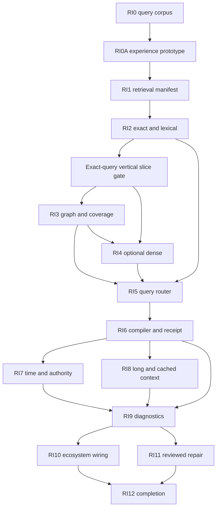

# Outcome

OKF Studio should answer a bundle question by selecting the evidence path that fits the question, preserving the knowledge structure that makes the evidence meaningful, and showing the user exactly what entered context. The connected model remains replaceable and the bundle remains useful without a model.

The transformation succeeds when exact lookup, relationship questions, semantic discovery, corpus-wide synthesis, temporal conflict checks, structured evidence, and small-bundle full-context tasks each have a measured route. Every route produces stable identities, source references, budget decisions, and a retrieval receipt. A failed answer can be traced to retrieval, filtering, context assembly, or generation instead of being one opaque miss.

The interface must remain one readable workspace as those capabilities arrive. Retrieval detail uses progressive disclosure and stable surface ownership instead of adding another persistent shelf for each backend stage.

This roadmap follows the [state-of-RAG research](rag-state-and-failures.md), implements the [OKF retrieval thesis](okf-retrieval-thesis.md), and is governed by the [retrieval experience contract](retrieval-experience-contract.md).

# Current baseline

The completed [agent-specialization roadmap](../agent-specialization-roadmap.md) already gives Studio full-text browser search, faceted filters, concept and graph identity, bounded graph traversal, bundle validation, Knowledge Health, source adapters, source provenance, explicit context plans, multi-bundle federation, structured artifacts, bundle fingerprints, one-shot MCP grants, and reviewed staging.

It does not have a retrieval manifest, lexical ranker, embeddings, reranker, query router, coverage-aware global search, coherent context compiler, temporal or authority model, retrieval receipt, or retrieval-specific benchmark. Existing agents can search and traverse with tools, but each provider must decide how to combine those calls and Studio cannot explain the resulting evidence selection.

# Product stance

- Start with an offline lexical and graph baseline. Dense retrieval is optional and must prove incremental value.
- Route queries instead of forcing every task through one pipeline.
- Preserve concept, section, source, and revision identity through every index and provider boundary.
- Compile context as coherent evidence, not an unordered top-k list.
- Enforce bundle grants before candidate generation. Relevance cannot expand scope.
- Keep indexes, embeddings, summaries, derived edges, and caches in disposable app data.
- Treat retrieval diagnostics as evidence. They do not become OKF conformance or automatic edits.
- Make repair explicit and reviewed. A missed query may suggest a bundle improvement but cannot write it.
- Keep provider-specific cache, embedding, or reranking support behind typed adapters.
- Benchmark retrieval and generation separately, then test the complete task.
- Prototype interface-changing packages before backend wiring and keep one owner for each user job.
- Preserve the conversation viewport and composer. Retrieval detail replaces flexible content or opens in the separate Retrieval Lab; it never adds an unbounded shelf.

# Cross-cutting contracts

Identity
: A retrieval unit has bundle ID, bundle fingerprint, concept ID, section ID, content hash, and source range. Section IDs are deterministic within one concept revision and never replace the concept's OKF identity.

Scope
: Rust resolves the selected bundle grant set before indexing or retrieval. A revoked, stale, or missing grant removes its candidates. Federated results keep bundle namespaces separate.

Derived state
: Indexes, embeddings, summaries, ranker features, and inferred relationships carry producer, version, input fingerprint, creation time, and invalidation state. None are authored bundle facts.

Evidence packet
: Each included unit retains parent concept, heading path, relevant metadata, citations, source identity, relationship context, and any health or authority caveat needed to interpret it.

Retrieval receipt
: Each query records route, candidate generators, scores, filters, included and omitted units, budget, provider involvement, timing, bundle fingerprints, and a stable reason code for every exclusion.

Provider boundary
: Studio records what it selected and delivered separately from observed model or agent use. Provider unavailability changes the route or reports a degraded task; it never becomes a silent pass.

Privacy
: Local indexes and receipts remain on device. Remote embedding, reranking, search, or cache calls require an explicit configured provider and disclose which text leaves the device.

Surface ownership
: Conversation, context plan, Reader, retrieval inspector, Retrieval Lab, Settings, and reviewed staging each own one class of work. A package cannot add a second owner for the same action or state.

Progressive disclosure
: Ordinary conversation shows an answer, citations, and one compact evidence summary. Candidate lists, scores, paths, filters, and route internals appear only after deliberate inspection.

Layout stability
: The conversation keeps the flexible height and the composer remains reachable. Dynamic retrieval state uses bounded regions, one scroll owner per region, and the narrow-width behavior defined in the [experience contract](retrieval-experience-contract.md).

# Second-pass risks

| Risk | Resolution in the package contract |
| --- | --- |
| “Use RAG” becomes a solution before query needs are known | Freeze query classes and compare routes in RI0 before choosing infrastructure |
| Concept files are treated as perfect chunks | Add deterministic section identity and coherent parent context in RI1 |
| Dense retrieval becomes a mandatory dependency | Ship lexical and graph routes first; gate dense work on measured incremental recall |
| Existing graph links are presented as causal or authoritative | Keep authored links, inferred candidates, and typed task relationships distinct |
| More context is mistaken for better context | Measure useful coverage, noise, citation support, and budget omissions separately |
| A generated global summary hides minority or conflicting evidence | Attach coverage, sources, fingerprint, and invalidation; retain direct evidence paths |
| Timestamps are treated as validity periods | Add explicit temporal and supersession signals without overloading `timestamp` |
| Bundle grants are marketed as enterprise ACLs | State the bundle-level boundary and defer concept ACL overlays to a separate contract |
| Provider cache changes answer semantics | Bind caches to the exact evidence-manifest digest and compare output against uncached mode |
| Retrieval repair turns into metadata spam | Measure held-out query improvement and keep every proposal in reviewed staging |
| The model judges its own retrieval | Use frozen relevance sets and deterministic metrics before labelled model critique |
| Debug receipts leak source content | Store bounded identities and excerpts, redact protected values, and inherit bundle retention rules |
| Backend packages accumulate controls in the Agent Panel | Name one surface owner and pass the experience definition of ready before implementation |
| Receipts compete with answers for reading space | Keep one compact turn summary and move technical detail into the replace-in-place inspector |
| Dynamic retrieval state squeezes live work or the composer | Enforce the layout invariants at 360, 440, 560, and wide widths before wiring |
| Retrieval controls migrate into an already crowded Settings area | Keep per-query choices with the receipt and reserve Settings for persistent defaults |
| Isolated components pass while the whole workspace fails under pressure | Screen Storybook states through MCP, then repeat the composition with live work, long content, and blocking recovery together |

# Experience gate for work packages

The [retrieval experience contract](retrieval-experience-contract.md) is a prerequisite for every package that changes visible behavior. Before production code, the package must name its user job, surface owner, disclosure levels, state matrix, focus and scroll behavior, narrow composition, and controls added or removed. Storybook MCP is used to inventory existing components and screen the proposed composition.

Completion requires colocated stories with interaction assertions, 360-pixel and wide screening, the owning integration journey, accessibility coverage, and whole-workspace pressure review. A technical package can complete without UI when it remains an internal contract. It cannot ship a provisional interface that defers these checks to RI9 or RI12.

# Work packages

## RI0: Query corpus and evaluation contract

- [ ] Build a frozen corpus of lookup, semantic, relationship, impact, global, temporal, contradiction, structured-data, abstention, and federated queries over representative OKF fixtures.
- [ ] Record relevant concepts, relevant sections, required paths, acceptable alternatives, forbidden sources, authority constraints, and expected abstention for each query.
- [ ] Include thin metadata, duplicate passages, stale claims, conflicting definitions, missing indexes, broken links, oversized concepts, tables, and 10,000-concept scale.
- [ ] Measure current browser search, existing OKF MCP tools, agent-directed search, and full-context prompting where the fixture fits.
- [ ] Score candidate recall and precision, path coverage, authority and grant violations, context bytes, useful evidence use, unsupported claims, abstention, latency, and provider cost when reported.
- [ ] Keep deterministic retrieval measures separate from answer-level and human usefulness review.
- [ ] Freeze thresholds before RI2 implementation.

Gate: the corpus exposes different winners for at least two query classes and can distinguish a retrieval miss from a generation miss without a live provider.

## RI0A: Experience architecture and first-slice prototype

- [ ] Freeze the user jobs and surface map in the [retrieval experience contract](retrieval-experience-contract.md).
- [ ] Inventory existing Agent Panel, task launcher, Reader, graph, structured-work, Settings, and shell components through Storybook MCP before proposing another component or region.
- [ ] Prototype the first exact or lexical question with a compact evidence summary, retrieval inspector, Reader source opening, and retained composer.
- [ ] Make the inspector replace the flexible transcript viewport and restore transcript scroll, draft state, selected evidence, and focus when closed.
- [ ] Cover preparing, ready, empty, partial, stale, permission-blocked, provider-unavailable, cancelled, oversized, and long-content states, marking genuinely inapplicable states in the story contract.
- [ ] Screen the prototype at 360, 440, 560, and wide widths with live work and a blocking request present.
- [ ] Record controls and persistent regions added, removed, or merged; reject any composition that needs another unbounded shelf.
- [ ] Write the interaction, keyboard, focus, scroll, and recovery acceptance criteria before RI1 production wiring begins.

Gate: the exact-query slice remains readable under live-work pressure, keeps the composer reachable, has one primary recovery action per blocking state, and adds no duplicate surface owner.

## RI1: Revision-bound retrieval manifest

- [ ] Define deterministic section IDs from concept ID, heading ancestry, structural ordinal, and content hash.
- [ ] Preserve Markdown paragraphs, lists, code, tables, citations, and frontmatter as coherent units instead of fixed token windows.
- [ ] Carry parent concept, bundle fingerprint, index ancestry, links, backlinks, type, tags, resource, timestamp, token estimate, and health signals with every unit.
- [ ] Define table units that retain headers and exact numeric cells when a row or subsection is retrieved.
- [ ] Store manifests in app data with schema version, producer version, source fingerprint, size bounds, atomic publication, cancellation, and rebuild state.
- [ ] Invalidate a manifest on bundle change without blocking ordinary reading or search.
- [ ] Add a provider-neutral JSONL export with stable OKF identities and no absolute filesystem paths.

Gate: rebuilding the same bundle produces the same manifest; a one-line concept change invalidates only the affected revision while every exported unit still resolves to visible source text.

## RI2: Local exact and lexical retrieval

- [ ] Add Rust-owned exact title, ID, tag, type, heading, citation, and identifier lookup over the manifest.
- [ ] Add a local BM25-style lexical index with field weighting and deterministic tokenization.
- [ ] Combine exact and lexical candidates through a documented rank-fusion rule.
- [ ] Respect active bundle grants, selected federation set, filters, language, and bundle fingerprint before ranking.
- [ ] Return bounded snippets with matched terms, section identity, score components, and exclusion reason codes.
- [ ] Keep index creation cancellable and incremental without moving raw bundle content outside app data.
- [ ] Compare against the RI0 baseline at small, medium, and generated scale.
- [ ] Connect the first-slice prototype to real exact and lexical results without changing its surface ownership or disclosure levels.

Gate: exact identifiers never lose to semantic-looking passages, lexical retrieval improves frozen recall over current substring search, and the route works offline without a model.

## RI3: Graph and coverage retrieval

- [ ] Add candidate expansion through links, backlinks, index ancestry, shared citations, and existing deterministic relationship candidates.
- [ ] Support bounded neighborhood, upstream, downstream, shortest-path, and path-between query plans.
- [ ] Keep ordinary OKF links untyped unless authored prose or a validated artifact supplies the relationship meaning.
- [ ] Add coverage-aware global retrieval over index sections and graph communities without requiring generated summaries.
- [ ] Label synthesized indexes, broken links, orphans, and heuristic relationships in the candidate evidence.
- [ ] Measure graph expansion against relationship, impact, and global RI0 cases and reject routes that add noise without recall.
- [ ] Add optional derived community summaries only after direct-evidence coverage is measurable and invalidate them by fingerprint.

Gate: relationship and global queries retrieve their required connected evidence more reliably than lexical-only search without presenting inferred edges as authored facts.

## RI4: Optional dense retrieval and reranking

- [ ] Define typed embedding and reranker adapters with local, configured endpoint, unavailable, degraded, and cancelled states.
- [ ] Start with no mandatory model. Compare a user-installed local embedding model and one configured remote endpoint against the same manifest contract.
- [ ] Bind embeddings to model identity, dimensions, normalization, manifest revision, and content hash.
- [ ] Combine dense candidates with exact, lexical, and graph results rather than replacing them.
- [ ] Rerank only a bounded candidate set and expose input count, selected count, model, latency, and score origin.
- [ ] Disclose exact text sent to a remote embedding or reranking provider before activation.
- [ ] Ship dense retrieval only if held-out semantic recall improves enough to justify index size, build time, privacy, and latency.

Gate: disabling or removing every embedding provider leaves a complete offline retrieval path, and dense mode shows measured incremental value on the frozen semantic cases.

## RI5: Inspectable query router

- [ ] Define stable query classes and route IDs for exact, lexical, semantic, relationship, global, temporal, structured, full-context, and mixed plans.
- [ ] Use deterministic features first: explicit UI action, query syntax, selected object, task ID, corpus size, available indexes, and provider capability.
- [ ] Add model-assisted routing only where RI0 shows deterministic routing is insufficient; retain confidence, model identity, and fallback.
- [ ] Preview the chosen route, bundle set, filters, network use, and context budget before a named task starts.
- [ ] Let the user choose another available route without rewriting the query.
- [ ] Keep routine local route selection at disclosure level 1; require preflight attention only when scope, network use, cost, or capability changes materially.
- [ ] Fall back to local lexical plus graph retrieval when a provider, cache, or model route fails.
- [ ] Compare routing against one fixed hybrid pipeline and per-class oracle routes.

Gate: the router improves the aggregate RI0 score over a fixed route, never changes grants, and always has a visible deterministic fallback.

## RI6: Coherent context compiler and receipt

- [ ] Assemble selected units with concept title, heading path, defining context, table headers, citations, and relationship explanation.
- [ ] Deduplicate overlap while preserving distinct conflicting claims and source identities.
- [ ] Order definitions and primary evidence before dependent interpretation; preserve temporal order where the query requires it.
- [ ] Budget by estimated provider tokens and bytes, keep coherent units intact, and report every omitted candidate with a reason.
- [ ] Define a versioned evidence-packet schema for Studio Agent, ACP text fallback, MCP resources, and export.
- [ ] Define a versioned retrieval receipt with route, candidates, scores, filters, inclusions, omissions, budgets, timing, and fingerprints.
- [ ] Render one compact turn-owned evidence summary and open the full receipt in the replace-in-place retrieval inspector; never stack the receipt as another persistent conversation band.
- [ ] Preserve transcript scroll, draft state, selected source, and focus across inspector open, close, rerun, stale recovery, and route changes.

Gate: a user can answer “why was this included, why was that omitted, and which bundle revision was searched?” from the receipt without reading logs.

## RI7: Time, authority, conflict, and abstention

- [ ] Inventory existing timestamp, log, source, citation, freshness, conflict, and ownership signals without treating any single field as authority.
- [ ] Define optional derived effective-time, supersession, source-class, and authority annotations in app data or validated artifacts before proposing any OKF profile.
- [ ] Detect competing claims and retain both in context when no authority rule resolves them.
- [ ] Add route filters for current-as-of, changed-since, source class, and explicit owner where evidence supports them.
- [ ] Require abstention or a conflict answer when required authority or current evidence is absent.
- [ ] Keep temporal and authority inferences labelled and reviewable.
- [ ] Add benchmark cases for relative dates, superseded definitions, unresolved ownership, and stale citations.

Gate: Studio never turns a file timestamp or top rank into a silent authority decision, and unresolved conflicts remain visible in the evidence packet and answer contract.

## RI8: Long-context and cached-snapshot routing

- [ ] Define a full-context eligibility check from corpus size, source scope, provider window, cache support, privacy, and expected update rate.
- [ ] Build a canonical ordered bundle snapshot from the retrieval manifest with exact fingerprint and token estimate.
- [ ] Negotiate long-context and prefix or KV cache support where the provider exposes it; otherwise report unavailable.
- [ ] Invalidate cache identity on any evidence-manifest change and never reuse a cache across bundle grant sets.
- [ ] Compare full-context, cached-context, routed retrieval, and mixed modes on small stable bundles.
- [ ] Show cache creation, reuse, invalidation, provider, text scope, cost, and latency in the receipt.
- [ ] Fall back to ordinary retrieval without changing the query or claim contract.

Gate: cached mode produces the same evidence scope as its canonical snapshot, invalidates exactly, and wins a measured cost or latency trade-off without a quality regression.

## RI9: Retrieval diagnostics and lab UX

- [ ] Classify empty results, low recall, noisy candidates, filter mismatch, stale manifest, missing metadata, conflicting evidence, budget omission, provider failure, and generation non-use as separate failures.
- [ ] Add a diffable diagnostic bundle containing query, route, candidate lists before and after each stage, context packet, receipt, answer citations, and corpus health scoped to involved concepts.
- [ ] Build a separate Retrieval Lab workspace that can compare two routes or configurations on one query without changing default settings or reducing the ordinary conversation viewport.
- [ ] Show score components, graph paths, exact matches, provider involvement, latency, and omissions in a scan-friendly layout.
- [ ] Keep protected content bounded and inherit bundle grant, retention, deletion, and export rules.
- [ ] Add loading, empty, partial, stale, conflict, provider-unavailable, large, and 360-pixel states in Storybook and screen them through Storybook MCP.
- [ ] Keep raw scores, stage tables, and diagnostic exports out of the default evidence summary and general Settings.
- [ ] Let users export a redacted diagnostic bundle for an external RAG stack or attach it to an OKF research task.

Gate: seeded failures land in the correct diagnostic class, two receipts produce a stable diff, and the lab never broadens source scope or writes a bundle.

## RI10: Agent, MCP, CLI, and ecosystem wiring

- [ ] Add bounded tools for query planning, retrieval, receipt inspection, and failure diagnosis to the built-in OKF capability pack.
- [ ] Expose the same tools through Studio Agent and the one-shot granted MCP server with capability and resource receipts.
- [ ] Add native OKF actions from search, reader, graph, validation, source inventory, and structured work surfaces.
- [ ] Inventory every proposed entry action against the surface map and merge duplicate actions before adding another persistent control.
- [ ] Let CLI and deep-link entry points prefill a query and route request but require the existing grant and visible confirmation boundaries.
- [ ] Publish the retrieval-manifest and receipt schemas with adapters for at least one local search engine and one external vector store.
- [ ] Keep tool results provider-neutral and free of absolute filesystem paths, credentials, or unbounded source bodies.
- [ ] Benchmark generic chat and named tasks against the same retrieval contract.

Gate: an external agent can retrieve and explain bounded OKF context without implementing its own chunker or receiving broader filesystem access.

## RI11: Reviewed knowledge repair loop

- [ ] Turn retrieval failures into candidate repairs for titles, descriptions, links, index entries, citations, source mappings, concept splits, and optional metadata.
- [ ] Require the diagnostic bundle, affected held-out queries, expected improvement, and evidence source for every repair proposal.
- [ ] Keep suggestions advisory and separate from OKF conformance.
- [ ] Send accepted repairs through the existing author or enrich capability, claim ledger, staged revision, validation, diff review, and Apply.
- [ ] Rebuild the affected manifest and rerun both triggering and held-out queries before presenting improvement.
- [ ] Detect keyword stuffing, duplicated aliases, generated summary churn, and repairs that improve one query while harming others.
- [ ] Retain before-and-after retrieval receipts with the staged checkpoint.

Gate: a reviewed repair improves its declared retrieval case without a held-out regression, unsupported claim, or direct index-to-bundle write path.

## RI12: Rollout and completion

- [ ] Dogfood the full path on the Studio docs bundle and at least two external OKF bundles with different schemas and sizes.
- [ ] Run the frozen corpus twice in shuffled order through offline lexical and graph routes, optional dense mode, one external agent, and one local model where available.
- [ ] Complete privacy, threat, performance, cache, corruption, cancellation, live-reload, federation, and provider-failure reviews.
- [ ] Update feature, architecture, UX, migration, support, site, and capability-pack documentation when behavior ships.
- [ ] Add app-data migration, index rebuild, provider removal, cache invalidation, and rollback paths.
- [ ] Run app, Rust, Storybook, site, OKF, ODSF, installer, and platform gates.
- [ ] Repeat the experience definition of done with simultaneous long content, live work, blocking recovery, stale evidence, and narrow width rather than isolated happy-path stories alone.
- [ ] Retain honest unavailable results for providers or platform paths that cannot be tested.

Gate: a new user can ask a real bundle question, inspect and override the route, receive cited context from the correct scope, diagnose a seeded miss, and carry an accepted repair through reviewed staging while the app remains useful offline with no embedding model.

# Delivery order

RI0 establishes the measured retrieval problem. RI0A then freezes the workspace behavior before production retrieval wiring. The first delivered vertical slice connects only the manifest, exact or lexical route, compact summary, inspector, and Reader source opening. Graph, dense, cached, diagnostic, ecosystem, and repair work follow after that slice passes the experience gate.

# Exit contract

- Retrieval works offline over a granted bundle with no account, model, embedding download, or vector database.
- Exact, lexical, graph, semantic, global, temporal, structured, and full-context routes have explicit support and unavailable states.
- Every retrieved unit resolves to a visible bundle concept and source range at one exact fingerprint.
- Every query produces a bounded receipt that explains route, scope, candidates, filters, inclusions, omissions, budget, provider use, and timing.
- Revoking a bundle grant removes its candidates, index access, cache eligibility, and exported context.
- Dense and cached modes are optional adapters whose removal leaves the local path intact.
- Authored links, inferred relationships, generated summaries, ranker scores, and source authority remain distinguishable.
- Retrieval and generation failures are measured separately and then exercised together.
- A retrieval defect can become a reviewed OKF repair but can never write directly from an index or diagnostic.
- Existing agents can consume the same context engine through bounded Studio and MCP tools.
- The first exact-query slice passes the experience contract before graph, dense, cached, or diagnostic UI ships.
- Ordinary turns show one compact evidence summary; technical receipt detail stays in the replace-in-place inspector or separate Retrieval Lab.
- Conversation, live work, and composer regions keep stable owners and remain usable at 360, 440, 560, and wide widths under simultaneous pressure.

# Deferred decisions

- bundled embedding model versus user-installed local model;
- concept-level policy overlay and enterprise identity mapping;
- an optional typed-relationship OKF profile;
- cross-device index or cache synchronization;
- a persistent background context service outside the desktop application;
- remote hosted indexes managed by Studio;
- automatic web crawling beyond explicit source fetches;
- learned routing trained from user activity or telemetry.
