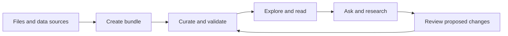
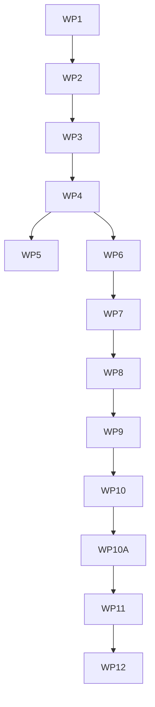

# Outcome

OKF Studio brings the complete knowledge loop into one desktop workspace:

The graph and reader remain first-class. The new [Agent Panel](../features/agent-panel.md) acts on the knowledge beside them: create bundles from source material, enrich existing bundles, propose dataset documentation changes, and conduct cited research.

# Product stance

- Opening a folder remains read-only. Write access is a separate, visible grant scoped to a thread and bundle.
- There is no required Studio account or hosted service. Users bring an agent subscription, API key, or local model.
- Agent work stays visible as plans, activity, tool calls, citations, and diffs.
- Every write transaction runs OKF validation before apply.
- The packaged OKF skill and Studio tools provide the domain contract. Connections remain replaceable.

# Agent paths

| Path | Authentication | OKF guarantee | Best for |
| --- | --- | --- | --- |
| External agent over ACP | Owned by Claude Agent, Codex, or another agent | Studio context, scoped client tools, permissions, and OKF tools where supported | Existing subscriptions and native agent behavior |
| Studio Agent | API key in the OS credential store or local endpoint | Studio system prompt, packaged OKF skill, scoped tools, validation, and review | Predictable OKF work and local models |
| Local external agent over ACP | Owned by the local harness | Same capability-based ACP boundary | Fully local or self-hosted work |

ACP does not standardize replacing an external agent's system prompt. Studio Agent is the path with that guarantee. External agents receive explicit OKF resources and tools through capabilities the integration supports.

# Work packages

Each package ends in a focused commit and its own verification gate.

## WP0: Research and contract

- [x] Research Zed's panel, provider boundaries, ACP client, permissions, sandbox, skills, threads, and diff review.
- [x] Record the target feature, architecture, security boundary, and source reference.
- [x] Validate and commit the docs bundle.

Gate: this roadmap, [Agent Panel](../features/agent-panel.md), [Agent System](../architecture/agent-system.md), and [Zed research](../reference/zed-agent-system.md) agree.

## WP1: Studio identity without breaking upgrades

- [x] Rename visible app, docs, fixture, site, window-title, and display metadata copy to **OKF Studio**.
- [x] Replace the viewer one-liner with a proposition covering connected knowledge and user-chosen agents.
- [x] Keep the repository name, update endpoint, Tauri identifier `app.okfviewer.desktop`, and current app-data location so installed copies upgrade in place.
- [x] Document compatibility names that intentionally remain `okf-viewer`.

Gate: no visible Viewer branding remains; updater identity is unchanged; app and site builds pass.

## WP2: Agent Panel shell

- [x] Put the Agent opener last at the bottom-right of the status bar.
- [x] Toggle a resizable right dock that reduces the workspace instead of covering it.
- [x] Persist visibility and width; add `Ctrl/Cmd+Shift+A` and a command-palette action.
- [x] Ship no-connection, loading, connection-error, no-bundle, and narrow-window states.

Gate: keyboard, focus return, axe, 24px targets, and screenshots at narrow and wide widths.

## WP3: Catalog and installation

- [x] Model available, installing, installed, connecting, auth-required, ready, update, and failed states.
- [x] Read the curated ACP Registry and feature Claude Agent, Codex, and local choices without brand-specific domain logic.
- [x] Support custom ACP commands.
- [x] Install in Rust with pinned versions, integrity checks, cancellation, and app-cache isolation.
- [x] Manage an app-scoped Node runtime for registry `npx` packages and disclose download size before install.
- [x] Install production dependencies without lifecycle scripts and record the dependency lock before activation.

Gate: mocked offline, corrupt, unsupported-platform, cancel, retry, and update tests. Discovery never starts an agent.

## WP4: ACP runtime

- [x] Add a Rust boundary using the official `agent-client-protocol` client.
- [x] Start agents on demand over stdin/stdout JSON-RPC; keep bounded redacted stderr diagnostics.
- [x] Negotiate a typed capability set during initialization.
- [x] Scope each new session to one canonical absolute bundle root.
- [x] Expose typed Tauri commands and terminal lifecycle events for custom connections.
- [x] Launch installed catalog agents through managed Node and the same ACP actor.
- [x] Expose typed Tauri commands/events for text prompts, streaming, and cancellation.
- [x] Expose typed permission requests and responses with deny-by-default cancellation.
- [x] Stop children on disconnect, removal, and app exit.

Gate: a fake agent covers initialize, auth, session/new, streaming, permission, cancellation, crash, and reconnect.

## WP5: Authentication and providers

- [x] Render stable agent-owned ACP auth methods; let external agents own browser, subscription, and token login.
- [ ] Add client-owned terminal and environment-variable authentication if ACP stabilizes those variants.
- [x] Never copy external-agent credentials into Studio settings or logs.
- [x] Store Studio Agent keys only in the OS credential store.
- [x] Configure and probe Ollama, LM Studio, llama.cpp, and custom OpenAI-compatible endpoints without sending prompts or credentials.
- [x] Use a selected model from a saved local endpoint for bounded text-only Studio Agent turns.

Gate: secrets never enter frontend state, settings JSON, transcripts, diagnostics, or snapshots.

## WP6: Threads and conversation

- [x] Ship the first bundle-scoped text conversation with streamed output and Stop.
- [x] Render agent responses as sanitized Markdown while preserving user messages as literal text.
- [x] Distinguish waiting, running, cancelled, and failed states in the active thread.
- [x] Add archived and restorable thread states after Studio metadata persistence lands.
- [x] Stream structured ACP plans as live replacement cards and preserve the final plan in export.
- [x] Stream bounded ACP tool-call lifecycle cards without raw arguments or output.
- [x] Stream bounded ACP context-window usage and cumulative session cost when reported.
- [x] Stream bundle-scoped tool locations without absolute path disclosure or access grants.
- [x] Support send, stop, and safe retry when a prompt fails before turn acceptance.
- [x] Export the current in-memory thread as Markdown through an explicit native save dialog.
- [x] Derive and edit a title for the current in-memory thread and use it in Markdown export.
- [x] Queue one visible, editable in-memory follow-up and submit it after the active turn.
- [x] Browse and restore bundle-matching agent-owned ACP sessions when both list and load are advertised.
- [x] Add accepted-turn retry while the same ACP session remains live.
- [x] Persist the current thread title and agent-owned session pointer per bundle and profile; re-list through ACP before restore.

Gate: reducer and fake-agent tests cover concurrent sessions, cancellation, and late updates.

## WP7: OKF context and tools

- [x] Package the OKF skill from one canonical source and attach it with the bundle index on the first ACP turn.
- [x] Provide ACP agents with canonical, session-scoped, read-only text access to the active bundle.
- [x] Attach up to eight concepts through a searchable picker as visible, removable, scoped resource links.
- [x] Give Studio Agent a native system boundary and a metadata-only catalog generated from the canonical OKF skill.
- [x] Progressively load the detailed OKF skill resources through the native tool loop.
- [x] Add the native Studio Agent tool loop before enabling bundle context, sources, or edits for local models.
- [x] Keep recoverable native tool failures inside the bounded model loop while cancellation remains terminal.
- [x] Add bounded native search and graph traversal tools and offer them to every ACP session over standard stdio MCP.
- [x] Add bounded inventory and validation inspection with filtered cursor paging.
- [x] Add bounded concept reads and native source discovery without arbitrary file access or network fetching.
- [x] Add source extraction, proposed write, and review tools.
- [x] Attach the active bundle, selected concepts, sources, and validation issues explicitly.
- [x] Attach bounded reader selections explicitly through the compact context menu.
- [x] Attach previous-thread context explicitly after thread persistence lands.
- [x] Establish the per-session, bundle-scoped stdio MCP tool boundary for ACP agents.

Gate: benchmark tasks produce conformant output on Studio Agent, Claude Agent, Codex, and one local model, with limitations recorded.

## WP8: Reviewed writes

- [x] Keep tools read-only until **Allow edits in this thread** is granted.
- [x] Stage Studio writes; show bounded per-file diffs and reject controls.
- [x] Add revision-bound per-hunk keep and reject selection before apply.
- [x] Reduce ACP diff content into the staged change service; never present it as an applied Studio change.
- [x] Validate the selected staged tree against the same OKF parser and validator used for the open bundle.
- [x] Apply the exact validated revision as a rollback transaction.
- [x] Retain a guarded connection-lifetime checkpoint and restore the latest apply.
- [x] Persist the latest successful checkpoint outside the bundle and restore it after restart.
- [x] Recover transactions interrupted while apply or restore is in progress.
- [x] Protect `.git`, credentials, packaged skills, and paths outside granted roots.
- [x] Require an enforcement-capable sandbox before unattended external-agent writes.

Gate: traversal, crash safety, validator parity, checkpoint restore, and hostile-agent tests.

## WP9: Create and enhance from sources

- [x] Accept pasted text and Markdown as visible, removable, bounded source attachments.
- [x] Select local text and Markdown files through the native host, without exposing absolute paths.
- [x] Preserve local HTML, CSV, and JSON as inert, media-typed UTF-8 source evidence.
- [x] Extract bounded PDFs in an isolated helper with page provenance, original-file hashes, and partial-text warnings.
- [x] Discover supported sources from a bounded local folder without exposing its absolute path.
- [x] Fetch bounded public HTTPS text, Markdown, HTML, CSV, and JSON sources with redirect-safe network mediation and final-URL provenance.
- [x] Accept bounded PNG, JPEG, and WebP images when the connected ACP agent advertises image prompt support.
- [x] Normalize CSV locally with strict records, original-file hashes, and row-range provenance.
- [x] Normalize JSON locally with deterministic JSON Pointer provenance and original-file hashes.
- [x] Show the proposed concepts, types, links, and indexes before generation.
- [x] Generate into staging, validate, preview the graph, then choose a destination.
- [x] Reuse the pipeline to enrich bundles without silently overwriting authored facts.

The generation and enhancement package is complete. The newest reviewed proposal enters staged writes after an explicit thread grant. Create validates and previews an isolated fresh-bundle tree, then writes the exact reviewed revision into a new named folder below a parent the user chooses. Enhance overlays the active bundle but blocks validation and Apply until every hunk touching an existing file has an explicit Keep or Reject choice. Existing destination folders are never merged with or replaced.

Gate: mixed, duplicate, malformed, offline, provenance, and deterministic-validation fixtures.

## WP10: Guided knowledge work

- [x] Add **Create bundle**, **Enhance bundle**, **Request dataset change**, and **Deep research** starters.
- [x] Keep starters as normal inspectable threads, not separate result silos.
- [x] Require cited evidence and mark inference in research exports.
- [x] Require a change plan and affected-concept set before dataset edits.

Gate: end-to-end tests reach useful results with no hidden write or network action.

## WP10A: Agent workspace UX refinement

The Agent Panel now contains the complete workflow, but its controls accumulated as separate feature layers. In a live thread, the connection strip, thread strip, thread toolbar, saved-thread prompt, starters, transcript, and composer can all appear at once. The next pass must establish one visible hierarchy for the user's current task before adding more autonomy.

The journey contract defines what earns persistent space and what stays deferred:

| Journey | Keep visible | Defer or hide |
| --- | --- | --- |
| No bundle or connection | Current bundle state, one **Connect an agent** action, and the fact that browsing starts no agent | Thread controls, history, write grants, workflow starters, and the composer |
| First connected thread | Agent, bundle scope, authentication when required, one short orientation, starters, and the composer | History when none exists, staged-change actions, secondary connection details, and duplicate bundle labels |
| Returning to saved work | Saved thread title, agent, age or state, **Resume**, **Dismiss**, and a clear **Start new thread** alternative | A second empty-thread explanation and the full starter grid until the user chooses new work |
| Research | Thread identity, attached evidence, turn state, source requirements, transcript, and composer | Write grants and staged-change actions until the agent requests a write or the user selects an editing workflow |
| Create or enhance | Workflow identity, edit-grant state, staged-change state, review and validation progress, transcript, and composer | Research-only export guidance and unrelated toolbar actions |
| Permission or failure | The blocking request or error beside the action that owns it, recovery action, retained draft, and Stop when applicable | Unrelated actions that cannot complete; disabled controls must explain why |
| Parallel agents and threads | Selected agent and thread, compact status, switch affordances, and one add action per level | Repeated product, bundle, agent, and thread labels across stacked bars |
| Narrow panel | The same task state, a scrollable or condensed switcher, transcript, and composer with 24px minimum targets | Text labels that can move into an accessible overflow menu without hiding state |

The persistent-band audit assigns one owner to each identity: the global switcher owns the bundle, the connection strip owns the agent, and the thread strip owns the thread. The panel header owns entry and exit, the task-aware action row owns direct thread boundaries, the transcript owns work and blocking state, staged review owns edits, and the composer owns intake plus turn submission. The removed duplication was the toolbar's second agent, bundle, and thread label. Empty read-only threads no longer show disabled edit, export, or archive commands. History, Export, Archive, and Change agent now share one predictable secondary menu; the History surface keeps a direct Back action.

- [x] Inventory every persistent band and action across disconnected, authentication, empty, resumed, streaming, permission, staged, validation, and error states. Record duplicate labels, actions without a current use, and controls that move between states.
- [ ] Prototype the workspace hierarchy with real long agent, bundle, and thread names. Compare a merged agent/thread navigator with the current stacked strips at 360px, the default panel width, and 560px before choosing the structure.
- [x] Reduce the live workspace to one clear identity header. The selected agent and thread remain discoverable, while the product name, bundle name, connection state, and repeated new-thread actions appear only where they add information.
- [x] Make saved-thread continuation a distinct returning-user state. Resume, dismiss, or start new work must resolve that state before the ordinary empty-thread guidance takes over.
- [x] Separate research and editing emphasis. Keep read-only research calm by default; reveal the edit grant, staged review, validation, Apply, and Restore controls when the selected workflow or live stage makes them relevant.
- [x] Consolidate secondary thread actions into one predictable menu. Keep Stop, Send or Queue, the active blocking request, and staged-review actions direct because they are time-sensitive.
- [x] Give the transcript the dominant vertical budget. Empty guidance must be short enough that the composer remains visually connected to it, and long content must scroll without pushing identity or send controls out of reach.
- [ ] Treat connection, session, turn, permission, staging, and validation as separate status owners. Each failure appears once beside its recovery action and survives switching away and back to its agent or thread.
  - [x] Retain an unexpected process failure at panel level after its connection disappears. Keep the reason beside **Review connections** and **Dismiss**, and clear it when the same profile reconnects.
  - [x] Give session event-stream failures their own retryable thread notice instead of presenting them as agent prose.
  - [x] Keep turn-control failures beside Stop or Retry without duplicating terminal turn records.
  - [x] Keep permission-response failures inside their request card while that request remains active.
  - [ ] Move staging operation failures into the staged-review or proposal surface that owns the retry; keep validation failures inside validation.
- [ ] Add a deterministic UI state gallery or fixture for the journey matrix, including long names, long errors, no history, stale history, unsupported capabilities, active turns, queued prompts, permissions, staged changes, and disconnected processes.
- [ ] Verify keyboard order, focus return, popover focus, horizontal switcher scrolling, 24px targets, text reflow, and visible focus at narrow and wide widths. No task-critical action may exist only on hover.
- [ ] Run a visual-consistency pass over spacing, type scale, common edges, dividers, repeated controls, overflow, and focus rings. Use the existing theme tokens and record any hierarchy choice that still needs judgment.
- [ ] Dogfood the first-use, resume, deep-research, create, enhance, permission, failure-recovery, parallel-thread, and narrow-panel journeys. Capture before and after screenshots and note where the user must hunt, backtrack, or interpret hidden state.

Gate: each journey has one obvious next action, no duplicated persistent identity, no hidden blocking state, and screenshot plus keyboard evidence at 360px, the default panel width, and 560px.

## WP11: Isolation and autonomy

- [x] Enforce the active bundle root through a Rust-owned grant registry rather than trusting a path supplied by the webview.
  - [x] Move local folder selection behind a Rust command that registers only the canonical path returned by the native dialog.
  - [x] Register remote-cache roots when the Rust fetch completes and persist enough Rust-owned grant metadata to reopen a recent bundle without trusting the frontend store as authority.
  - [x] Require a live grant for scanning, bundle reads, asset reads, watching, and agent session creation; keep source, export, and fresh-destination pickers as separate one-operation grants.
  - [x] Cover forged paths, stale recents, symbolic links, pop-out windows, remote-cache eviction, and grant revocation with native tests.
- [ ] Add OS-level restrictions where enforceable; keep writes scoped, protect Git metadata, and default-deny local-agent network.
  - [x] Own each external ACP process tree and terminate descendants on disconnect or host cancellation.
  - [x] Bind each external process launch to one canonical Rust-granted bundle root and reject cross-bundle session operations before ACP dispatch.
  - [x] Show the effective bundle, file, network, write, and process scope in every live thread.
  - [x] Reject model-invented native tools before dispatch and refuse provider redirects without contacting their destination.
- [ ] Support allow/deny once, thread grants, and narrow persistent rules.
  - [x] Reuse an explicit once-decision only for the exact same bounded request in one live thread.
  - [ ] Add cross-session rules after ACP exposes a stable tool identity and Studio can show their scope.
- [x] Add parallel threads only after single-thread cancellation, permissions, and transactions are reliable.
  - [x] Keep one live bundle-scoped conversation per active connection mounted and switch without interrupting its turn.
  - [x] Isolate each live conversation surface so one connection can own multiple concurrent sessions without weakening its one-turn-per-session rule.
- [ ] Make unattended mode an explicit profile with visible scope and stop conditions.

Gate: platform docs and tests state exactly what is contained on Windows, Linux, and macOS.

### WP11 exit contract

The remaining WP11 boxes stay open until their enforcement dependency exists. A command wrapper, provider self-report, or process-tree owner cannot unlock unattended mode.

- [ ] Choose and test an external-process host that limits filesystem access to the active bundle plus explicit app-owned runtime paths, denies Git and credential paths below those mounts, and reports a closed network mode.
  - [x] Select system Bubblewrap for the first Linux backend and preflight its ownership, mode, file capabilities, namespace creation, network isolation, parent-death handling, and deadline without enabling a launch profile.
  - [x] Compile and test the fail-closed Linux launch branch: empty mount root, read-only system and app runtime paths, one read-only Rust-granted bundle, protected-path masks, private temporary filesystems, bounded policy traversal, nested-user-namespace denial, and an explicit network mode. Derive managed app mounts from the verified Node receipt and canonical package root instead of a broad cache parent.
  - [x] Exercise that branch with the distribution Bubblewrap package on Ubuntu 22.04 CI and prove protected-path masking, read-only bundle access, private temporary storage, and successful lifecycle completion.
  - [x] Launch an explicit Restricted offline custom ACP command through the proven backend with the complete mount and protected-path policy, then bind its live evidence to the connection profile only after process spawn and POSIX process-group attachment. Standard stays the default, and managed subscription agents remain off this profile.
- [ ] Provide a Windows enforcement path. WSL plus Bubblewrap may be an opt-in profile, but Studio cannot assume WSL exists or describe a native Job Object as a filesystem or network sandbox. A Linux- or macOS-only first slice must remain visibly unavailable on Windows.
- [x] Bind every isolation claim to launcher-produced evidence. Saved profile text and agent-advertised capabilities are descriptive input, never proof that containment is active.
- [x] Define reusable profiles by effective mounts, writable roots, network policy, credential exposure, lifetime, and stop conditions. The initial native-mediated and external-interactive profiles both lock unattended work; the external baseline explicitly reports host network access instead of hiding it. A future restricted profile must model authentication bootstrap as a separate network exception.
- [ ] Add cross-session permission rules only when ACP supplies a stable tool identity that Studio can display and match independently of agent-controlled titles or raw arguments.
- [ ] Unlock unattended writes only for a live connection whose verified host profile satisfies the filesystem, network, and process requirements on that platform. Revocation, timeout, disconnect, app exit, and failed verification must all return to deny.
- [x] Treat the active bundle as granted only when the Rust registry produced and still owns the canonical root. Frontend store entries and path strings cannot satisfy this condition.

## WP12: Completion

- [x] Update the site with each user-facing package and recapture changed surfaces.
- [x] Run app, Rust, site, OKF, and ODSF gates.
- [x] Dogfood creation and reviewed editing against `docs/`.
- [x] Publish migration notes for local data, credentials, billing, and compatibility names.

Gate: Studio creates a conformant bundle from mixed sources, improves it through reviewed changes, and answers a cited question through a subscription agent or fully local path.

# Dependency order

# Deferred decisions

- The native agent-loop library is chosen in WP7 against executable provider and tool tests.
- The Windows sandbox is chosen in WP11. Native Windows lacks Zed's WSL plus Bubblewrap enforcement, so Studio must not promise confinement before it exists.
- Repository and application identifiers remain compatibility names until a separate updater/app-data migration exists.
