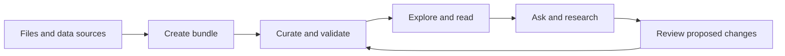
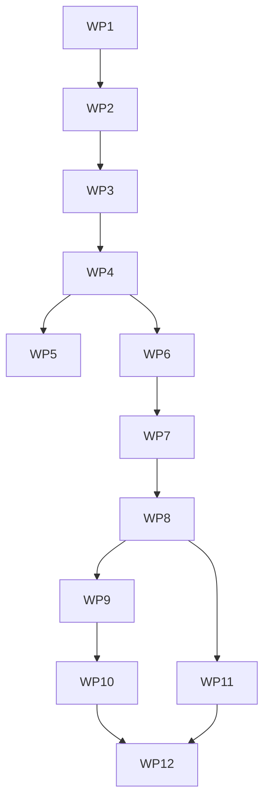

# Outcome

OKF Studio brings the complete knowledge loop into one desktop workspace:

The graph and reader remain first-class. The new [Agent Panel](../features/agent-panel.md) acts on the knowledge beside them: create bundles from source material, enrich existing bundles, propose dataset documentation changes, and conduct cited research.

# Product stance

- Opening a folder remains read-only. Write access is a separate, visible grant scoped to a thread and bundle.
- There is no required Studio account or hosted service. Users bring an agent subscription, API key, or local model.
- Agent work stays visible as plans, activity, tool calls, citations, and diffs.
- Every write transaction runs OKF validation before apply.
- The packaged OKF skill and Studio tools provide the domain contract. Connections remain replaceable.

# Agent paths

| Path | Authentication | OKF guarantee | Best for |
| --- | --- | --- | --- |
| External agent over ACP | Owned by Claude Agent, Codex, or another agent | Studio context, scoped client tools, permissions, and OKF tools where supported | Existing subscriptions and native agent behavior |
| Studio Agent | API key in the OS credential store or local endpoint | Studio system prompt, packaged OKF skill, scoped tools, validation, and review | Predictable OKF work and local models |
| Local external agent over ACP | Owned by the local harness | Same capability-based ACP boundary | Fully local or self-hosted work |

ACP does not standardize replacing an external agent's system prompt. Studio Agent is the path with that guarantee. External agents receive explicit OKF resources and tools through capabilities the integration supports.

# Work packages

Each package ends in a focused commit and its own verification gate.

## WP0: Research and contract

- [x] Research Zed's panel, provider boundaries, ACP client, permissions, sandbox, skills, threads, and diff review.
- [x] Record the target feature, architecture, security boundary, and source reference.
- [x] Validate and commit the docs bundle.

Gate: this roadmap, [Agent Panel](../features/agent-panel.md), [Agent System](../architecture/agent-system.md), and [Zed research](../reference/zed-agent-system.md) agree.

## WP1: Studio identity without breaking upgrades

- [x] Rename visible app, docs, fixture, site, window-title, and display metadata copy to **OKF Studio**.
- [ ] Replace the viewer one-liner with the knowledge-loop proposition once the Agent Panel makes that claim true.
- [x] Keep the repository name, update endpoint, Tauri identifier `app.okfviewer.desktop`, and current app-data location so installed copies upgrade in place.
- [x] Document compatibility names that intentionally remain `okf-viewer`.

Gate: no visible Viewer branding remains; updater identity is unchanged; app and site builds pass.

## WP2: Agent Panel shell

- [x] Put the Agent opener last at the bottom-right of the status bar.
- [x] Toggle a resizable right dock that reduces the workspace instead of covering it.
- [x] Persist visibility and width; add `Ctrl/Cmd+Shift+A` and a command-palette action.
- [x] Ship no-connection, loading, connection-error, no-bundle, and narrow-window states.

Gate: keyboard, focus return, axe, 24px targets, and screenshots at narrow and wide widths.

## WP3: Catalog and installation

- [x] Model available, installing, installed, connecting, auth-required, ready, update, and failed states.
- [x] Read the curated ACP Registry and feature Claude Agent, Codex, and local choices without brand-specific domain logic.
- [x] Support custom ACP commands.
- [x] Install in Rust with pinned versions, integrity checks, cancellation, and app-cache isolation.
- [x] Manage an app-scoped Node runtime for registry `npx` packages and disclose download size before install.
- [x] Install production dependencies without lifecycle scripts and record the dependency lock before activation.

Gate: mocked offline, corrupt, unsupported-platform, cancel, retry, and update tests. Discovery never starts an agent.

## WP4: ACP runtime

- [x] Add a Rust boundary using the official `agent-client-protocol` client.
- [x] Start agents on demand over stdin/stdout JSON-RPC; keep bounded redacted stderr diagnostics.
- [x] Negotiate a typed capability set during initialization.
- [x] Scope each new session to one canonical absolute bundle root.
- [x] Expose typed Tauri commands and terminal lifecycle events for custom connections.
- [x] Launch installed catalog agents through managed Node and the same ACP actor.
- [x] Expose typed Tauri commands/events for text prompts, streaming, and cancellation.
- [x] Expose typed permission requests and responses with deny-by-default cancellation.
- [x] Stop children on disconnect, removal, and app exit.

Gate: a fake agent covers initialize, auth, session/new, streaming, permission, cancellation, crash, and reconnect.

## WP5: Authentication and providers

- [x] Render stable agent-owned ACP auth methods; let external agents own browser, subscription, and token login.
- [ ] Add client-owned terminal and environment-variable authentication if ACP stabilizes those variants.
- [x] Never copy external-agent credentials into Studio settings or logs.
- [ ] Store Studio Agent keys only in the OS credential store.
- [ ] Add Ollama, LM Studio, llama.cpp, and custom compatible endpoints with connection tests.

Gate: secrets never enter frontend state, settings JSON, transcripts, diagnostics, or snapshots.

## WP6: Threads and conversation

- [x] Ship the first bundle-scoped text conversation with streamed output and Stop.
- [ ] Implement active, waiting, running, cancelled, failed, archived, and restorable thread states.
- [ ] Stream messages, plans, tool cards, locations, diffs, usage, and stop reasons.
- [ ] Support send, queue, stop, supported retry, titles, history, and Markdown export.
- [ ] Persist Studio metadata; use ACP restore capabilities only when advertised.

Gate: reducer and fake-agent tests cover concurrent sessions, cancellation, and late updates.

## WP7: OKF context and tools

- [x] Package the OKF skill from one canonical source and attach it with the bundle index on the first ACP turn.
- [x] Provide ACP agents with canonical, session-scoped, read-only text access to the active bundle.
- [x] Attach up to eight concepts through a searchable picker as visible, removable, scoped resource links.
- [ ] Give Studio Agent its OKF system prompt and progressive-disclosure skill catalog.
- [x] Add bounded native search and graph traversal tools and offer them to every ACP session over standard stdio MCP.
- [ ] Add native inventory, source extraction, proposed write, validation, and review tools.
- [ ] Attach bundle, selection, source, issue, and previous-thread context explicitly.
- [x] Establish the per-session, bundle-scoped stdio MCP tool boundary for ACP agents.

Gate: benchmark tasks produce conformant output on Studio Agent, Claude Agent, Codex, and one local model, with limitations recorded.

## WP8: Reviewed writes

- [ ] Keep tools read-only until **Allow edits in this thread** is granted.
- [ ] Stage Studio writes; show per-file/per-hunk accept and reject controls.
- [ ] Validate the staged tree, apply accepted files atomically, and retain a restorable checkpoint.
- [ ] Protect `.git`, credentials, packaged skills, and paths outside granted roots.
- [ ] Require an enforcement-capable sandbox before unattended external-agent writes.

Gate: traversal, crash safety, validator parity, checkpoint restore, and hostile-agent tests.

## WP9: Create and enhance from sources

- [ ] Accept text, Markdown, PDF, HTML, CSV/JSON, images, folders, and URLs in a source tray.
- [ ] Extract locally and retain hashes, page/range provenance, and warnings.
- [ ] Show the proposed concepts, types, links, and indexes before generation.
- [ ] Generate into staging, validate, preview the graph, then choose a destination.
- [ ] Reuse the pipeline to enrich bundles without silently overwriting authored facts.

Gate: mixed, duplicate, malformed, offline, provenance, and deterministic-validation fixtures.

## WP10: Guided knowledge work

- [ ] Add **Create bundle**, **Enhance bundle**, **Request dataset change**, and **Deep research** starters.
- [ ] Keep starters as normal inspectable threads, not separate result silos.
- [ ] Require cited evidence and mark inference in research exports.
- [ ] Require a change plan and affected-concept set before dataset edits.

Gate: end-to-end tests reach useful results with no hidden write or network action.

## WP11: Isolation and autonomy

- [ ] Add OS-level restrictions where enforceable; keep writes scoped, protect Git metadata, and default-deny local-agent network.
- [ ] Support allow/deny once, thread grants, and narrow persistent rules.
- [ ] Add parallel threads only after single-thread cancellation, permissions, and transactions are reliable.
- [ ] Make unattended mode an explicit profile with visible scope and stop conditions.

Gate: platform docs and tests state exactly what is contained on Windows, Linux, and macOS.

## WP12: Completion

- [ ] Update the site with each user-facing package and recapture changed surfaces.
- [ ] Run app, Rust, site, OKF, and ODSF gates.
- [ ] Dogfood creation and reviewed editing against `docs/`.
- [ ] Publish migration notes for local data, credentials, billing, and compatibility names.

Gate: Studio creates a conformant bundle from mixed sources, improves it through reviewed changes, and answers a cited question through a subscription agent or fully local path.

# Dependency order

# Deferred decisions

- The native agent-loop library is chosen in WP7 against executable provider and tool tests.
- The Windows sandbox is chosen in WP11. Native Windows lacks Zed's WSL plus Bubblewrap enforcement, so Studio must not promise confinement before it exists.
- Repository and application identifiers remain compatibility names until a separate updater/app-data migration exists.
