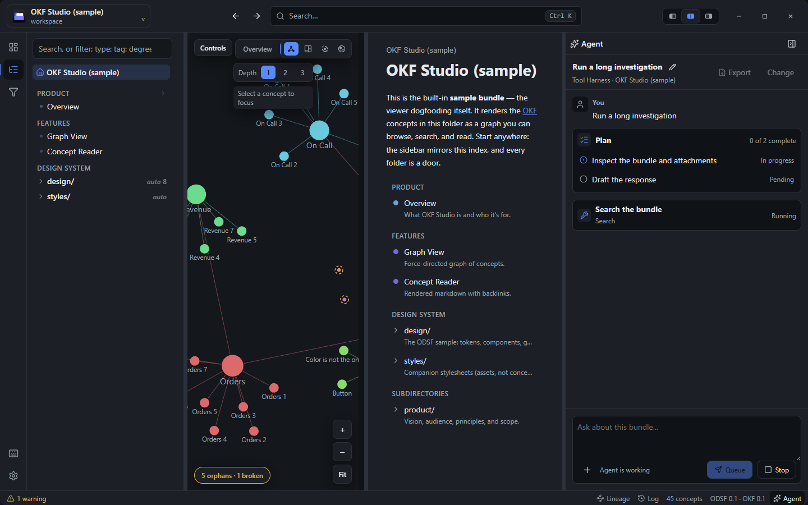
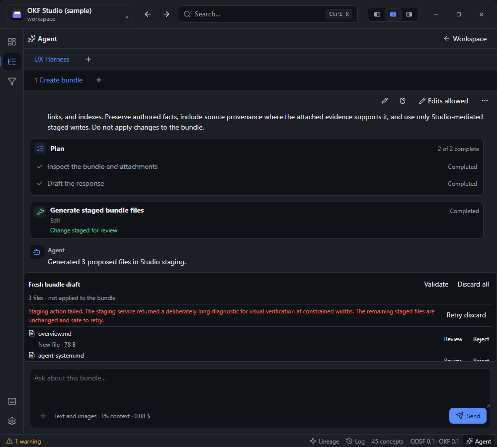
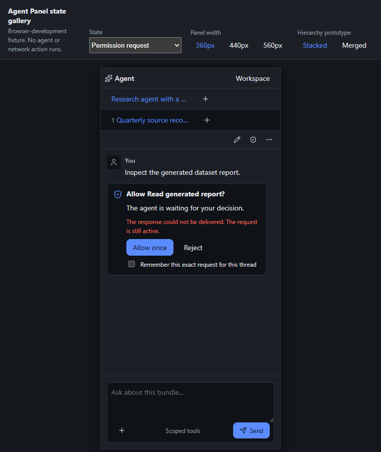
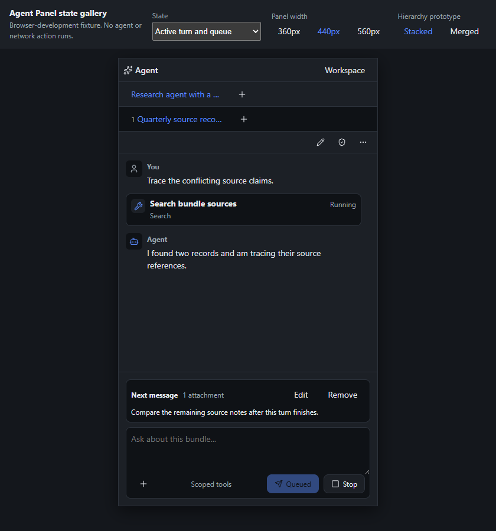
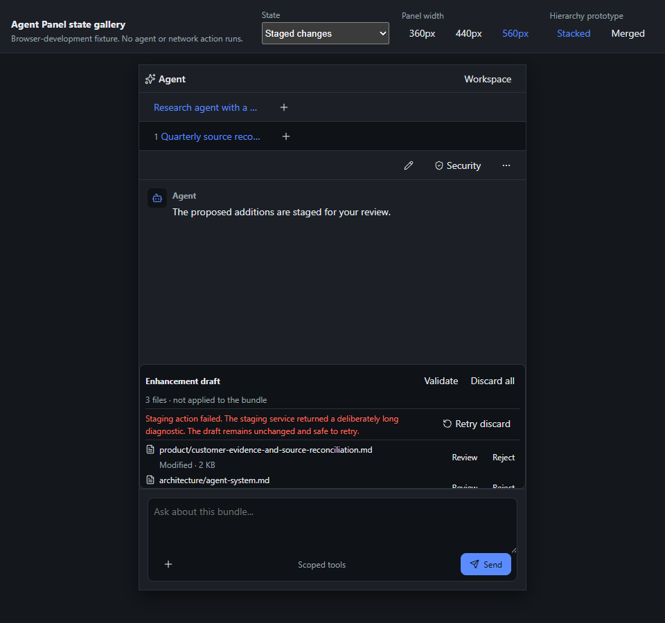

# Scope

This review exercises the Agent Panel as a workspace, not as a collection of isolated controls. It covers first connection, saved work, research, creation, enhancement, permission, failure recovery, parallel threads, and a narrow panel. The deterministic [state gallery](../architecture/testing.md) supplies repeatable blocking and width states. The browser mock supplies real starter, thread-switching, and staged-review navigation.

# Before and after

The baseline was captured after streamed plans landed at commit `de9977a`, before the workspace hierarchy pass. It repeats the thread, agent, and bundle identity in one toolbar, leaves secondary actions persistent, and lets a full plan card compete with the transcript.

The current workspace assigns bundle, agent, and thread identity to separate stable owners. The transcript receives the flexible height, secondary actions share one menu, and the staged surface owns its recovery action above its internal file scroll.

# Journey results

| Journey | Path tested | Result | Hunt, backtrack, or hidden state |
| --- | --- | --- | --- |
| First use | Open the panel with a bundle and no connection | **Connect an agent** is the only task action. No session, history, edit, or composer controls appear. | None. The bundle remains visible in the global switcher and the panel states that connecting is explicit. |
| Resume | Reconnect an agent with current and archived saved sessions | The current session is first and owns the primary **Resume** action. Archived recovery remains visible with secondary emphasis. **Start new thread** is separate and preserves saved work in History. | Fixed during this review: both Resume buttons previously used primary emphasis. |
| Deep research | Start new work, choose **Deep research**, and inspect the composer | The starter fills an editable prompt with evidence, citation, Sources, and Inferences requirements. It does not send, grant writes, or open another result surface. | None. The user supplies the question in the same composer and can inspect the whole prompt first. |
| Create | Choose **Create bundle**, grant edits, generate a reviewed proposal, then enter staging | The workflow stays in one normal thread. The edit boundary appears for the editing task, and Generate, Validate, Review, Reject, and Discard remain with the proposal or stage that owns them. | None. The staged-operation failure remains above the internally scrolling file list and does not hide recovery. |
| Enhance | Choose **Enhance bundle** and inspect the prepared prompt and staged transaction | The prompt requires additive changes and preservation of authored facts. Existing-file decisions remain blocked on explicit Keep or Reject review before Apply. | None. Research-only export guidance and unrelated controls remain absent. |
| Permission | Open a waiting tool request with a failed response delivery | The request card owns the decision, failure, **Allow once**, **Reject**, and exact-request checkbox. The composer remains reachable below it. | None. There is one blocking owner and no detached error banner. |
| Failure recovery | Stop the final connected process, then inspect the retained panel state | One connection notice keeps the agent name, bounded reason, **Review connections**, and **Dismiss**. The remaining space says that bundle browsing is unaffected. | Fixed before this review: the empty space previously competed with a second connection action. |
| Parallel thread | Start a second thread, return to the staged first thread, then return to the prepared research prompt | Agent and thread strips remain stable. Each level has one add action. The staged state and unsent prompt survive switching. | None. Long labels truncate visually but retain their complete accessible names. |
| Narrow panel | Render permission at 360px, active queue at 440px, and staged review at 560px | All three widths keep `clientWidth` equal to `scrollWidth`; the composer stays visible; the smallest visible control is 28px; focus uses the shared two-pixel ring. | None. The strips scroll their focused item into view instead of moving controls to a different row. |

# Width evidence

The three fixtures deliberately use different high-pressure states instead of repeating an empty panel.

# Findings

- **Untidy, Safe, fixed:** current and archived sessions both used primary Resume styling. Only the newest current candidate now receives primary emphasis.
- **Untidy, Safe, fixed before capture:** staged-operation recovery could start below the staged file scroll, and a final-process failure could present two competing connection actions.
- **Nitpick, Judgment, retained:** staged graph labels use 9px text. They supplement the textual staged-file list; increasing them to the 12px text floor makes dense preview nodes overlap.

No Glaring finding remains in these journeys. The next unresolved workspace gaps are capability-driven session controls and the compact live-work shelf defined by [WP10B and WP10C](../product/studio-roadmap.md).
