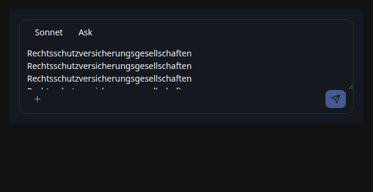
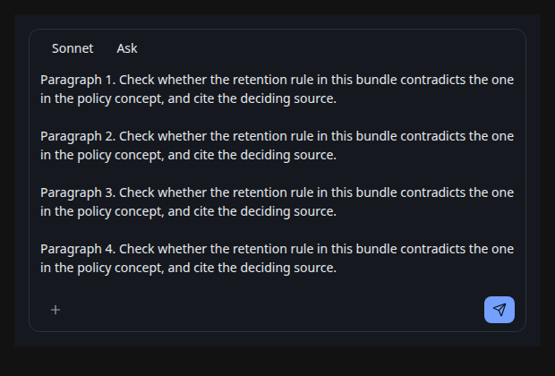
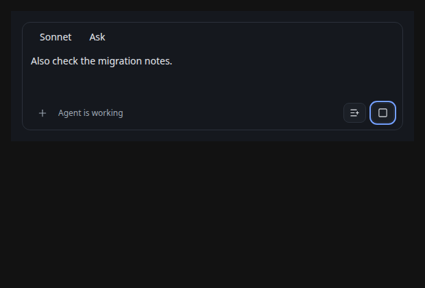

# Summary

Eleven stories, nine axes. axe-core reported no violations in any story, which is the expected floor rather than a result. Three findings came from simulation and judgment: two confirmed and fixed, one confirmed content-rule violation and fixed. One question stays open for a human. One suspected finding turned out to be an artifact of a story fixture and is recorded so a later run does not raise it again.

# composer-input-fixed-height

| Field | Value |
| --- | --- |
| id | `composer-input-fixed-height` |
| title | Long draft is written blind and the last line is cut in half |
| story | `agent-conversation-agentcomposer--with-draft` |
| axis | content-stress |
| confidence | confirmed |
| rule | manual |
| standard_refs | none |
| repro | `http://localhost:6006/iframe.html?id=agent-conversation-agentcomposer--with-draft&viewMode=story`, then set the textarea value to eight paragraphs |
| selector | `.agent-composer__input-shell > textarea` |
| environment | Chromium headless, 620x320, agent-browser axe run 2026-08-13 |
| impact | serious |
| likelihood | high |
| severity | high |
| evidence | `assets/composer-input-fixed-height-actual.png`, `assets/composer-input-fixed-height-expected.png` |
| status | fixed |
| first_seen | 2026-08-13 |
| last_seen | 2026-08-13 |

The input was fixed at three rows and never grew. With a long draft the measured `scrollHeight` was 268px against a `clientHeight` of 79px, so everything past the third line sat outside the box, and the fourth line was sliced through the middle of its glyphs by the action bar. A user writing a paragraph could not read back what they were about to send without dragging the resize handle.

**Remediation, applied.** The field now measures its own content in a layout effect and grows to a 260px ceiling, then scrolls. The manual resize handle is gone: it existed to work around a box that never grew.

# composer-queue-icon-collision

| Field | Value |
| --- | --- |
| id | `composer-queue-icon-collision` |
| title | Queue is the same paper plane as Send, so a running turn looks idle |
| story | `agent-conversation-agentcomposer--turn-running` |
| axis | contract |
| confidence | confirmed |
| rule | manual |
| standard_refs | none |
| repro | `http://localhost:6006/iframe.html?id=agent-conversation-agentcomposer--turn-running&viewMode=story` |
| selector | `.agent-composer__turn-actions button[type=submit]` |
| environment | Chromium headless, 620x300 |
| impact | moderate |
| likelihood | high |
| severity | medium |
| evidence | `assets/composer-queue-icon-collision-expected.png` |
| status | fixed |
| first_seen | 2026-08-13 |
| last_seen | 2026-08-13 |

While a turn runs, the submit control queues the prompt rather than sending it, but it kept the same paper-plane icon and the same primary fill as Send. The one control whose behavior changes mid-turn looked identical before and after the change. A user pressing it reasonably expected the prompt to go now. Only the tooltip said otherwise, and a tooltip does not reach a pointer user who does not hover or a touch user at all.

**Remediation, applied.** Queue now uses a distinct list-plus icon, drops the primary fill, and its tooltip states the consequence: "Queue. It sends when this turn ends."

# composer-placeholder-carries-instructions

| Field | Value |
| --- | --- |
| id | `composer-placeholder-carries-instructions` |
| title | The only instruction for the @ shortcut disappears on the first keystroke |
| story | `agent-conversation-agentcomposer--empty` |
| axis | microcopy |
| confidence | confirmed |
| rule | manual |
| standard_refs | none |
| repro | `http://localhost:6006/iframe.html?id=agent-conversation-agentcomposer--empty&viewMode=story`, then type one character |
| selector | `.agent-composer__input-shell > textarea` |
| environment | Chromium headless, 620x260 |
| impact | minor |
| likelihood | high |
| severity | low |
| evidence | none, the defect is the absence of text after typing |
| status | fixed |
| first_seen | 2026-08-13 |
| last_seen | 2026-08-13 |

The placeholder read "Ask about this bundle... Use @ for context". A grep confirmed the composer taught `@` nowhere else, and the attachment menu never mentioned it, so the sole instruction for a discoverability affordance lived in text that vanishes as soon as the user acts. This is the documented placeholder antipattern: placeholder text is not a label and not help, because it is gone exactly when the user needs to check it.

**Remediation, applied.** The placeholder now states the task only, "Ask about this bundle". The shortcut moved to the attachment trigger's tooltip, which persists: "Add context or sources. Type @ in the message to attach a concept."

Open question for a human: the trigger's tooltip is still hover-only, so `@` remains undiscoverable to a touch or keyboard-only user. If `@` matters, it belongs in the attachment menu body rather than its tooltip.

# composer-forced-colors-untested

| Field | Value |
| --- | --- |
| id | `composer-forced-colors-untested` |
| title | No forced-colors handling exists anywhere in the app stylesheets |
| story | all |
| axis | theme |
| confidence | needs-review |
| rule | manual |
| standard_refs | `wcag22:1.4.3` |
| repro | not reproduced; the driver used here cannot emulate forced colors |
| selector | none |
| environment | not applicable |
| impact | unknown |
| likelihood | unknown |
| severity | unknown |
| evidence | none |
| status | open |
| first_seen | 2026-08-13 |
| last_seen | 2026-08-13 |

A grep found zero `forced-colors` rules across every stylesheet in `src/`. That is a fact about the codebase, not a demonstrated defect: browsers supply sensible defaults in forced-colors mode, and the composer conveys its disabled states through the `disabled` attribute rather than colour alone, which survives the override.

**The question for a human.** Does Studio claim support for Windows high contrast? If it does, this needs a driver that can emulate forced colors and a pass across the whole app, not just this component. If it does not, this should be closed as out-of-scope and recorded as a non-goal.

# composer-reflow-320 (false positive)

| Field | Value |
| --- | --- |
| id | `composer-reflow-320` |
| title | Send and stop appeared to fall outside the viewport at 320px |
| story | `agent-conversation-agentcomposer--crowded` |
| axis | zoom-reflow |
| confidence | confirmed |
| rule | manual |
| standard_refs | `wcag22:1.4.10` |
| repro | `http://localhost:6006/iframe.html?id=agent-conversation-agentcomposer--crowded&viewMode=story` at a 320px viewport |
| selector | `.agent-composer__turn-actions` |
| environment | Chromium headless, 320x400 |
| impact | none |
| likelihood | none |
| severity | none |
| evidence | none retained |
| status | false-positive |
| first_seen | 2026-08-13 |
| last_seen | 2026-08-13 |

The Crowded story pins its container to 360px so it can exercise the narrow panel, so at a 320px viewport the fixture itself overflows and clips the send controls. Retested against a story whose container shrinks: at 320px the queue button's right edge sits at 234px and stop at 275px, both inside the viewport, with no horizontal scroll. The component reflows correctly and the fixture was the cause.

Recorded so a later run does not raise it again. A narrow-width probe should use a story whose decorator allows the container to shrink.
